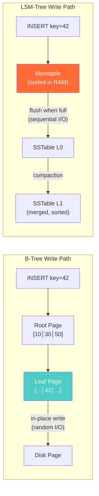

# B-Trees vs LSM-Trees — Interview Angle

---

## How This Appears in Interviews

**Format**: System design deep dive. "Design a high-throughput event ingestion system" or "Explain how a database stores data on disk." Interviewers use this to test: do you understand storage engine internals, or do you just know which SQL to write?

---

## Sample Questions

### Q1: "Explain B-Trees vs LSM-Trees."

**What they're testing**: Foundational systems knowledge. Can you reason about I/O patterns?

**Weak (Senior) Answer**: "B-Trees are for reads, LSM-Trees are for writes."
→ Missing: the WHY (random vs sequential I/O), the amplification factors, the specific engines.

**Strong (Principal) Answer**: "B-Trees do in-place updates: find the leaf page (O(log n) random reads), modify it, write back. Great for reads — one path from root to leaf. Bad for writes — every update is random I/O. LSM-Trees append everything: writes go to an in-memory memtable (WAL for durability), then flush to sorted SSTables on disk (sequential I/O). Great for writes — all sequential. Bad for reads — must check memtable plus potentially every SSTable level. The trade-off is quantified by three amplification factors: read amplification (how many places to check), write amplification (how many times data is rewritten by compaction, typically 10-30x for LSM), and space amplification (dead versions until compacted, 1.1-2x for LSM). PostgreSQL uses B-Tree, RocksDB uses LSM, and CockroachDB builds SQL on top of an LSM (Pebble)."

**Follow-up**: "How does an LSM-Tree handle reads efficiently despite multiple levels?"
→ "Bloom filters. Before reading any SSTable, the engine checks a probabilistic filter: 'Is this key POSSIBLY in this SSTable?' If the answer is 'definitely no' (no false negatives), skip the SSTable entirely. With 10 bits per key, false positive rate is ~1%. This turns a theoretical 5-level read into 1-2 actual disk reads for most queries."

---

### Q2: "Your database has degrading write performance over time. What's happening?"

**What they're testing**: Can you diagnose a production issue by reasoning about engine internals?

**Strong Answer**: "For B-Tree (PostgreSQL): likely dead tuple bloat from MVCC. Updates create new row versions. Without aggressive VACUUM, dead tuples accumulate, indexes grow, and every page-level operation touches more pages. I'd check `pg_stat_user_tables.n_dead_tup`. For LSM (RocksDB): likely compaction can't keep up with write rate. SSTables accumulate at L0 (write stall threshold). I'd check `rocksdb.num-files-at-level0` — if it hits the write stall trigger (typically 20-36 files), writes are throttled or blocked."

---

### Q3: "Design a storage engine for a system that ingests 1M events/sec."

**What they're testing**: Can you make an informed engine choice based on workload?

**Strong Answer**: "LSM-Tree. At 1M events/sec with 200-byte events, that's 200MB/sec sustained writes. B-Tree random I/O would need 200K random IOPS (each event = random page write) — that requires ~20 NVMe SSDs. LSM sequential append: 200MB/sec sustained sequential — 2 NVMe SSDs can handle this. I'd use RocksDB or ClickHouse's MergeTree. Key tuning: memtable size = 64-256MB (buffer more before flush), Bloom filter = 12 bits/key, compaction = Leveled (for predictable read performance). For reads: batch queries over time ranges, not point lookups — LSM excels at sequential scans within sorted runs."

---

### Q4: "What is write amplification and why does it matter?"

**Strong Answer**: "Write amplification is the ratio of bytes physically written to disk versus bytes written by the application. In B-Tree: ~2x (write page + WAL). In LSM: 10-30x — data is written to memtable, flushed to L0, compacted into L1, L2, L3... each level rewrites it. A 100GB database with 20x write amplification writes 2TB/day. This matters for: (1) SSD lifespan — consumer SSDs rated for 150 TBW die in 75 days, (2) I/O budget — compaction consumes disk bandwidth that could serve queries, (3) Cost — enterprise SSDs (3 DWPD) cost 5-10x more than consumer SSDs (0.3 DWPD)."

---

## Whiteboard Exercise (5 minutes)

Draw B-Tree (left) and LSM-Tree (right) side by side. Show the write path for each:

**Annotate with**: "B-Tree = random I/O per write. LSM = sequential I/O, but 10-30x rewrite during compaction."
