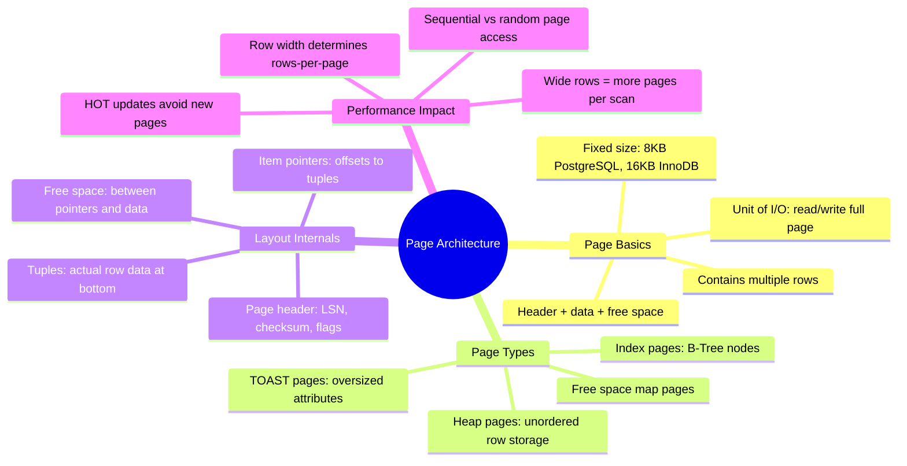

# Page Architecture — Concept Overview & Deep Internals

> How databases organize data within fixed-size pages — the fundamental unit of I/O.

---

## Why This Exists

Databases don't read individual rows from disk. They read **pages** (typically 8KB or 16KB blocks). Everything — B-Tree nodes, heap tuples, index entries — lives inside pages. Understanding page layout explains why some queries read 1 page and others read 1000.

## Mindmap



## PostgreSQL Page Layout (8KB)

```
┌─────────────────────────────────────────┐  ← Offset 0
│ Page Header (24 bytes)                  │
│   - pg_lsn (WAL position)              │
│   - checksum                            │
│   - flags, lower, upper, special        │
├─────────────────────────────────────────┤
│ Item Pointers (4 bytes each)            │
│   [ptr1] [ptr2] [ptr3] ...             │
│   (point to tuple offsets below)        │
├ ─ ─ ─ ─ ─ ─ ─ ─ ─ ─ ─ ─ ─ ─ ─ ─ ─ ─ ┤
│                                         │
│            FREE SPACE                   │
│                                         │
├ ─ ─ ─ ─ ─ ─ ─ ─ ─ ─ ─ ─ ─ ─ ─ ─ ─ ─ ┤
│ Tuple 3 (row data)                      │
│ Tuple 2 (row data)                      │
│ Tuple 1 (row data)                      │
│   - each tuple: header + column values  │
├─────────────────────────────────────────┤
│ Special Area (index-specific data)      │
└─────────────────────────────────────────┘  ← Offset 8192
```

**Key insight**: Item pointers grow downward from the top. Tuple data grows upward from the bottom. They meet in the middle. When they meet → page is full.

## Rows Per Page Calculation

```sql
-- How many rows fit in one 8KB page?
-- Page header: 24 bytes
-- Item pointer per row: 4 bytes  
-- Tuple header per row: 23 bytes
-- Alignment padding: ~1 byte
-- Available for data: 8192 - 24 = 8168 bytes

-- Example: customer table
-- customer_id (INT): 4 bytes
-- customer_name (VARCHAR(100)): avg 40 bytes
-- email (VARCHAR(255)): avg 30 bytes
-- city (VARCHAR(100)): avg 20 bytes
-- Total row data: ~94 bytes
-- Total per row: 4 (ptr) + 23 (header) + 94 (data) = 121 bytes
-- Rows per page: 8168 / 121 ≈ 67 rows

-- Full table scan on 1M customers:
-- Pages to read: 1,000,000 / 67 ≈ 14,925 pages
-- At 8KB each: ~117 MB sequential I/O

-- If we add a TEXT column averaging 2KB:
-- Total per row: 4 + 23 + 2094 = 2121 bytes
-- Rows per page: 8168 / 2121 ≈ 3 rows
-- Pages to read: 1,000,000 / 3 ≈ 333,333 pages (22x more I/O!)
```

## War Story: Stripe — Row Width Impact on Query Performance

Stripe discovered that a `payments` table with a JSONB `metadata` column averaging 3KB per row was reading 25x more pages per query than expected. The fix: move the JSONB to a separate table (vertical partitioning) and store only a FK in the main table. Query time for the common columns dropped from 4.5 seconds to 180ms.

## Pitfalls

| Pitfall | Fix |
|---|---|
| Wide rows causing excessive page reads | Vertical partition: hot columns in one table, cold/wide columns in another |
| Not monitoring page splits in B-Tree indexes | Use `pg_stat_user_tables` to track index bloat and dead tuples |
| Ignoring alignment padding waste | Reorder columns by alignment (int, bigint, varchar) to minimize padding |

## Interview — Q: "Why does row width matter for query performance?"

**Strong Answer**: "Because databases read fixed-size pages (8KB in Postgres), not individual rows. A narrow row (100 bytes) fits 67 rows per page. A wide row (2KB) fits only 3. A full table scan on 1M rows reads 15K pages vs 333K pages — 22x difference in I/O. This is why I vertically partition wide tables and keep JSONB/TEXT columns in separate tables."

## References

| Resource | Link |
|---|---|
| [PostgreSQL Page Layout](https://www.postgresql.org/docs/current/storage-page-layout.html) | Official internals |
| *Designing Data-Intensive Applications* | Martin Kleppmann — Ch. 3 |
