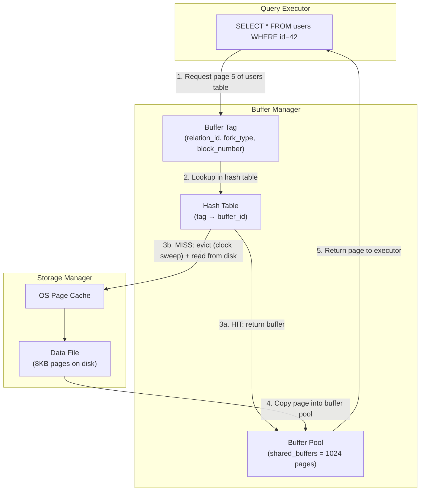
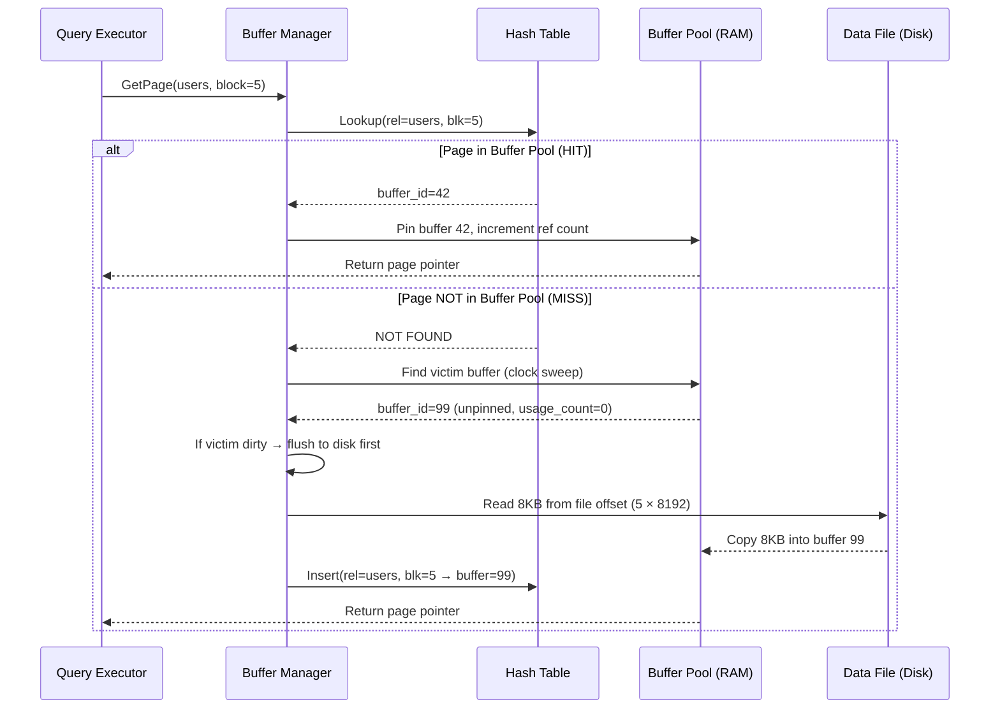
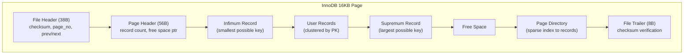
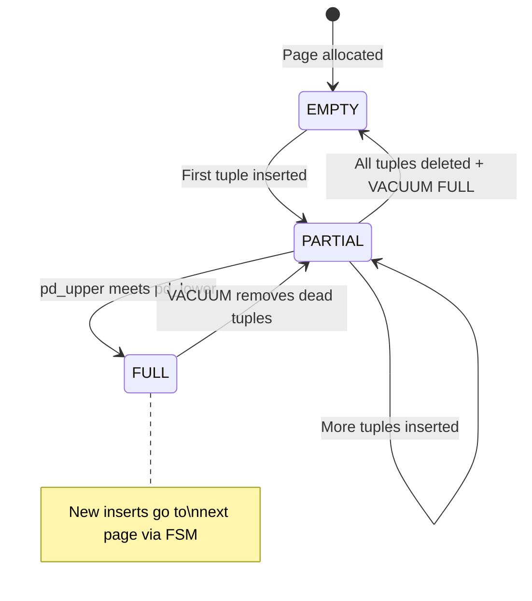

# Page Architecture — How It Works

> The internal anatomy of a database page: headers, line pointers, tuples, and free space management.

---

## PostgreSQL 8KB Page Layout (Detailed)

```
┌──────────────────────────────────────────────────────────┐
│ PAGE HEADER (24 bytes)                                    │
│ ┌───────────┬────────────┬──────────┬──────────────────┐ │
│ │ pd_lsn    │ pd_checksum│ pd_flags │ pd_lower/pd_upper│ │
│ │ (WAL pos) │ (CRC-16)   │          │ (free space ptrs)│ │
│ └───────────┴────────────┴──────────┴──────────────────┘ │
├──────────────────────────────────────────────────────────┤
│ LINE POINTERS (ItemIdData array, 4 bytes each)           │
│ ┌────┬────┬────┬────┬────┬────────────────────────────┐ │
│ │ LP1│ LP2│ LP3│ LP4│ LP5│  ...grows downward →       │ │
│ └────┴────┴────┴────┴────┴────────────────────────────┘ │
│                                                           │
│ ═══════════ FREE SPACE ════════════                      │
│ pd_lower ↓                                                │
│                                                           │
│ pd_upper ↑                                                │
│ ═══════════════════════════════════                       │
│                                                           │
│ TUPLE DATA (grows upward from bottom ↑)                  │
│ ┌──────────────────────────────────────────────────────┐ │
│ │ Tuple 5: [header 23B][null bitmap][user data]        │ │
│ │ Tuple 4: [header 23B][null bitmap][user data]        │ │
│ │ Tuple 3: [header 23B][null bitmap][user data]        │ │
│ │ Tuple 2: [header 23B][null bitmap][user data]        │ │
│ │ Tuple 1: [header 23B][null bitmap][user data]        │ │
│ └──────────────────────────────────────────────────────┘ │
├──────────────────────────────────────────────────────────┤
│ SPECIAL SPACE (for B-Tree: sibling pointers)             │
└──────────────────────────────────────────────────────────┘
```

**Key mechanics**:
- `pd_lower` points to the end of line pointers (grows down)
- `pd_upper` points to the start of tuple data (grows up)
- Free space = `pd_upper - pd_lower`
- When free space runs out → page is full → insert goes to next page

## HLD — Buffer Manager and Page Flow



## Sequence Diagram — Page Read Path



## Tuple Header — MVCC Versioning (23 bytes)

```
┌──────────────────────────────────────────────────┐
│ HeapTupleHeaderData (23 bytes)                    │
├───────────┬──────────────────────────────────────┤
│ t_xmin    │ Transaction ID that INSERT'd this row │
│ (4 bytes) │ Visibility: is xmin committed?        │
├───────────┼──────────────────────────────────────┤
│ t_xmax    │ Transaction ID that DELETE'd/UPDATE'd │
│ (4 bytes) │ 0 = not deleted; >0 = check CLOG     │
├───────────┼──────────────────────────────────────┤
│ t_cid     │ Command ID within transaction         │
│ (4 bytes) │                                       │
├───────────┼──────────────────────────────────────┤
│ t_ctid    │ Current tuple's TID (block, offset)   │
│ (6 bytes) │ Points to newer version after UPDATE  │
├───────────┼──────────────────────────────────────┤
│ t_infomask│ Status bits (committed, aborted, etc) │
│ (2+2+1 B) │ HEAP_XMIN_COMMITTED, HEAP_UPDATED... │
└───────────┴──────────────────────────────────────┘
```

## InnoDB 16KB Page Layout (Comparison)



**Key difference from PostgreSQL**: InnoDB pages store records ordered by primary key (clustered index). PostgreSQL heap pages store tuples in insertion order (unordered).

## State Machine — Page Lifecycle


