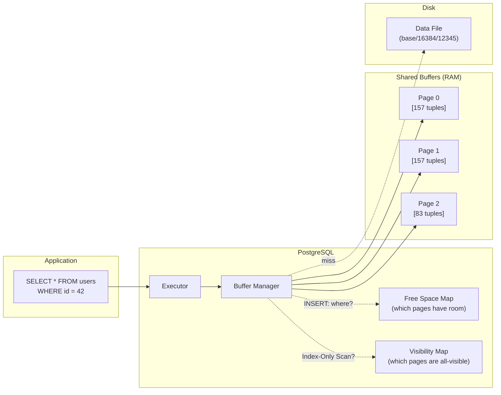

# Page Architecture — Hands-On Examples

> Inspect actual page contents, measure row widths, and calculate I/O impact.

---

## Example 1: Inspecting PostgreSQL Page Contents with pageinspect

```sql
-- Enable the extension
CREATE EXTENSION IF NOT EXISTS pageinspect;

-- Create a test table
CREATE TABLE page_demo (
    id    SERIAL PRIMARY KEY,
    name  VARCHAR(50),
    email VARCHAR(100),
    score INT
);

INSERT INTO page_demo (name, email, score) VALUES
    ('Alice', 'alice@example.com', 95),
    ('Bob',   'bob@example.com', 87),
    ('Carol', 'carol@example.com', 91);

-- Inspect page header (page 0 = first page)
SELECT * FROM page_header(get_raw_page('page_demo', 0));
-- Output:
--   lsn     | checksum | flags | lower | upper | special | pagesize | version | prune_xid
--   0/...   |    0     |   0   |   40  |  8048 |   8192  |   8192   |    4    |     0
--
-- lower=40: 24B header + 4 line pointers × 4B = 40
-- upper=8048: tuples start here (3 tuples at ~48 bytes each)
-- Free space = 8048 - 40 = 8008 bytes remaining

-- Inspect individual line pointers
SELECT * FROM heap_page_item_attrs(get_raw_page('page_demo', 0), 'page_demo'::regclass);

-- Inspect tuple headers (xmin, xmax, MVCC info)
SELECT lp, lp_off, lp_len, t_xmin, t_xmax, t_ctid
FROM heap_page_items(get_raw_page('page_demo', 0));
-- lp=1: line pointer 1, offset, length
-- t_xmin: transaction that created this row
-- t_xmax=0: row has not been deleted
```

## Example 2: Calculating Rows Per Page

```sql
-- Formula: rows_per_page = (page_size - header - special) / (tuple_header + row_data + alignment)
-- PostgreSQL page_size = 8192 bytes
-- Header = 24 bytes
-- Special = 0 (for heap pages)
-- Tuple header = 23 bytes + null bitmap
-- Alignment = round up to 8-byte boundary (MAXALIGN)

-- Real calculation for a narrow table:
-- Row: id INT(4) + name VARCHAR(10)(14) + score INT(4) = 22 bytes data
-- Total per tuple: 23 (header) + 1 (null bitmap) + 22 (data) = 46 bytes → padded to 48
-- Line pointer: 4 bytes
-- Rows per page: (8192 - 24) / (48 + 4) ≈ 157 rows per page

-- Verify with actual data:
SELECT relpages, reltuples, 
       reltuples / GREATEST(relpages, 1) AS rows_per_page
FROM pg_class WHERE relname = 'page_demo';

-- For a WIDE table:
-- Row: 20 columns × avg 50 bytes = 1000 bytes data
-- Total per tuple: 23 + 3 (null bitmap) + 1000 = 1026 → padded to 1032
-- Rows per page: (8192 - 24) / (1032 + 4) ≈ 7.9 → 7 rows per page
-- 
-- 157 rows vs 7 rows = 22x MORE I/O for the same number of rows!
```

## Example 3: Row Width Impact on Full Table Scan

```sql
-- Narrow table: 1M rows, 157 rows/page → 6,369 pages → 50 MB
-- Wide table: 1M rows, 7 rows/page → 142,857 pages → 1.1 GB
-- Full scan of narrow: 6,369 sequential reads × 0.01ms = 64ms
-- Full scan of wide: 142,857 sequential reads × 0.01ms = 1,429ms
-- → 22x slower just because of wider rows!

-- Measure actual page count
SELECT pg_relation_size('narrow_table') / 8192 AS pages_narrow;
SELECT pg_relation_size('wide_table') / 8192 AS pages_wide;
```

## Example 4: Free Space Map (FSM) Inspection

```sql
-- Install pg_freespacemap
CREATE EXTENSION IF NOT EXISTS pg_freespacemap;

-- Check free space per page
SELECT blkno, avail 
FROM pg_freespace('page_demo') 
ORDER BY blkno 
LIMIT 10;
-- blkno=0, avail=8008 → page 0 has 8008 bytes free
-- blkno=1, avail=0    → page 1 is full

-- After DELETE + VACUUM:
DELETE FROM page_demo WHERE id = 2;
VACUUM page_demo;
SELECT blkno, avail FROM pg_freespace('page_demo');
-- blkno=0, avail=8056 → space reclaimed after vacuum
```

## Integration Diagram — Page, Buffer Pool, and Storage



## Before vs After: Column Width Reduction

| Metric | Before (VARCHAR(255) everywhere) | After (right-sized columns) |
|---|---|---|
| Row width | 1,200 bytes | 180 bytes |
| Rows per page | 6 | 42 |
| Pages for 10M rows | 1,666,667 (13 GB) | 238,095 (1.9 GB) |
| Sequential scan time | ~17 seconds | ~2.4 seconds |
| Buffer pool efficiency | 6 rows per 8KB cached | 42 rows per 8KB cached |
