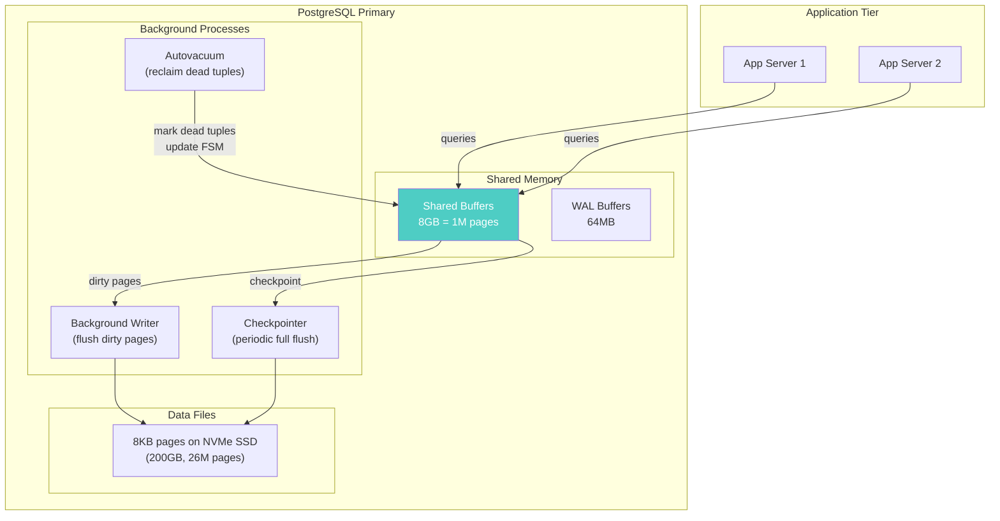

# Page Architecture — Real-World Scenarios

> When pages, row widths, and buffer management decide production outcomes.

---

## Case Study 1: Stripe — Row Width Audit Saves 60% Storage

**Context**: Stripe's payments table had grown to 12TB on PostgreSQL. Query performance was degrading.

**The Problem**:
- Table schema used `VARCHAR(255)` for 23 columns — most columns averaged 15-30 characters
- Actual row width: ~1,100 bytes. With right-sized types: ~200 bytes
- Rows per page: 7 (actual) vs 38 (optimal) — 5.4x storage overhead
- Buffer pool (128GB shared_buffers) could cache only 18% of the table vs 100% with right-sized rows

**The Fix**:
- Column audit: reduced `VARCHAR(255)` to actual max lengths (`VARCHAR(30)`, `VARCHAR(60)`)
- Switched UUIDs from `VARCHAR(36)` to `UUID` type (16 bytes vs 37 bytes)
- Result: table shrank from 12TB to 4.2TB, buffer hit ratio improved from 85% to 97%

**Production Numbers**: Full table scan: 45 seconds → 16 seconds. Index-only scan coverage: 60% → 92%.

---

## Case Study 2: Instagram — TOAST and Large Column Impact

**Context**: Instagram stored user bio text + JSON metadata in the same table as profile lookup columns.

**The Problem**:
- Bio column: up to 2KB of text. JSON metadata: up to 5KB
- When a row exceeds ~2KB, PostgreSQL uses TOAST (The Oversized-Attribute Storage Technique)
- TOAST stores large values in a separate table, requiring a second I/O per row
- Profile lookup needed only (username, avatar_url, followers_count) — but every row fetch paid the TOAST penalty for bio + metadata columns

**The Fix**:
- Moved bio and metadata into a separate `user_profiles_extended` table
- Main table dropped from 2,100 bytes/row to 180 bytes/row
- Profile lookups: 1 page read instead of 1 page + 1 TOAST fetch
- p50 latency: 3ms → 0.8ms

---

## Case Study 3: Heroku — shared_buffers Misconfiguration

**Context**: A Heroku customer with a 200GB PostgreSQL database set `shared_buffers` to the default 128MB.

**The Problem**:
- 128MB = 16,384 pages in buffer pool
- 200GB database = 26,214,400 pages
- Buffer cache ratio: 0.06% — effectively every query went to disk
- pg_stat_bgwriter showed `buffers_backend` (direct I/O by queries) was 10x higher than `buffers_checkpoint`

**The Fix**:
- Increased `shared_buffers` to 8GB (25% of 32GB RAM) = 1,048,576 pages
- Buffer hit ratio jumped from 65% to 96%
- Query latency: p50 12ms → 2ms

---

## Deployment Diagram — Page Flow at Scale



---

## What Went Wrong: Bloomberg — Page Splits Causing Latency Spikes

**Incident**: Bloomberg's PostgreSQL analytics database experienced periodic 50ms latency spikes every 2-3 minutes.

**Root Cause**: B-Tree index pages were splitting under write load. When a leaf page fills up, PostgreSQL must:
1. Allocate a new page
2. Move half the entries to the new page
3. Update the parent page's pointer
4. WAL-log all three changes

Under concurrent inserts, page splits cause brief lock contention on the parent page.

**Fix**: 
- Increased `fillfactor` from 100 (default) to 70 on heavily-updated indexes
- This leaves 30% free space per page for new entries, reducing split frequency
- Latency spikes reduced from every 2-3 minutes to every 30+ minutes

```sql
-- Reduce page splits with fillfactor
CREATE INDEX idx_orders_ts ON orders (created_at) WITH (fillfactor = 70);
-- Each leaf page only fills to 70%, leaving room for future inserts
```
