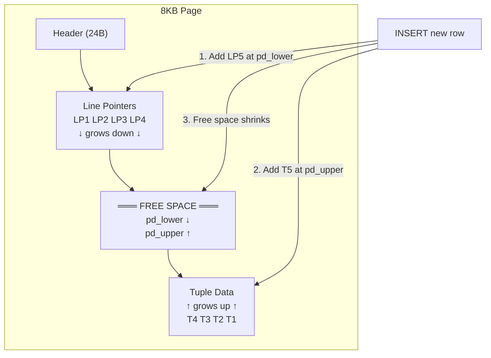

# Page Architecture — Interview Angle

---

## How This Appears in Interviews

**Format**: Deep dive or system design follow-up. "How does PostgreSQL store data on disk?" or "Why is your query slow despite having an index?" Interviewers use page architecture to separate candidates who understand storage mechanics from those who only write SQL.

---

## Sample Questions

### Q1: "Describe the internal structure of a PostgreSQL page."

**What they're testing**: Do you understand the fundamental unit of I/O?

**Weak (Senior) Answer**: "PostgreSQL stores data in 8KB pages with rows and metadata."
→ Missing: line pointers, free space management, tuple headers, MVCC versioning.

**Strong (Principal) Answer**: "An 8KB page has: (1) a 24-byte header with the WAL LSN (crash recovery position), checksum, and free space pointers (pd_lower, pd_upper). (2) An array of 4-byte line pointers growing downward — each points to a tuple's offset within the page. (3) Free space between the line pointer array and tuple data. (4) Tuples packed from the bottom upward, each with a 23-byte header containing xmin/xmax (MVCC transaction IDs), t_ctid (pointer to the next version after UPDATE), and infomask bits. The free space shrinks as tuples are added. When it's exhausted, PostgreSQL consults the Free Space Map (FSM) to find another page with room."

**Follow-up**: "How does this affect query performance?"
→ "Row width directly determines rows per page. Narrow rows = more rows per page = fewer I/O operations per scan. A 100-byte row gives ~75 rows per page; a 1000-byte row gives ~7 rows per page — that's 10x more I/O for the same number of rows. This is why right-sizing column types matters at scale."

---

### Q2: "Why does SELECT * perform differently from SELECT specific_columns?"

**Strong Answer**: "In a heap scan, PostgreSQL reads entire pages regardless — `SELECT *` and `SELECT specific_columns` read the same pages. The difference is minimal for heap scans. BUT: with columnar storage (Citus, ClickHouse), `SELECT *` reads all columns while `SELECT c1, c2` reads only those column files — the difference can be 100x. In PostgreSQL, the real cost difference comes with TOAST: if any column is TOASTed (>2KB), `SELECT *` pays the TOAST I/O penalty even if you don't need that column. `SELECT specific_columns` still avoids detoasting unused columns."

---

### Q3: "Your database table is 10x larger on disk than expected. What happened?"

**Strong Answer**: "I'd check five things: (1) **Dead tuple bloat** — `SELECT n_dead_tup FROM pg_stat_user_tables`. Without VACUUM, dead MVCC versions accumulate. (2) **TOAST overhead** — large column values stored in a separate TOAST table. (3) **Alignment padding** — PostgreSQL rounds tuple sizes to 8-byte boundaries. Many small columns = wasteful padding. (4) **Index bloat** — indexes on tables with frequent updates contain dead entries. Check `pgstattuple('index_name')`. (5) **Over-wide columns** — `VARCHAR(255)` when actual data is 10 characters doesn't waste storage but may affect planning."

---

### Q4: "How would you estimate I/O for a query on a 1-billion row table?"

**Strong Answer**: "Estimate row width (including tuple header), calculate rows per page: `(8192 - 24) / (row_width + 4)`. For 200-byte rows: ~38 rows/page. 1B rows / 38 rows per page = 26.3M pages = 200GB. Full sequential scan at 1GB/sec (NVMe) = 200 seconds. Index scan for a single row: 4 page reads (B-Tree height for 1B rows) × 0.01ms = 0.04ms. The 5-million-fold difference between sequential scan and index lookup is why indexes exist."

---

## Whiteboard Exercise (5 minutes)

Draw a PostgreSQL 8KB page with labeled sections. Show how an INSERT adds a line pointer (growing down) and tuple data (growing up), and what happens when the two pointers meet (page full → FSM lookup).

