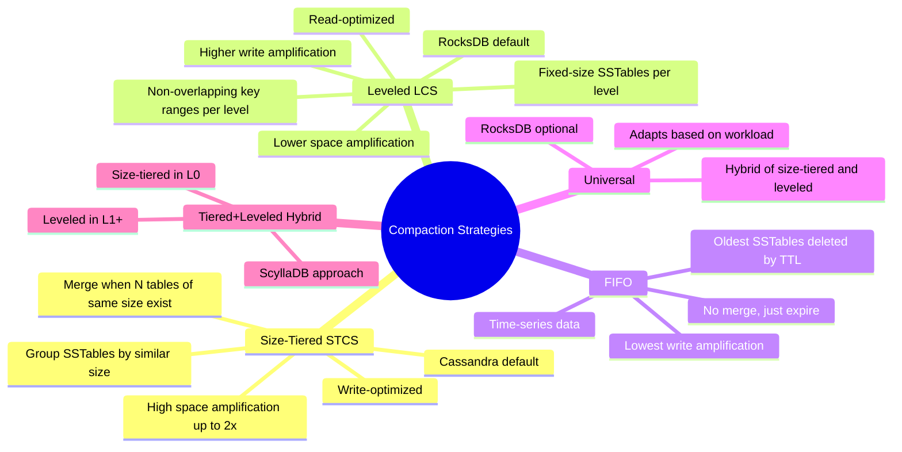
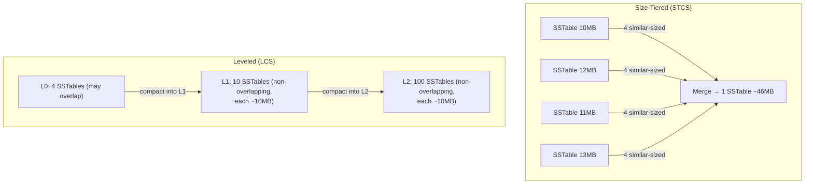

# Compaction Strategies — Concept Overview & Deep Internals

> How LSM-Trees clean up old data on disk — and why choosing the wrong strategy can burn your SSDs.

---

## Why This Exists

LSM-Trees never overwrite data in place. Updates and deletes create new versions. Over time, multiple SSTables contain overlapping keys with different versions. Compaction merges these SSTables, discarding old versions. The compaction strategy determines the trade-off between write amplification, read amplification, and space amplification.

## Mindmap

## Size-Tiered vs Leveled

## Comparison

| Factor | Size-Tiered | Leveled | FIFO |
|---|---|---|---|
| **Write amplification** | ✅ Low (2-5x) | ❌ High (10-30x) | ✅ Lowest (1x) |
| **Read amplification** | ❌ High (check many SSTables) | ✅ Low (1 SSTable per level per key) | ⚠️ Depends |
| **Space amplification** | ❌ High (up to 2x during compaction) | ✅ Low (~1.1x) | ✅ Low (expired data freed) |
| **Best for** | Write-heavy, space tolerant | Read-heavy, space constrained | TTL-based time-series |
| **Used by** | Cassandra (default), HBase | RocksDB (default), LevelDB | RocksDB (option), Cassandra |

## War Story: Discord — Switching from STCS to LCS

Discord runs Cassandra for message storage (trillions of messages). Under Size-Tiered Compaction:

- Space amplification spiked to 2x during compaction (needed double the disk capacity)
- Read latency p99 was 200ms (checking 15+ SSTables)
Switching to Leveled Compaction:
- Space amplification dropped to 1.1x
- Read latency p99 dropped to 15ms (checking 2-3 SSTables)
- BUT write amplification increased 5x — they accepted this because reads outnumbered writes 100:1

## Pitfalls

| Pitfall | Fix |
|---|---|
| Defaulting to size-tiered for a read-heavy workload | Switch to leveled — lower read amplification |
| Not provisioning for compaction temporary space | Size-tiered needs 2x disk during compaction. Budget for it |
| Running compaction during peak hours | Schedule major compaction during off-peak. Use rate limiters |
| Using leveled for a write-heavy append-only workload | Switch to FIFO with TTL for time-series data — zero write amplification |

## Interview — Q: "What compaction strategy would you choose for a time-series database?"

**Strong Answer**: "FIFO compaction with TTL. Time-series data is append-only (no updates) and has natural expiration (keep last 30 days). FIFO simply deletes the oldest SSTables when they expire — no merge, no rewrite, write amplification of 1x. For time-series data that needs long-term retention with decreasing resolution, I'd combine FIFO for recent data with leveled compaction for downsampled historical data."

## References

| Resource | Link |
|---|---|
| [RocksDB Compaction](https://github.com/facebook/rocksdb/wiki/Compaction) | Leveled vs Universal |
| [Cassandra Compaction](https://cassandra.apache.org/doc/latest/cassandra/operating/compaction/) | STCS vs LCS |
| *Designing Data-Intensive Applications* | Ch. 3: LSM-Tree compaction |
| Cross-ref: B-Trees vs LSM | [../01_B_Trees_vs_LSM_Trees](../01_B_Trees_vs_LSM_Trees/) |
