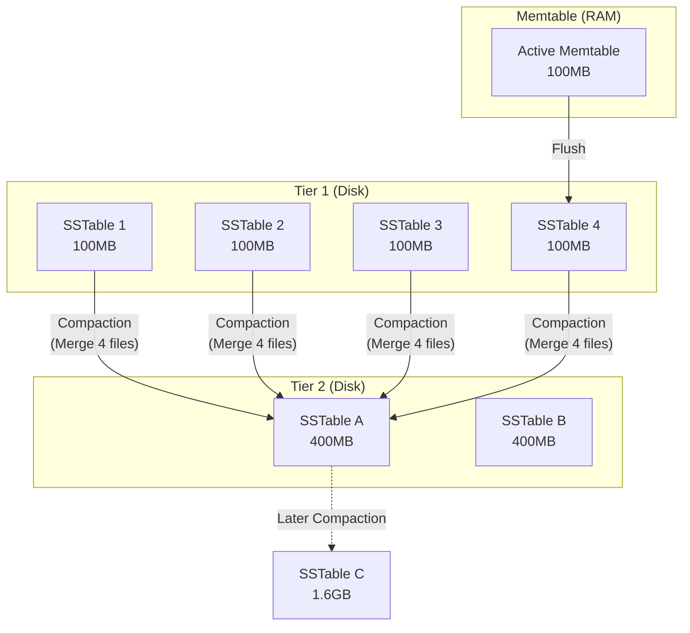
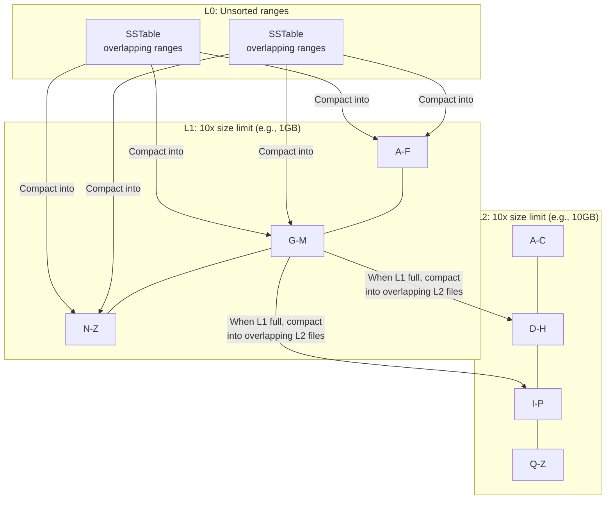
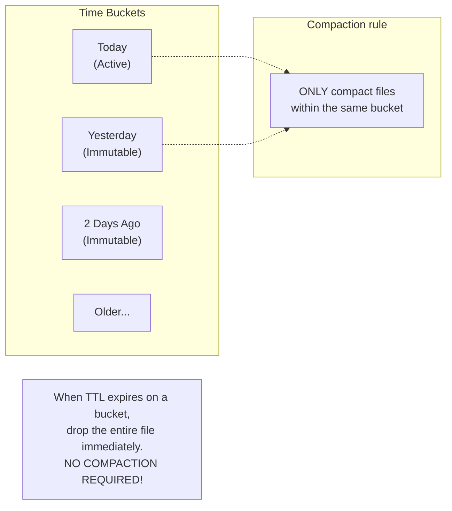

# Compaction Strategies — How It Works

> The mechanics of merging immutable SSTables to reclaim space and optimize read performance.

---

## The Core Problem: Why Compaction Exists

In Log-Structured Merge (LSM) trees, all writes (inserts, updates, deletes) are purely sequential **appends**. 
- An **update** creates a new version of a key.
- A **delete** creates a "tombstone" marker for the key.

Over time, this append-only nature causes **Space Amplification** (storing many dead versions of the same key) and **Read Amplification** (having to check many files to find the latest version).

Compaction is the background process that reads these immutable files (SSTables), merges them, discards old versions and tombstones, and writes out a new, compacted SSTable.

---

## Strategy 1: Size-Tiered Compaction Strategy (STCS)

**Primary Goal**: Minimize write amplification for write-heavy workloads.
**Used by**: Cassandra (default), HBase, ScyllaDB.

### How It Works

**Mechanics**:
1. When X files of similar size exist (e.g., 4 files of ~100MB), merge them into one larger file (~400MB).
2. When X files of the new size exist, merge THEM into an even larger file.

**Trade-offs**:
- ✔️ **Lowest Write Amplification**: Files are merged infrequently.
- ❌ **Highest Read Amplification**: A read must check multiple tables per tier because key ranges overlap across all files in a tier.
- ❌ **Space Spikes**: Compacting 4 x 100GB files requires 400GB of FREE disk space during the merge. Total space requirement = 2x data size.

---

## Strategy 2: Leveled Compaction Strategy (LCS)

**Primary Goal**: Minimize read amplification and space amplification for read-heavy workloads.
**Used by**: RocksDB (default), LevelDB, Cassandra (optional).

### How It Works

**Mechanics**:
1. Data is organized into levels (L0, L1, L2...). Each level is 10x larger than the previous.
2. **L0**: Flushed from memtable. Key ranges overlap.
3. **L1 and below**: Key ranges are **strictly partitioned** (no overlap within the same level).
4. When L1 exceeds its size limit, a file is selected and merged with *only the overlapping files* in L2.

**Trade-offs**:
- ✔️ **Low Read Amplification**: To find a key, you check L0, then exactly ONE file in L1, ONE file in L2, etc.
- ✔️ **Low Space Amplification**: Old versions are cleared quickly since files are continuously rolling downward. Space overhead is ~10-11%.
- ❌ **High Write Amplification**: Data is rewritten 10-30 times as it moves down through the levels.

---

## Strategy 3: Time-Window Compaction Strategy (TWCS)

**Primary Goal**: Optimize for time-series data with TTL (Time To Live).
**Used by**: Cassandra, ScyllaDB, InfluxDB.

### How It Works

**Mechanics**:
1. Group SSTables into time windows (e.g., 1 day per window).
2. Only compact files *within the same time window*. Never merge data from Tuesday with data from Wednesday.
3. When the TTL for a time window expires, delete the files entirely via OS file deletion.

**Trade-offs**:
- ✔️ **Zero Compaction Cost for Deletes**: No tombstones needed. Entire files are dropped.
- ✔️ **Excellent Time-Range Reads**: Queries for "yesterday" only touch yesterday's files.
- ❌ **Terrible for Out-of-Order Writes**: If you update a 3-day-old record, it ruins the time partitioning and you must scan multiple buckets.

---

## The Compaction Trade-off Triangle

You cannot optimize all three amplifications simultaneously (established by the RUM Conjecture - Read, Update, Memory/Space).

| Strategy | Write Amp | Read Amp | Space Amp | Best For |
|---|---|---|---|---|
| **Size-Tiered (STCS)** | Low (good for SSDs) | High (slow reads) | High (2x disk needed) | Write-heavy (logging, IoT) |
| **Leveled (LCS)** | High (burns SSDs faster) | Low (fast, predictable reads) | Low (~1.1x disk) | Read-heavy (user profiles) |
| **Time-Window (TWCS)**| Low | Low (for time ranges) | Low (with TTLs) | Time-series, analytics |

## The Mechanics of a Merge (The Sort-Merge Join)

Because SSTables are internally sorted by key, compaction is highly efficient. It works exactly like the merge phase of MergeSort:

1. Open K files containing overlapping key ranges.
2. Read the first record from each file.
3. Compare the keys. Select the smallest.
4. If multiple files have the same key, keep the one with the highest timestamp (latest version). Discard the others.
5. If the latest version is a tombstone (delete marker), discard the key entirely (unless it must be kept for older snapshots).
6. Write the winning record to the new SSTable.
7. Repeat until all files are consumed.
