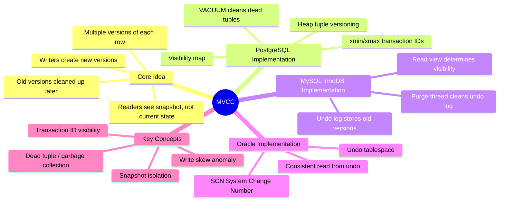

# MVCC Internals — Concept Overview

> Multi-Version Concurrency Control: how databases let readers and writers work simultaneously without locking each other out.

---

## Why This Exists

**The problem**: Without MVCC, a reader must wait for a writer to finish, and a writer must wait for readers to finish (shared/exclusive locking). Under load, this creates lock contention — queries queue behind each other, and throughput collapses.

**MVCC solution**: Instead of locking, the database keeps multiple versions of each row. Readers see a consistent snapshot (old version), writers create a new version. Readers never block writers. Writers never block readers. This is why PostgreSQL and Oracle can handle thousands of concurrent connections without lock-based bottlenecks.

## Mindmap

## How MVCC Differs From Locking

| Aspect | Lock-Based | MVCC |
|---|---|---|
| **Readers vs writers** | Block each other | Never block each other |
| **Concurrency** | Low under contention | High even under load |
| **Overhead** | Lock manager memory | Version storage + cleanup |
| **Deadlocks** | Possible | Rare (only writer-writer) |
| **Consistency** | Read latest committed | Read snapshot at query/tx start |

## Key Terminology

| Term | Definition |
|---|---|
| **MVCC** | Multi-Version Concurrency Control — concurrent access via row versioning |
| **xmin** | PostgreSQL: transaction ID that created this row version |
| **xmax** | PostgreSQL: transaction ID that deleted/updated this row version (0 if active) |
| **Snapshot** | A frozen view of which transactions are committed at a point in time |
| **Dead Tuple** | An obsolete row version that no transaction can see anymore |
| **VACUUM** | PostgreSQL process that reclaims space from dead tuples |
| **Undo Log** | InnoDB/Oracle: storage for old row versions that active transactions may still need |
| **Write Skew** | Anomaly where two transactions each read, then write based on stale reads |
