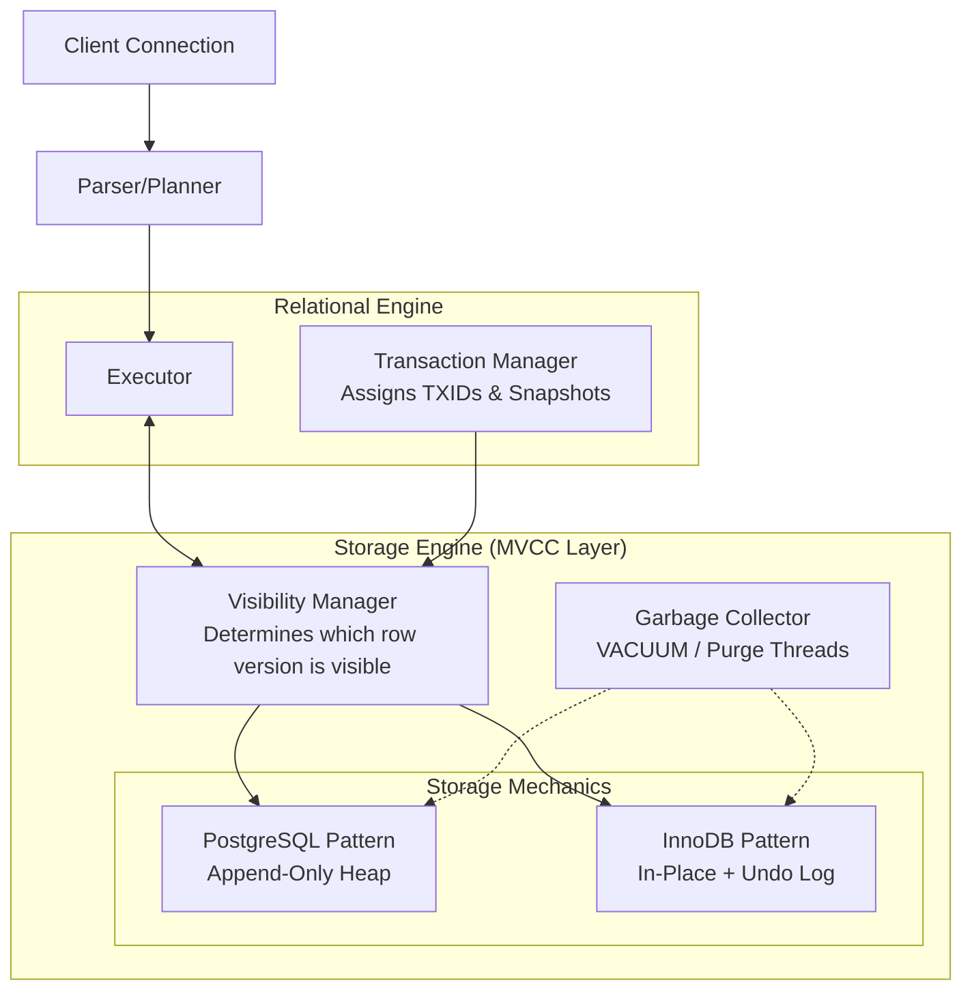

# MVCC Internals — Concept Overview

> The fundamental architecture that allows databases to achieve high concurrency by giving readers point-in-time snapshots and allowing writers to create new row versions rather than acquiring blocking locks.

---

## Why This Exists

**The Historical Problem**:
In early database systems, concurrency control relied on **Two-Phase Locking (2PL)**. If Transaction A wanted to read a row, it took a shared lock. If Transaction B wanted to update that row, it needed an exclusive lock. 
- **Result**: Readers blocked Writers, and Writers blocked Readers.
- Under high concurrent load, this created massive lock contention, stalling processing throughput and occasionally leading to deadlocks even for simple read-heavy workloads.

**The MVCC Solution**:
Multi-Version Concurrency Control (MVCC) solves this by maintaining **multiple versions of the same data**. 
- When a writer modifies a row, it doesn't overwrite the existing data in place. It creates a *new version*.
- When a reader queries the database, it is given a *snapshot* of the database at a specific point in time. It reads the older, unmodified version of the row.
- **The Golden Rule of MVCC**: *Readers never block writers, and writers never block readers.*

---

## What Value It Provides

- **Massive Concurrency**: OLTP systems can handle tens of thousands of simultaneous connections querying the same tables being actively updated.
- **Lock-Free Reads**: Analytics or reporting queries can run for hours on the operational database without blocking milliseconds-latency transactional updates.
- **Point-in-Time Recovery and Time Travel**: The historical versions inherently support viewing the database "as of" a past timestamp.

---

## Where It Fits

MVCC lives inside the **Storage Engine**, sitting exactly between the Transaction Manager and the Buffer Pool. It governs what physical bytes the executor is allowed to see.

---

## When To Use / When NOT To Use

Every modern operational database uses MVCC (PostgreSQL, MySQL/InnoDB, Oracle, SQL Server, Spanner, CockroachDB). You rarely "choose" to use it; you choose the database that implements the flavor of MVCC that matches your workload.

| Workload | PostgreSQL MVCC (Append-only) | MySQL InnoDB MVCC (Undo Logs) |
|---|---|---|
| **High Write/Update Churn** | ❌ **Poor**. Every update writes a full new row, bloats table, requires aggressive Vacuuming. | ✅ **Excellent**. Updates in-place, pushes old versions to undo log. Table size stays stable. |
| **Many Secondary Indexes** | ❌ **Poor**. Updating a non-indexed column still requires updating ALL secondary indexes (Write Amplification). | ✅ **Excellent**. Secondary indexes point to Primary Key, unaffected by non-key updates. |
| **Analytical Scans (OLAP)** | ✅ **Excellent**. Heap structure is highly optimized for sequential scans and parallel queries. | ❌ **Slower**. Clustered index structure requires traversing B-Trees for full table scans. |
| **Long-Running Reads** | ❌ **Dangerous**. Prevents Vacuum from cleaning up ANY dead rows modified since the read started. Causes massive bloat. | ⚠️ **Manageable**. Undo logs swell, but main table data remains unbloated. |

---

## Key Terminology

| Term | Definition |
|---|---|
| **Snapshot** | A point-in-time view consisting of: the current Transaction ID (TXID), a list of all currently active (uncommitted) TXIDs, and the highest committed TXID. |
| **Transaction ID (TXID)** | A strictly increasing integer assigned to transactions that modify data. Used to determine the chronological order of changes. |
| **xmin / xmax** | (PostgreSQL). The TXID that *inserted* a row (xmin) and the TXID that *deleted/updated* a row (xmax). |
| **Dead Tuple / Row** | An old version of a row that has been superseded by a newer version, and is older than the snapshot of any currently running transaction. It can be safely deleted. |
| **Write Amplification** | The ratio of physical bytes written to disk versus the logical bytes modified in the SQL statement. A major pain point in MVCC designs. |
| **VACUUM** | (PostgreSQL). The background process that scans tables for Dead Tuples, marks their space as reusable, and updates indexes. |
| **Undo Log / Rollback Segment** | (InnoDB / Oracle). The separate storage area where old row versions are kept. If a reader needs an old version, it reconstructs it from this log. |
| **TXID Wraparound** | A catastrophic failure condition where the database runs out of 32-bit transaction IDs (at 4.2 billion), requiring immediate downtime if not managed. |
