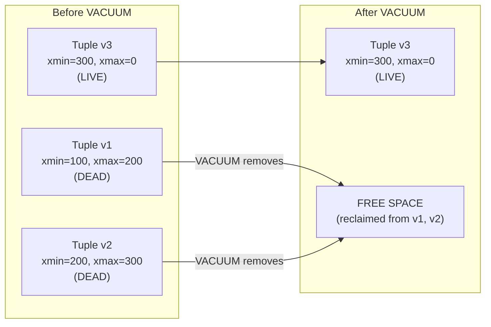
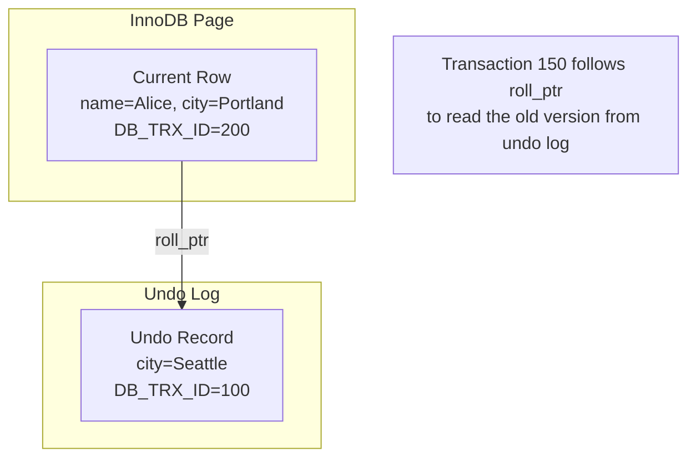

# MVCC Internals — How It Works, Deep Mechanics, War Stories, Interview

---

## PostgreSQL MVCC — Tuple Versioning

```
Row "Alice" goes through UPDATE:

BEFORE UPDATE (xid=100):
┌─────────────────────────────────────────┐
│ xmin=100 │ xmax=0 │ name="Alice" │ city="Seattle" │
└─────────────────────────────────────────┘
  ↑ This is the only version. xmax=0 means "alive"

AFTER UPDATE (xid=200 updates city to Portland):
┌─────────────────────────────────────────┐
│ xmin=100 │ xmax=200 │ name="Alice" │ city="Seattle" │  ← DEAD (xmax set)
└─────────────────────────────────────────┘
┌─────────────────────────────────────────┐
│ xmin=200 │ xmax=0   │ name="Alice" │ city="Portland" │  ← LIVE (new version)
└─────────────────────────────────────────┘

Transaction 150 (started before xid 200) still sees "Seattle"
Transaction 250 (started after xid 200 committed) sees "Portland"
```

## Visibility Rules (PostgreSQL)

```sql
-- A tuple is VISIBLE to transaction T if:
-- 1. xmin is committed AND xmin < T's snapshot
-- 2. xmax is either 0 (not deleted) OR xmax > T's snapshot OR xmax is aborted

-- Simplified pseudocode:
IF xmin_committed AND xmin < my_snapshot THEN
    IF xmax = 0 OR xmax > my_snapshot OR xmax_aborted THEN
        VISIBLE  -- I can see this row
    ELSE
        NOT VISIBLE  -- row was deleted/updated before my snapshot
    END IF
END IF
```

## VACUUM — The Garbage Collector



**Critical**: If VACUUM doesn't run, dead tuples accumulate → table bloat → full table scans read 10x more pages → cascading performance degradation.

## InnoDB MVCC (MySQL) — Undo Log Approach



**Key difference from PostgreSQL**: InnoDB stores only the CURRENT version in the data page. Old versions live in the undo log. PostgreSQL stores ALL versions in the heap (causing bloat without VACUUM).

## War Story: Uber — PostgreSQL MVCC Bloat

Uber famously abandoned PostgreSQL for MySQL in 2016, partly due to MVCC-related issues:

- Write-heavy workload creating millions of dead tuples per minute
- VACUUM couldn't keep up → table bloat reached 3-5x logical data size
- B-Tree indexes on PostgreSQL include *all* tuple versions (dead and live)
- Index scans degraded as 80% of indexed tuples were dead

**Lesson**: PostgreSQL MVCC works brilliantly for read-heavy and moderate-write workloads. For extreme write-heavy workloads (millions of updates/sec), InnoDB's undo-log approach creates less heap bloat.

## War Story: GitLab — VACUUM Freeze Storm

GitLab's PostgreSQL database experienced a "VACUUM freeze" storm: when transaction ID wraparound approached (~2 billion), aggressive VACUUM froze operations for hours on large tables, blocking all writes. Fix: autovacuum tuning with more frequent, smaller vacuum operations and monitoring `pg_stat_user_tables.n_dead_tup`.

## Pitfalls

| Pitfall | Fix |
|---|---|
| Disabling autovacuum on large tables | NEVER disable. Tune `autovacuum_vacuum_scale_factor` instead (0.01 for large tables) |
| Long-running transactions preventing VACUUM cleanup | Monitor `pg_stat_activity` for old transactions. Set `idle_in_transaction_session_timeout` |
| Not monitoring dead tuple ratio | Alert when `n_dead_tup / n_live_tup > 0.2` (20% dead tuples) |
| Write-heavy workload on PostgreSQL without VACUUM tuning | Increase `autovacuum_max_workers`, decrease `autovacuum_vacuum_cost_delay` |

## Interview

### Q: "Explain how MVCC works in PostgreSQL."

**Strong Answer**: "Each row has xmin (creating transaction) and xmax (deleting/updating transaction). An UPDATE creates a NEW row version with xmax=0 and sets xmax on the old version. Readers see the version where xmin < their snapshot and xmax is either 0, uncommitted, or > their snapshot. Old versions are dead tuples — VACUUM reclaims them. The key consequence: UPDATE writes a new tuple at a new location, which means indexes must also be updated. This is why PostgreSQL can suffer from bloat on write-heavy workloads."

### Q: "How does InnoDB's MVCC differ from PostgreSQL's?"

**Strong Answer**: "Storage location. PostgreSQL stores all versions in the heap (same table). InnoDB stores only the current version in the data page; old versions go to the undo log, linked via a rollback pointer. This means InnoDB's clustered index always has the current row, and old reads follow the pointer chain to the undo log. PostgreSQL's approach causes heap bloat requiring VACUUM. InnoDB's approach causes undo log growth but doesn't bloat the data pages."

## References

| Resource | Link |
|---|---|
| *Designing Data-Intensive Applications* | Ch. 7: Transactions |
| [PostgreSQL MVCC](https://www.postgresql.org/docs/current/mvcc.html) | Official documentation |
| [Uber's PostgreSQL -> MySQL](https://www.uber.com/blog/postgres-to-mysql-migration/) | Engineering blog (2016) |
| Cross-ref: Isolation Levels | [../02_Isolation_Levels](../02_Isolation_Levels/) |
