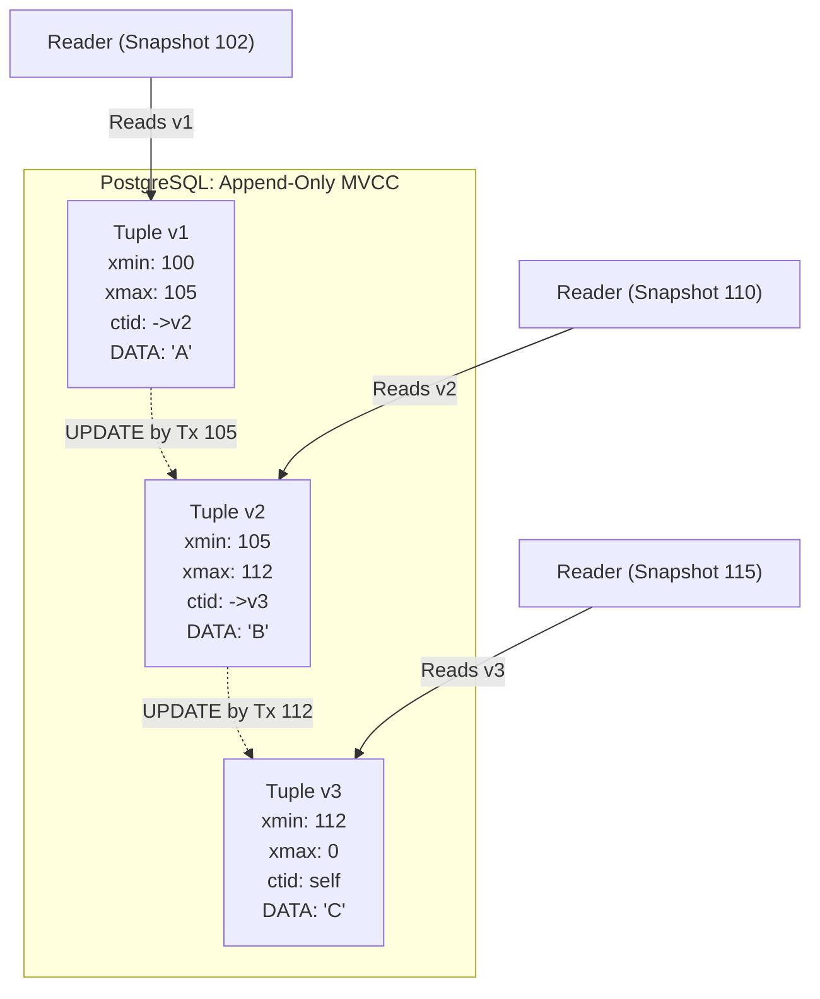
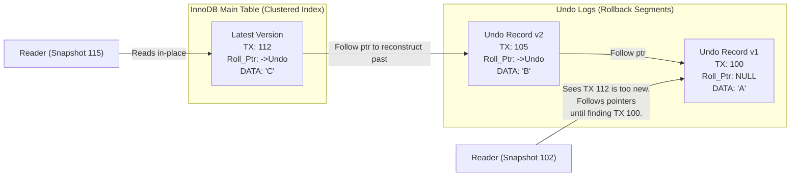
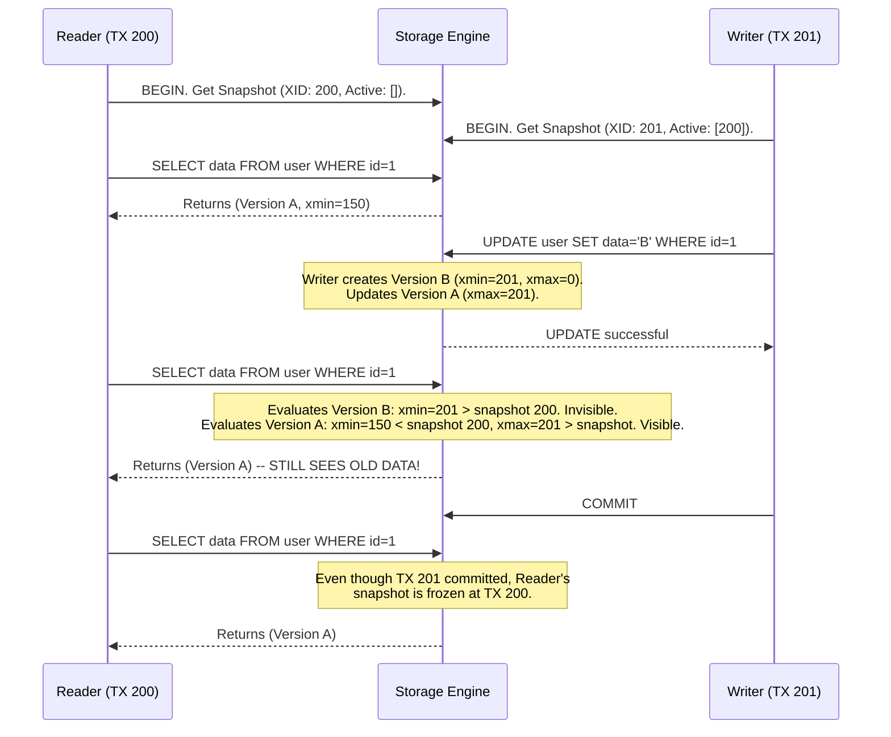
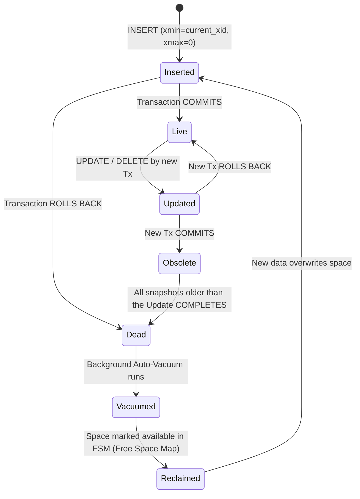

# MVCC Internals — How It Works

> Two fundamentally different architectural approaches to MVCC dominate the industry: PostgreSQL's Append-Only Heap, and MySQL/Oracle's In-Place Updates with Undo Logs.

---

## Architecture 1: The Append-Only Heap (PostgreSQL)

In PostgreSQL, every `UPDATE` is physically executed as a `DELETE` followed by an `INSERT`. The new row version and the old row version live side-by-side in the main table heap.

### PostgreSQL Tuple Header Anatomy
Every row (tuple) in a Postgres table has a 23-byte header containing MVCC routing info:
- `t_xmin`: The Transaction ID (TXID) that inserted this version.
- `t_xmax`: The TXID that deleted or updated this version (0 if it is the current, active version).
- `t_ctid`: A physical pointer (Block Number + Offset) to the newest version of this row.

### The Visibility Rules (Simplified)
When Transaction $T_r$ (with snapshot $S$) reads a row:
1. Is `xmin` uncommitted? → **Invisible** (Wait, unless $T_r$ created it).
2. Is `xmin` committed, but occurred *after* $S$ was taken? → **Invisible** (From the future).
3. Is `xmin` committed before $S$, AND `xmax` is 0 (not deleted)? → **Visible**.
4. Is `xmax` committed before $S$? → **Invisible** (It was deleted before I started).

**Consequences**: 
1. The main table grows rapidly under high update workloads.
2. Background `VACUUM` processes are required to scavenge the main table for dead tuples whose `xmax` is older than all running transactions.
3. **Write Amplification**: Updating one column in a 30-column table duplicates all 30 columns into a new physical location.
4. **Secondary Index Update**: Because the new tuple is at a new physical location (`ctid`), *every secondary index* must be updated to point to the new location, even if indexed columns weren't changed (partially mitigated by HOT - Heap Only Tuples).

---

## Architecture 2: In-Place Update with Undo Logs (MySQL InnoDB / Oracle)

In MySQL/InnoDB and Oracle, data is stored in clustered index (B-Tree) leaf nodes. Because moving data in a B-Tree is expensive, `UPDATE` statements modify the row **in place**. 

Before modifying the row, the engine copies the old version of the row (or just the diff) into a separate, dedicated storage area called the **Undo Log** (or Rollback Segment).

### Undo Log Pointer Anatomy
- `DB_TRX_ID`: The TXID of the last transaction to modify this row.
- `DB_ROLL_PTR`: A physical pointer to the previous version of this row stored inside the Undo Log.

**Consequences**:
1. The main table stays compact. No dead tuples accumulate in the primary file structure.
2. Write Amplification is vastly lower for updates. Secondary indexes usually don't need updating because the primary key (the physical location mapping) didn't change.
3. Reading historical versions is slow (you must reconstruct the row incrementally by walking the undo log chain).
4. Background `Purge` threads clean up the Undo Log, not the main tables.

---

## Sequence Diagram: Read-Write Conflict Resolution

This demonstrates exactly how MVCC provides lock-free concurrency.

---

## State Machine: Row Version Lifecycle (PostgreSQL)

How a tuple transitions from creation to garbage collection.

### The "Long-Running Transaction" Dilemma
Looking at the state machine, an `Obsolete` tuple cannot transition to `Dead` if *any* currently running transaction has a snapshot older than the transaction that obsoleted the row. 
If an analyst leaves a `SELECT` running over the weekend, vacuum *cannot* clean up any rows updated all weekend. The database will bloat massively.
