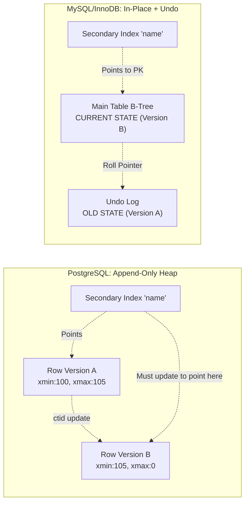

# MVCC Internals — Interview Angle

---

## Application in Architecture Interviews

MVCC represents the barrier between junior/senior database users and Principal architects. A junior developer views databases as a black box that magically executes SQL. A Principal architect knows *exactly* how the disk structures under the hood govern the behavior, performance, and failure modes of that SQL.

---

## Sample Questions

### Q1: "Explain how PostgreSQL and MySQL fundamentally differ in how they execute an UPDATE statement, and what trade-offs that creates."

**What they're testing**: Deep understanding of the divergent implementations of MVCC (Append vs Undo Logs) and Write Amplification.

**Weak Answer**: "PostgreSQL leaves old rows behind and cleans them up with Vacuum, while MySQL updates them directly." (Too shallow, misses the architectural consequence).

**Strong (Principal) Answer**: "PostgreSQL uses an Append-Only MVCC model. An `UPDATE` is physically a `DELETE` combined with an `INSERT`. This leaves 'Dead Tuples' in the heap that must be scavenged by Autovacuum. A critical downside is Write Amplification: because the physical disk address (`ctid`) of the row changes, every secondary index must be updated to point to the new location. 
Conversely, MySQL/InnoDB uses In-Place Updates paired with an Undo Log. When an `UPDATE` happens, the old version is pushed to the Undo Log, and the main B-Tree is updated in place. Because MySQL secondary indexes point to the Primary Key (not the physical disk address), an update to a non-indexed column requires zero secondary index writes. Thus, MySQL handles extremely high update-churn workloads better than Postgres."

---

### Q2: "A developer tells you they are running a nightly analytical Python script that queries a massive PostgreSQL table over a live operational replica. Within an hour, performance across the entire replica degrades. Storage alerts fire. What is happening?"

**What they're testing**: Understanding the interaction between MVCC Snapshots and Garbage Collection (Vacuum).

**Strong Answer**: "Because PostgreSQL relies on MVCC, the Python script's `SELECT` statement establishes a Read Snapshot tied to a specific Transaction ID (e.g., TXID 1000). The Golden Rule of MVCC is that no background process can garbage collect a row version if ANY active snapshot might need to see it. 
As the live replication stream applies millions of updates from the primary, millions of dead tuples are created. Autovacuum tries to clean them up, but it sees the Python script is holding Snapshot 1000 open, so it refuses to delete any dead data created after TXID 1000. 
The heap inflates. Sequential scans have to traverse massive amounts of dead space, saturating disk I/O and CPU, degrading replica performance and firing storage alerts. The fix is killing the long-running transaction and instituting max connection/transaction timeouts."

---

### Q3: "In 2016, Uber publicly wrote about abandoning PostgreSQL for MySQL, specifically citing Write Amplification. Could you theoretically 'fix' Uber's MVCC issue while staying on PostgreSQL?"

**What they're testing**: Architecture design under constraint. Schema remodeling vs Platform swapping.

**Strong Answer**: "Yes. Uber's core issue was that a frequently updating `status` column forced rewrites of the entire row and updates to 15 different secondary indexes pointing to that row. 
To stay on Postgres, we would vertically partition the table. We take the `status` column (and any other hyper-mutated columns) and put it in a separate 1:1 table called `trip_status` with NO secondary indexes. 
For MVCC, this means changing the status still does a Delete/Insert append, but the row is only 8 bytes wide instead of 800 bytes, and absolutely zero secondary indexes need updating. Write amplification plummets. We use Postgres's HOT (Heap-Only Tuples) optimization to handle the localized updates efficiently."

---

## Whiteboard Exercise (5 minutes)

Draw the fundamental contrast between Append-Only MVCC and Undo-Log MVCC.

**Talking points while drawing**: "In Postgres, the new version lives side-by-side with the old. The secondary index must write a new pointer directly to the new physical address. In MySQL, the new version overwrites the old, and the old gets shoved to an Undo Log. The secondary index doesn't have to change at all, saving massive I/O."
