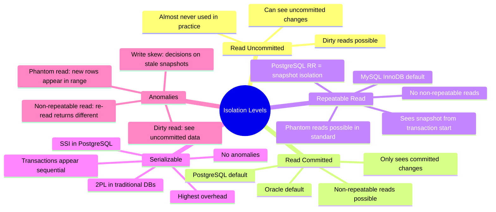

# Isolation Levels — Concept Overview & Deep Internals

> Read Uncommitted → Read Committed → Repeatable Read → Serializable: the spectrum from fast-and-dirty to slow-and-correct.

---

## Why This Exists

Isolation levels control what one transaction can see of another's uncommitted/committed changes. Higher isolation = fewer anomalies but more overhead. The default for most databases (Read Committed for PostgreSQL, Repeatable Read for MySQL) is a carefully chosen compromise.

## Mindmap



## Comparison Matrix

| Anomaly | Read Uncommitted | Read Committed | Repeatable Read | Serializable |
|---|---|---|---|---|
| **Dirty Read** | ❌ Possible | ✅ Prevented | ✅ Prevented | ✅ Prevented |
| **Non-Repeatable Read** | ❌ Possible | ❌ Possible | ✅ Prevented | ✅ Prevented |
| **Phantom Read** | ❌ Possible | ❌ Possible | ⚠️ Depends on engine | ✅ Prevented |
| **Write Skew** | ❌ Possible | ❌ Possible | ❌ Possible | ✅ Prevented |
| **Performance** | Fastest | Fast | Moderate | Slowest |
| **Default In** | — | PostgreSQL, Oracle | MySQL InnoDB | — |

## Write Skew — The Subtle Anomaly

```sql
-- SCENARIO: Hospital rule: "At least 1 doctor must be on call"
-- Currently: Alice ON CALL, Bob ON CALL

-- Transaction 1 (Alice):                    -- Transaction 2 (Bob):
BEGIN;                                        BEGIN;
SELECT COUNT(*) FROM on_call                  SELECT COUNT(*) FROM on_call
WHERE status = 'ON_CALL'; -- returns 2       WHERE status = 'ON_CALL'; -- returns 2

-- "2 on call, safe for me to go off"        -- "2 on call, safe for me to go off"
UPDATE on_call SET status='OFF'               UPDATE on_call SET status='OFF'
WHERE doctor='Alice';                         WHERE doctor='Bob';
COMMIT;                                       COMMIT;

-- RESULT: Both went off call! 0 doctors on call!
-- Under Repeatable Read: BOTH transactions saw "2 on call" (snapshot)
-- Under Serializable: Second transaction would ABORT (conflict detected)
```

## PostgreSQL SSI (Serializable Snapshot Isolation)

```sql
-- PostgreSQL's serializable uses SSI — optimistic concurrency
-- No locks until commit time. At commit, checks for conflicts.

BEGIN ISOLATION LEVEL SERIALIZABLE;
SELECT COUNT(*) FROM on_call WHERE status = 'ON_CALL';
-- returns 2
UPDATE on_call SET status = 'OFF' WHERE doctor = 'Alice';
COMMIT;
-- If another transaction read the same data and committed a conflicting write,
-- this COMMIT raises: ERROR: could not serialize access due to read/write dependencies
```

## War Story: Coinbase — Write Skew in Financial Transactions

Coinbase discovered a write skew bug where two concurrent withdrawals could each pass the balance check (both see $1000 balance) and both execute ($800 withdrawal each), resulting in a -$600 balance. The fix: upgrading critical withdrawal transactions from Repeatable Read to Serializable isolation, accepting the ~15% performance overhead for financial correctness.

## Pitfalls

| Pitfall | Fix |
|---|---|
| Assuming Repeatable Read prevents all anomalies | It doesn't prevent write skew. Use Serializable for critical consistency |
| Using Serializable for all transactions | Only use for transactions where correctness outweighs performance cost |
| Not handling serialization failures in application code | At Serializable, the DB may abort transactions. Application MUST retry |
| Confusing MySQL RR with PostgreSQL RR | MySQL's RR uses gap locks to prevent phantoms. PostgreSQL's RR is snapshot isolation |

## Interview — Q: "What isolation level would you use for a banking system?"

**Strong Answer**: "Serializable for balance-modifying transactions (transfers, withdrawals) to prevent write skew and phantom anomalies. Read Committed for read-only queries (balance checks, statement generation) where snapshot-level anomalies are acceptable. I'd implement retry logic in the application for serialization failures — under SSI, ~1-5% of transactions may need retry under moderate contention."

## References

| Resource | Link |
|---|---|
| *Designing Data-Intensive Applications* | Ch. 7: Weak Isolation Levels |
| [PostgreSQL Transaction Isolation](https://www.postgresql.org/docs/current/transaction-iso.html) | Official docs |
| [A Critique of ANSI SQL Isolation Levels](https://www.microsoft.com/en-us/research/wp-content/uploads/2016/02/tr-95-51.pdf) | Berenson et al. (1995) |
| Cross-ref: MVCC | [../01_MVCC_Internals](../01_MVCC_Internals/) |
| Cross-ref: Distributed Consensus | [../03_Distributed_Consensus](../03_Distributed_Consensus/) |
