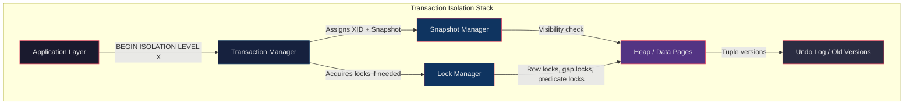
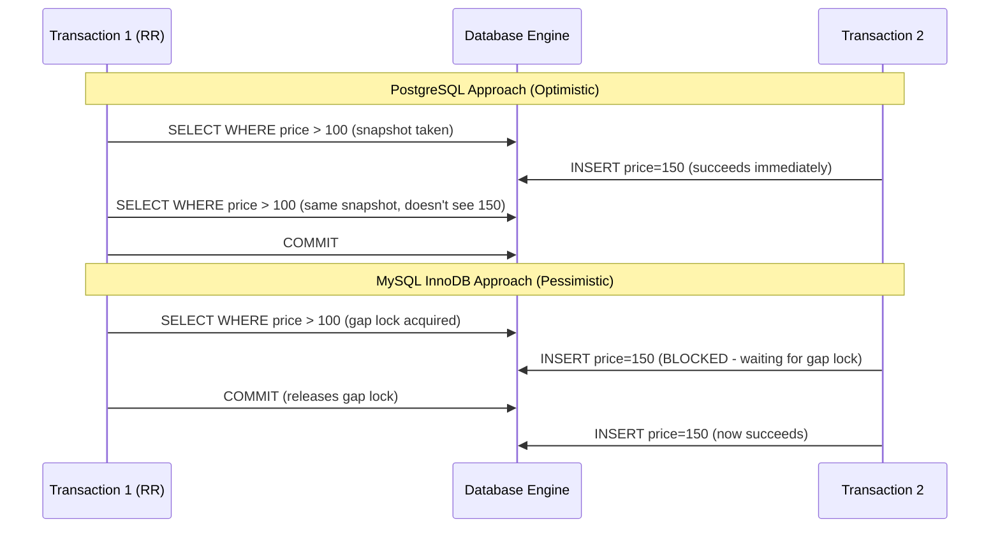
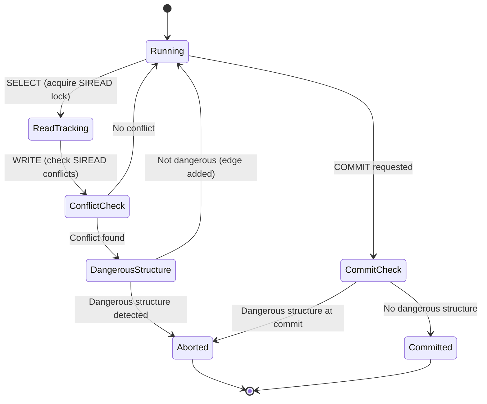
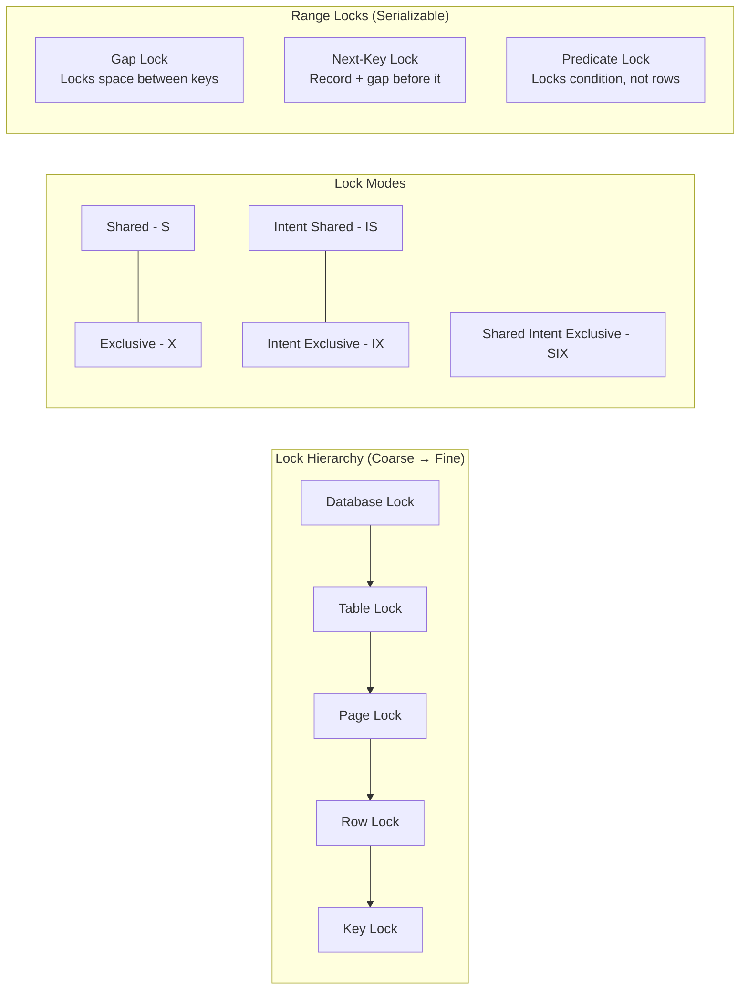
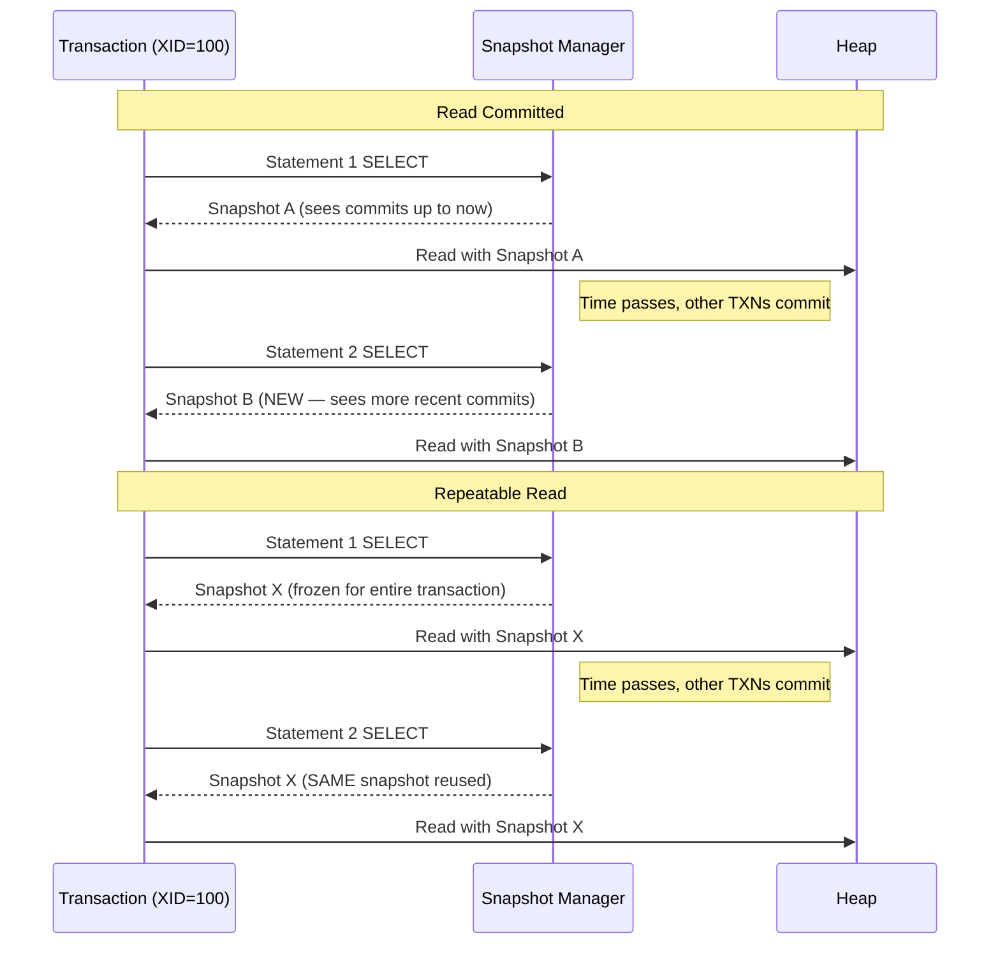
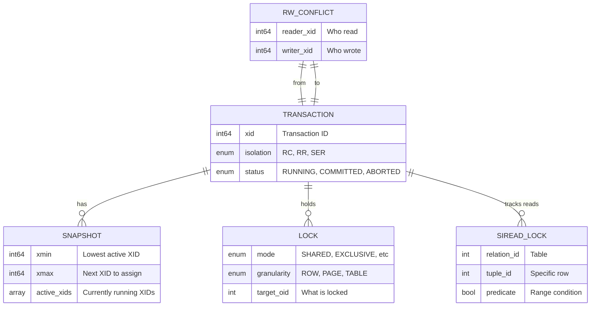

# Isolation Levels — How It Works — Deep Internals

> There is no single "isolation levels" implementation. PostgreSQL, MySQL, Oracle, and SQL Server each implement isolation differently — and the differences cause production bugs that take weeks to debug.

---

## 1. Two Fundamental Mechanisms

Every RDBMS implements isolation using one or both of these:

| Mechanism | How It Works | Used By |
|---|---|---|
| **2PL (Two-Phase Locking)** | Transactions acquire locks before accessing data. Locks are held until commit/abort. Conflicts block. | SQL Server (default), MySQL (partially), Oracle (partially) |
| **MVCC (Multi-Version Concurrency Control)** | Each transaction sees a consistent snapshot. Writes create new versions, not overwrite. Reads never block writes. | PostgreSQL, MySQL InnoDB, Oracle |

Most modern engines use **MVCC + selective locking** — pure 2PL is too slow for OLTP workloads.

---

## 2. High-Level Architecture



---

## 3. Read Committed — Implementation Mechanics

### PostgreSQL (MVCC-based)

**Each SQL statement** within a transaction gets a fresh snapshot.

```text
Execution Flow:
1. BEGIN → Transaction gets XID = 100
2. SELECT ... → Snapshot taken at statement start
   - Visibility rule: see all XIDs < 100 that committed BEFORE this statement started
   - Each tuple has (xmin, xmax) — creation and deletion XIDs
3. Another SELECT ... → NEW snapshot taken
   - Now sees any commits that happened between statement 1 and statement 2
```

**Critical detail**: Two SELECTs in the same transaction can return different results.

### MySQL InnoDB (MVCC + Undo Logs)

InnoDB also uses MVCC for Read Committed, but with a twist:
- Uses **undo logs** to reconstruct old versions (PostgreSQL stores versions in-heap)
- Each consistent read creates a new **ReadView** per statement
- ReadView contains: `m_low_limit_id` (next XID to be assigned), `m_up_limit_id` (lowest active XID), `m_ids` (list of active XIDs)

### Oracle

Oracle invented MVCC (they call it "Read Consistency"). Uses **undo segments** (rollback segments). Each query reconstructs blocks from undo if the block's SCN (System Change Number) is newer than the query's snapshot SCN.

**ORA-01555 "Snapshot Too Old"** — If a long query needs to reconstruct a block but the undo has been overwritten, the query fails. This does NOT exist in PostgreSQL (old versions are in-heap until VACUUM).

---

## 4. Repeatable Read — Implementation Mechanics

### PostgreSQL (Snapshot Isolation)

```text
Execution Flow:
1. BEGIN ISOLATION LEVEL REPEATABLE READ → XID = 200
2. First SELECT → Snapshot taken (this snapshot is FROZEN for the entire transaction)
   - All subsequent SELECTs see the SAME snapshot
   - Sees all XIDs < 200 that committed BEFORE the snapshot
3. Another transaction commits INSERT of new row (XID = 201)
4. Second SELECT → SAME snapshot → does NOT see the new row
   - This is TRUE snapshot isolation
```

**PostgreSQL's RR = Snapshot Isolation (SI)**, which is STRONGER than the SQL standard's definition of Repeatable Read. PostgreSQL's RR prevents phantom reads. The SQL standard allows phantoms at RR.

### MySQL InnoDB (Snapshot + Gap Locks)

MySQL takes a fundamentally different approach:

```text
Execution Flow:
1. BEGIN → Consistent ReadView created at first consistent read
2. SELECT ... WHERE price > 100 → ReadView frozen (like PostgreSQL)
3. But InnoDB also acquires GAP LOCKS for any range scans:
   - Locks the "gaps" between index records to prevent inserts
   - This is a PESSIMISTIC approach to preventing phantoms
4. Another transaction tries: INSERT INTO products (price) VALUES (150)
   - BLOCKED by the gap lock until Transaction 1 commits/aborts
```

**Key difference**: PostgreSQL allows the insert but hides it via snapshot. MySQL blocks the insert entirely.



---

## 5. Serializable — Implementation Mechanics

### PostgreSQL SSI (Serializable Snapshot Isolation)

PostgreSQL uses **SSI** — an optimistic protocol based on the research paper by Cahill et al. (2008).

**How SSI works internally:**

```text
Data Structures:
1. SIREAD locks — lightweight "locks" that don't block, only track what was read
2. RW-conflict graph — directed graph of read-write dependencies between transactions
3. Dangerous structure detector — looks for cycles (T1 →rw T2 →rw T3 →rw T1)

Execution Flow:
1. Transaction reads data → SIREAD lock recorded (no blocking)
2. Transaction writes data → Check if write conflicts with any SIREAD lock
3. If conflict found → Add edge to RW-conflict graph
4. At commit time → Check if this transaction is part of a "dangerous structure"
   - Dangerous = two consecutive rw-dependencies where middle txn committed first
5. If dangerous → ABORT with "could not serialize access"
6. If safe → COMMIT

Key insight: SSI aborts at commit time, not at conflict time. 
This means it allows MORE concurrency than traditional 2PL.
```



### MySQL InnoDB (Gap Locks + Next-Key Locks)

MySQL's Serializable = **Repeatable Read + all SELECTs automatically become `SELECT ... LOCK IN SHARE MODE`**.

Every plain `SELECT` acquires shared locks, which means:
- Readers block writers
- Writers block readers  
- Gap locks prevent phantom inserts

This is essentially 2PL behavior — much more pessimistic than PostgreSQL's SSI.

### SQL Server (Traditional 2PL by default)

SQL Server uses strict Two-Phase Locking:
- Shared (S) locks for reads, Exclusive (X) locks for writes
- Locks held until end of transaction
- Key-range locks prevent phantoms at Serializable level
- Result: high lock contention, frequent deadlocks under load

SQL Server also offers **Snapshot Isolation** (RCSI/SI) as opt-in MVCC alternative via `ALTER DATABASE SET READ_COMMITTED_SNAPSHOT ON`.

---

## 6. Lock Types and Their Granularity



### Lock Compatibility Matrix (SQL Server / MySQL)

| Request \ Held | S | X | IS | IX |
|---|---|---|---|---|
| **S (Shared)** | ✅ | ❌ | ✅ | ❌ |
| **X (Exclusive)** | ❌ | ❌ | ❌ | ❌ |
| **IS (Intent Shared)** | ✅ | ❌ | ✅ | ✅ |
| **IX (Intent Exclusive)** | ❌ | ❌ | ✅ | ✅ |

---

## 7. Visibility Rules — The Core Algorithm

### PostgreSQL Tuple Visibility

Every heap tuple has a header with `xmin` (creating XID) and `xmax` (deleting XID):

```text
Visibility Check Algorithm (simplified):

function is_visible(tuple, snapshot):
    // Was the creating transaction committed before our snapshot?
    if tuple.xmin NOT IN snapshot.active_xids 
       AND tuple.xmin < snapshot.xmax
       AND tuple.xmin is committed:
        
        // Was the tuple deleted?
        if tuple.xmax is invalid:
            return VISIBLE  // Not deleted
        
        if tuple.xmax IN snapshot.active_xids 
           OR tuple.xmax >= snapshot.xmax:
            return VISIBLE  // Deletion not yet visible to us
        
        if tuple.xmax is committed:
            return NOT_VISIBLE  // Deleted and committed
    
    return NOT_VISIBLE
```

### Read Committed vs Repeatable Read — The Snapshot Difference



---

## 8. Write Conflict Detection

### At Repeatable Read (PostgreSQL)

PostgreSQL detects **first-updater-wins**:

```text
1. T1 reads row R (version v1)
2. T2 reads row R (version v1) 
3. T1 updates row R → creates version v2, sets R.xmax = T1
4. T2 tries to update row R:
   - Sees R.xmax = T1 (someone else modified it)
   - Waits for T1 to commit or abort
   - If T1 COMMITS → T2 ABORTS with "could not serialize access"
   - If T1 ABORTS → T2 proceeds with update
```

### At Serializable (PostgreSQL SSI)

SSI detects more anomalies including **write skew** through the rw-conflict graph.

---

## 9. Entity-Relationship: Internal Structures



---

## 10. Performance Characteristics

| Level | Reads Block Writes | Writes Block Reads | Deadlock Risk | Abort Rate | Throughput (relative) |
|---|---|---|---|---|---|
| **Read Uncommitted** | No | No | Minimal | ~0% | 100% |
| **Read Committed** | No (MVCC) | No (MVCC) | Low | <1% | ~95% |
| **Repeatable Read** | No (PG) / Yes (MySQL gaps) | No (PG) / Partial (MySQL) | Medium (MySQL) | 1-3% | ~85% |
| **Serializable** | No (PG SSI) / Yes (MySQL, SS) | No (PG SSI) / Yes (MySQL, SS) | High (2PL) / Low (SSI) | 1-5% (SSI) | ~70-80% (SSI) / ~50% (2PL) |

> **Key insight**: PostgreSQL's SSI achieves Serializable with only 15-20% overhead over Read Committed because it never blocks. MySQL and SQL Server's lock-based Serializable can cost 50%+ throughput.
