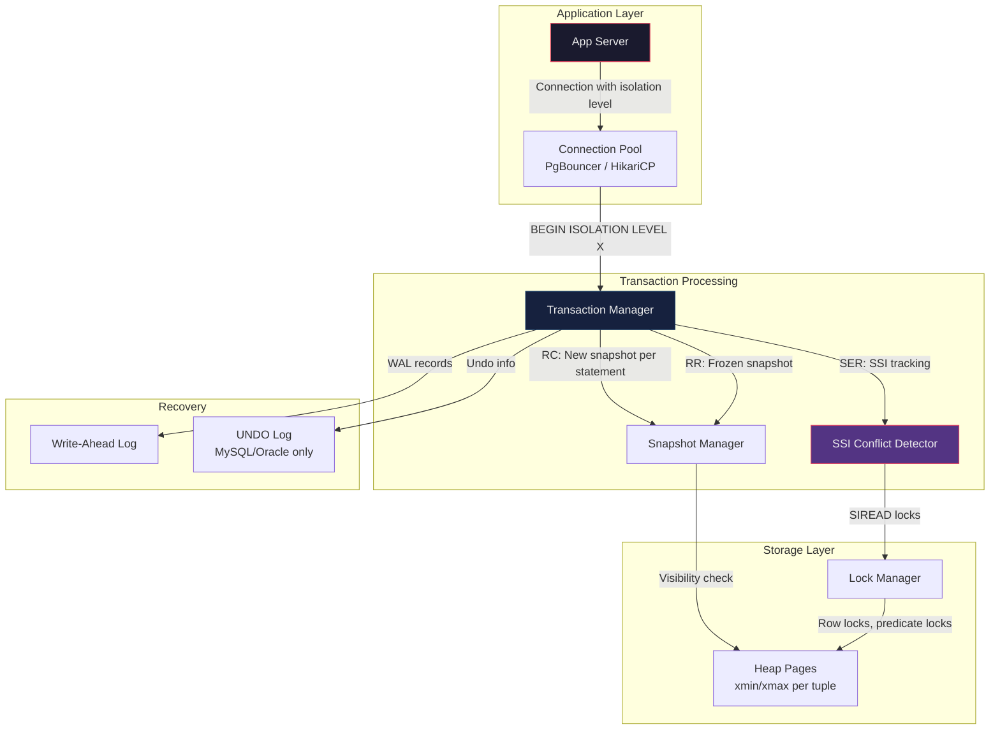

# Isolation Levels — Hands-On Examples

> Every example below can be run in two terminal windows connected to the same database. The point is to **see** the anomalies, not just read about them.

---

## 1. Proving Dirty Reads (Read Uncommitted)

MySQL is one of the few production databases that actually supports Read Uncommitted.

```sql
-- TERMINAL 1 (MySQL)
SET TRANSACTION ISOLATION LEVEL READ UNCOMMITTED;
BEGIN;
UPDATE accounts SET balance = 0 WHERE id = 1;  -- Don't commit yet!

-- TERMINAL 2 (MySQL)
SET TRANSACTION ISOLATION LEVEL READ UNCOMMITTED;
BEGIN;
SELECT balance FROM accounts WHERE id = 1;
-- Returns: 0  ← DIRTY READ! Transaction 1 hasn't committed.
-- If T1 rolls back, T2 made a decision based on data that never existed.

-- TERMINAL 1
ROLLBACK;  -- The balance was NEVER actually 0.
```

**PostgreSQL note**: PostgreSQL ignores Read Uncommitted — it silently upgrades to Read Committed. You cannot produce a dirty read in PostgreSQL.

---

## 2. Proving Non-Repeatable Reads (Read Committed)

```sql
-- Setup
CREATE TABLE products (id INT PRIMARY KEY, price DECIMAL(10,2));
INSERT INTO products VALUES (1, 100.00);

-- TERMINAL 1 (PostgreSQL — Read Committed is default)
BEGIN;
SELECT price FROM products WHERE id = 1;
-- Returns: 100.00

-- TERMINAL 2
BEGIN;
UPDATE products SET price = 200.00 WHERE id = 1;
COMMIT;

-- TERMINAL 1 (same transaction, second read)
SELECT price FROM products WHERE id = 1;
-- Returns: 200.00  ← NON-REPEATABLE READ!
-- Same transaction, same query, different result.
-- At Repeatable Read, this would still return 100.00.
COMMIT;
```

---

## 3. Proving Phantom Reads

```sql
-- Setup
CREATE TABLE orders (
    id SERIAL PRIMARY KEY,
    customer_id INT,
    total DECIMAL(10,2)
);
INSERT INTO orders (customer_id, total) VALUES (1, 50.00), (1, 75.00);

-- TERMINAL 1 (PostgreSQL — Read Committed)
BEGIN;
SELECT COUNT(*), SUM(total) FROM orders WHERE customer_id = 1;
-- Returns: count=2, sum=125.00

-- TERMINAL 2
BEGIN;
INSERT INTO orders (customer_id, total) VALUES (1, 200.00);
COMMIT;

-- TERMINAL 1 (same transaction)
SELECT COUNT(*), SUM(total) FROM orders WHERE customer_id = 1;
-- Returns: count=3, sum=325.00  ← PHANTOM ROW appeared!
COMMIT;
```

### Proving Repeatable Read Prevents Phantoms in PostgreSQL

```sql
-- TERMINAL 1
BEGIN ISOLATION LEVEL REPEATABLE READ;
SELECT COUNT(*), SUM(total) FROM orders WHERE customer_id = 1;
-- Returns: count=2, sum=125.00

-- TERMINAL 2
INSERT INTO orders (customer_id, total) VALUES (1, 300.00);
-- Succeeds immediately in PostgreSQL (no gap locks)

-- TERMINAL 1 (same transaction)
SELECT COUNT(*), SUM(total) FROM orders WHERE customer_id = 1;
-- Returns: count=2, sum=125.00  ← Snapshot prevents phantom!
COMMIT;
```

---

## 4. Proving Write Skew (The Hospital On-Call Bug)

This is the **most important** anomaly for Principal-level interviews.

```sql
-- Setup
CREATE TABLE on_call (
    doctor VARCHAR(50) PRIMARY KEY,
    status VARCHAR(10) CHECK (status IN ('ON', 'OFF'))
);
INSERT INTO on_call VALUES ('Alice', 'ON'), ('Bob', 'ON');

-- Constraint: At least 1 doctor must always be ON call.

-- TERMINAL 1 (Repeatable Read)
BEGIN ISOLATION LEVEL REPEATABLE READ;
SELECT COUNT(*) FROM on_call WHERE status = 'ON';
-- Returns: 2. "Safe to go off call."

-- TERMINAL 2 (Repeatable Read)
BEGIN ISOLATION LEVEL REPEATABLE READ;
SELECT COUNT(*) FROM on_call WHERE status = 'ON';
-- Returns: 2. "Safe to go off call."

-- TERMINAL 1
UPDATE on_call SET status = 'OFF' WHERE doctor = 'Alice';
COMMIT;  -- Succeeds!

-- TERMINAL 2
UPDATE on_call SET status = 'OFF' WHERE doctor = 'Bob';
COMMIT;  -- Succeeds!

-- CHECK:
SELECT * FROM on_call;
-- Alice: OFF, Bob: OFF
-- ZERO doctors on call! Write skew occurred.
```

### Fix: Use Serializable

```sql
-- Re-run with SERIALIZABLE
-- TERMINAL 1
BEGIN ISOLATION LEVEL SERIALIZABLE;
SELECT COUNT(*) FROM on_call WHERE status = 'ON';
UPDATE on_call SET status = 'OFF' WHERE doctor = 'Alice';
COMMIT;  -- Succeeds

-- TERMINAL 2
BEGIN ISOLATION LEVEL SERIALIZABLE;
SELECT COUNT(*) FROM on_call WHERE status = 'ON';
UPDATE on_call SET status = 'OFF' WHERE doctor = 'Bob';
COMMIT;
-- ERROR: could not serialize access due to read/write dependencies
-- among transactions
-- DETAIL: Reason code: Canceled on identification as a pivot...
```

### Alternative Fix: Explicit Locking (without Serializable)

```sql
-- Use SELECT ... FOR UPDATE to force conflict detection at RR
BEGIN ISOLATION LEVEL REPEATABLE READ;
SELECT COUNT(*) FROM on_call WHERE status = 'ON' FOR UPDATE;
-- This acquires row locks on all ON-call rows
-- Now T2's SELECT FOR UPDATE will BLOCK until T1 commits
UPDATE on_call SET status = 'OFF' WHERE doctor = 'Alice';
COMMIT;
```

---

## 5. MySQL vs PostgreSQL Gap Lock Demonstration

```sql
-- Setup (MySQL InnoDB)
CREATE TABLE inventory (
    id INT PRIMARY KEY,
    quantity INT,
    INDEX idx_qty (quantity)
);
INSERT INTO inventory VALUES (1, 10), (5, 50), (10, 100);

-- TERMINAL 1 (MySQL, Repeatable Read — default)
BEGIN;
SELECT * FROM inventory WHERE quantity BETWEEN 20 AND 80 FOR UPDATE;
-- Returns: (5, 50)
-- InnoDB acquires a GAP LOCK on the range (10, 50] and [50, 100)

-- TERMINAL 2 (MySQL)
BEGIN;
INSERT INTO inventory VALUES (3, 30);
-- BLOCKED! The gap lock prevents inserts in the range.
-- This would succeed in PostgreSQL (no gap locks at RR).
```

---

## 6. Serialization Failure Retry Pattern (Application Code)

Any application using Serializable MUST implement retry logic:

```python
import psycopg2
import time

def execute_with_retry(conn_params, operation, max_retries=5):
    """
    Execute a database operation with serialization failure retry.
    This is MANDATORY for Serializable isolation.
    """
    for attempt in range(max_retries):
        conn = psycopg2.connect(**conn_params)
        conn.set_isolation_level(
            psycopg2.extensions.ISOLATION_LEVEL_SERIALIZABLE
        )
        try:
            with conn.cursor() as cur:
                operation(cur)
            conn.commit()
            return  # Success
            
        except psycopg2.errors.SerializationFailure as e:
            conn.rollback()
            # Exponential backoff with jitter
            wait = (2 ** attempt) * 0.1 + random.uniform(0, 0.1)
            print(f"Serialization failure (attempt {attempt+1}), "
                  f"retrying in {wait:.2f}s...")
            time.sleep(wait)
            
        except Exception as e:
            conn.rollback()
            raise  # Non-retriable error
            
        finally:
            conn.close()
    
    raise Exception(f"Failed after {max_retries} retries")


# Usage:
def withdraw(cur):
    cur.execute("SELECT balance FROM accounts WHERE id = 1")
    balance = cur.fetchone()[0]
    if balance >= 100:
        cur.execute("UPDATE accounts SET balance = balance - 100 WHERE id = 1")
    else:
        raise ValueError("Insufficient funds")

execute_with_retry(
    {"dbname": "bank", "user": "app"},
    withdraw
)
```

---

## 7. Observing Lock Contention (PostgreSQL)

```sql
-- Query to see current locks in PostgreSQL
SELECT 
    pid,
    locktype,
    relation::regclass AS table,
    mode,
    granted,
    wait_start
FROM pg_locks
WHERE relation IS NOT NULL
ORDER BY wait_start NULLS LAST;

-- Query to see blocked queries
SELECT
    blocked.pid AS blocked_pid,
    blocked.query AS blocked_query,
    blocking.pid AS blocking_pid,
    blocking.query AS blocking_query,
    age(now(), blocked.query_start) AS waiting_duration
FROM pg_stat_activity AS blocked
JOIN pg_locks AS blocked_locks ON blocked.pid = blocked_locks.pid
JOIN pg_locks AS blocking_locks ON blocked_locks.relation = blocking_locks.relation
    AND blocked_locks.pid != blocking_locks.pid
JOIN pg_stat_activity AS blocking ON blocking_locks.pid = blocking.pid
WHERE NOT blocked_locks.granted;
```

---

## 8. Before vs After: Choosing the Right Level

| Scenario | Wrong Choice | Right Choice | Why |
|---|---|---|---|
| Balance check + withdrawal | Read Committed | Serializable (with retry) | Write skew: two withdrawals can overdraw |
| Dashboard analytics query | Serializable | Read Committed | No correctness risk, avoid unnecessary aborts |
| Inventory reservation | Read Committed | Repeatable Read + `FOR UPDATE` | Prevents double-booking same item |
| Audit log append-only | Repeatable Read | Read Committed | Append-only = no read-write conflicts possible |
| Report generation (long query) | Serializable | Repeatable Read | Long transactions at Serializable create massive abort storms |

---

## 9. Integration Diagram


