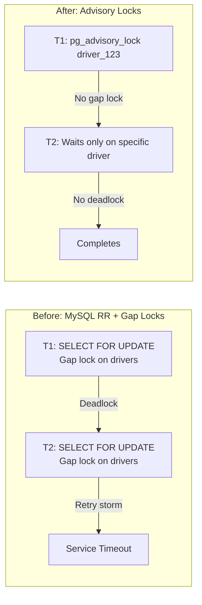
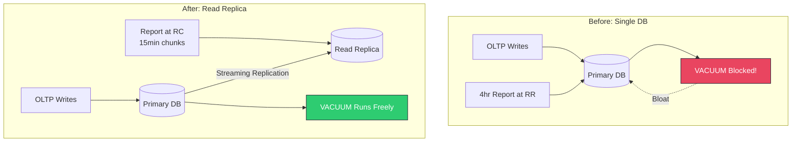
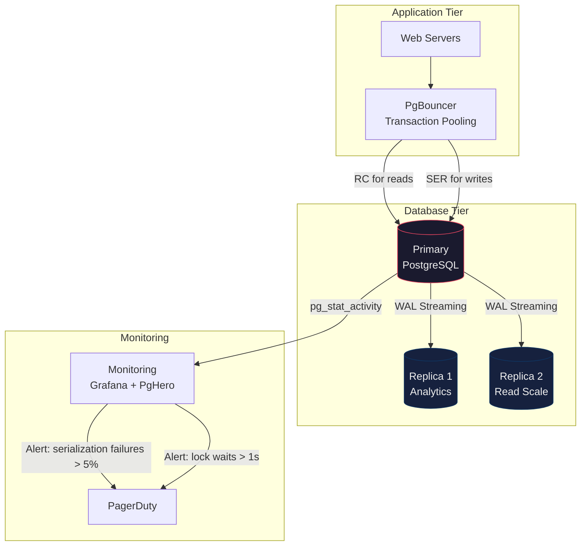

# Isolation Levels — FAANG War Stories & Real-World Scenarios

> Every company listed below learned about isolation levels the hard way — through production incidents, lost money, or corrupted data.

---

## Case Study 1: Coinbase — Write Skew in Cryptocurrency Withdrawals

**Scale**: ~$50B in trading volume, millions of concurrent users

**What Happened**:
Coinbase discovered that two concurrent withdrawal requests for the same user account could both pass the balance check and both execute. The sequence:

```text
Timeline:
T1 (Withdrawal A): SELECT balance WHERE user_id=X  → $1,000
T2 (Withdrawal B): SELECT balance WHERE user_id=X  → $1,000 (same snapshot)
T1: UPDATE balance = balance - 800  → $200
T1: COMMIT ✅
T2: UPDATE balance = balance - 800  → -$600
T2: COMMIT ✅  ← Balance is now NEGATIVE
```

**Root Cause**: The application used PostgreSQL's default Read Committed isolation. Both transactions saw $1,000 because they each got independent snapshots. Neither detected the other's write.

**The Fix**:
1. Upgraded financial transaction paths to `SERIALIZABLE` isolation
2. Implemented application-layer retry logic for serialization failures (~3% retry rate under normal load)
3. Added a `CHECK (balance >= 0)` constraint as a safety net — but this alone doesn't prevent write skew; it only catches the symptom

**Performance Impact**: ~15% increase in transaction latency for withdrawal operations. Acceptable for financial correctness.

---

## Case Study 2: Uber — Gap Lock Deadlocks in MySQL at Scale

**Scale**: ~100M trips/day generating billions of database operations

**What Happened**:
Uber's trip-matching system ran on MySQL InnoDB with Repeatable Read (default). As trip volume grew, the team observed exponentially increasing deadlock rates during peak hours. Deadlock detection was consuming significant CPU, and the retry storms were cascading into service timeouts.

**Root Cause**: InnoDB's gap locks at Repeatable Read.

```text
The Pattern:
1. Transaction A: SELECT ... WHERE city='SF' AND status='available' FOR UPDATE
   → Gap lock acquired on the range of available drivers in SF
2. Transaction B: SELECT ... WHERE city='SF' AND status='available' FOR UPDATE
   → Tries to acquire same gap lock → BLOCKED
3. Transaction A: INSERT INTO trips (driver_id, ...) VALUES (...)
   → Needs gap lock in trips table
4. Transaction B: INSERT INTO trips (driver_id, ...) VALUES (...)
   → Also needs gap lock in trips table
5. DEADLOCK: A holds gap-lock on drivers, waits for gap-lock on trips
              B holds gap-lock on trips, waits for gap-lock on drivers
```

**The Fix**:
1. Moved hot-path operations to Read Committed to eliminate gap locks
2. Replaced `SELECT ... FOR UPDATE` with application-level **advisory locks** (`SELECT pg_advisory_lock(driver_id)`)
3. Eventually migrated critical paths from MySQL to a custom in-house system using CockroachDB with SSI



---

## Case Study 3: GitHub — Serialization Failures Under Load

**Scale**: 300M+ repositories, billions of Git operations/day

**What Happened**:
GitHub uses PostgreSQL extensively. When they experimented with Serializable isolation for repository permission checks (to prevent TOCTOU race conditions), they observed:

- **Normal load**: 1-2% serialization failure rate. Manageable with retries.
- **Spike events** (e.g., a viral repo, GitHub Actions storms): Failure rate jumped to 30-40%. Retry storms created positive feedback loops that crashed connection pools.

**Root Cause**: SSI's conflict detection scales with the number of concurrent transactions touching overlapping data. During spikes, the rw-conflict graph grew explosively, triggering massive abort cascades.

**The Fix**:
1. **Selective Serializable**: Only used for the 3 most critical write paths. Everything else stays at Read Committed.
2. **Circuit breaker**: If serialization failure rate exceeds 10% in a 5-second window, temporarily downgrade to Repeatable Read with explicit `FOR UPDATE` locks.
3. **Connection pool sizing**: Increased pool size specifically for Serializable connections to absorb retry bursts.

**Lesson**: Serializable is not a "set and forget" configuration. You must monitor failure rates and have a degradation strategy.

---

## Case Study 4: Shopify — MySQL Read Committed vs PostgreSQL Read Committed

**Scale**: Processing 10% of global e-commerce

**What Happened**:
During a migration from MySQL to PostgreSQL, the Shopify team discovered that the "same" isolation level behaved differently:

| Behavior | MySQL Read Committed | PostgreSQL Read Committed |
|---|---|---|
| **Locking reads** | `SELECT ... FOR UPDATE` blocks other FOR UPDATE on same rows | Same behavior |
| **Plain reads** | Use consistent read (MVCC), see only committed data | Same behavior |
| **UPDATE ... WHERE** | Acquires **row lock** on matching rows | Acquires row lock on matching rows |
| **Non-matching rows during UPDATE** | Releases lock immediately after evaluation | Same behavior |
| **Consistent read scope** | Latest committed version per statement | Latest committed version per statement |

The subtle difference: MySQL's Read Committed still acquires **short-duration row locks** during UPDATE evaluation (even for non-matching rows), which PostgreSQL's MVCC avoids entirely. At Shopify's scale, this caused 5x more lock-wait timeouts on MySQL compared to PostgreSQL for the same workload.

---

## Case Study 5: Netflix — Long-Running Report Queries vs OLTP

**Scale**: 200M+ subscribers, complex billing analytics

**What Happened**:
A nightly analytics report ran at Repeatable Read to get a consistent view of billing data. The report took 4 hours. Meanwhile, the OLTP billing system was continuously updating customer records.

**PostgreSQL Problem**: The long RR transaction prevented `VACUUM` from cleaning up dead tuples modified after the transaction's snapshot. The `customers` table bloated from 10GB to 80GB over a week, causing index scans to degrade from 2ms to 200ms.

**The Fix**:
1. Moved long-running analytics to a **read replica** with `hot_standby_feedback = on`
2. Set `old_snapshot_threshold = 1h` on the primary to limit VACUUM blocking
3. Rewrote the report to use Read Committed with application-level checkpointing (process in 15-minute chunks, each with its own transaction)



---

## Deployment Topology: Isolation in Distributed Systems


