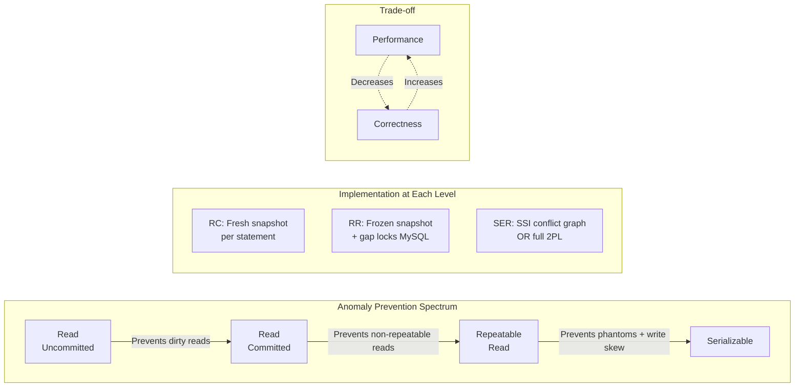

# Isolation Levels — Interview Angle

> Isolation levels are one of the top 3 questions in database system design interviews. The interviewer is testing whether you understand the trade-offs — not just the definitions.

---

## How This Appears in Interviews

| Format | What They Ask | What They're Really Testing |
|---|---|---|
| **System Design** | "Design a payment system. How do you prevent double-spending?" | Do you know about write skew? Can you choose the right isolation level? |
| **Deep Dive** | "Explain the difference between PostgreSQL RR and MySQL RR" | Do you understand implementation differences beneath identical SQL standard names? |
| **Behavioral** | "Tell me about a production bug caused by concurrency" | Have you actually debugged real isolation problems? |
| **Whiteboard** | "Draw the MVCC visibility check" | Can you explain the algorithm, not just the outcome? |

---

## Sample Questions & Answer Frameworks

### Q1: "What isolation level would you use for a banking system?"

**Weak Answer (Senior)**: "Serializable, because banks need consistency."

**Strong Answer (Principal)**:

"I'd use **mixed isolation levels** based on the operation:

- **Balance-modifying operations** (transfers, withdrawals): `SERIALIZABLE` with application-layer retry logic. Write skew is the primary threat — two concurrent withdrawals can each pass the balance check and overdraw. At Serializable on PostgreSQL, SSI detects the rw-dependency and aborts one. Retry rate is typically 1-5% under normal load, which is acceptable for financial correctness.

- **Read-only operations** (balance display, statement generation): `READ COMMITTED`. No correctness risk, and we avoid unnecessary serialization failures.

- **Batch operations** (end-of-day settlement, interest calculation): `REPEATABLE READ` on a read replica. Needs a consistent snapshot but doesn't modify data, so no write skew risk.

I'd also implement an **idempotency key** at the application layer — even with Serializable, network retries can cause duplicate submissions. The idempotency key is the outermost safety net."

### Q2: "Explain write skew. Why doesn't Repeatable Read prevent it?"

**What they're testing**: Deep understanding of snapshot isolation boundaries.

**Strong Answer**:

"Write skew occurs when two transactions read overlapping data, make decisions based on what they read, then write to different rows — creating a state that violates a business invariant.

The classic example: two doctors both read 'two doctors on call,' both decide it's safe to go off call, and both update their own row. Zero doctors on call.

Repeatable Read doesn't prevent this because each transaction has an isolated snapshot. T1's snapshot doesn't include T2's uncommitted write (to a different row), and vice versa. The reads don't conflict (different rows), the writes don't conflict (different rows), but the combined outcome is invalid.

Serializable prevents it via SSI: PostgreSQL tracks SIREAD locks (what was read) and detects that T1's read of 'doctors on call' has a rw-dependency with T2's write to Bob's row, and T2's read has a rw-dependency with T1's write to Alice's row. This forms a dangerous structure, and the second committer is aborted."

### Q3: "Your team migrated from MySQL to PostgreSQL and tests pass, but production shows phantom data in reports. What happened?"

**What they're testing**: Cross-engine knowledge.

**Strong Answer**:

"MySQL InnoDB at Repeatable Read uses **gap locks** — a pessimistic mechanism that physically blocks concurrent inserts in index ranges. PostgreSQL at Repeatable Read uses **Snapshot Isolation** — an optimistic mechanism that allows inserts but simply doesn't show them to existing snapshots.

If the application relied on MySQL's gap locks to prevent concurrent inserts (e.g., a uniqueness check that queries a range and then inserts if empty), PostgreSQL won't provide that behavior at RR. Two transactions can both see an empty range, both insert, and both commit — duplicates.

The fix is either:
1. Use `SELECT ... FOR UPDATE` to explicitly lock the range
2. Use Serializable isolation (SSI will detect the phantom conflict)
3. Use a UNIQUE constraint to catch duplicates at the database level"

---

## Follow-Up Probing Questions

| Initial Question | Follow-Up | What They Want to Hear |
|---|---|---|
| "Use Serializable for banking" | "What happens at 10,000 TPS?" | Abort storms, circuit breaker pattern, retry budgets |
| "PostgreSQL uses MVCC" | "How does VACUUM interact with long RR transactions?" | Dead tuple bloat, `old_snapshot_threshold`, replica strategy |
| "Write skew needs Serializable" | "Can you prevent it without Serializable?" | `SELECT ... FOR UPDATE`, materialized conflict (lock row they both need to read) |
| "SSI is better than 2PL" | "When is 2PL actually preferable?" | When you need zero aborts (2PL blocks instead of aborting), very low contention |

---

## Whiteboard Exercise: Draw the Anomaly Spectrum

Draw this in under 3 minutes:

**Talking points while drawing**:
1. "Each level prevents one more anomaly category"
2. "The key insight: PostgreSQL RR ≠ MySQL RR. Same name, different mechanisms"
3. "SSI is the breakthrough — it achieves Serializable without 2PL's blocking, at the cost of occasional aborts"
4. "In practice, 95% of transactions should use Read Committed. Serializable is reserved for the 5% where correctness is existential"
