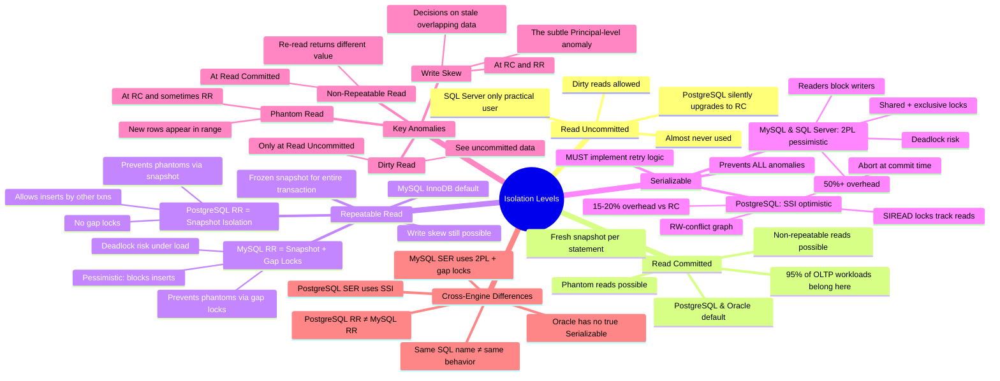

# Isolation Levels — Mind Map

> One-page scannable reference. Use for quick recall before interviews or when choosing isolation levels in production.

---

## Visual Mind Map



---

## Decision Cheat Sheet

```text
┌─────────────────────────────────────────────────────────┐
│              ISOLATION LEVEL SELECTOR                    │
├─────────────────────────────────────────────────────────┤
│                                                         │
│  Q: Does the operation modify financial/critical data?  │
│  └─ YES → Q: Can the app handle retries?                │
│           └─ YES → SERIALIZABLE (with retry logic)      │
│           └─ NO  → REPEATABLE READ + SELECT FOR UPDATE  │
│  └─ NO  → Q: Does it need a consistent snapshot?        │
│           └─ YES → REPEATABLE READ                      │
│           └─ NO  → READ COMMITTED (default, use this)   │
│                                                         │
│  NEVER USE: Read Uncommitted                            │
│  NEVER USE: Serializable without retry logic            │
│  NEVER USE: Long transactions at RR (blocks VACUUM)     │
│                                                         │
└─────────────────────────────────────────────────────────┘
```

---

## Quick-Reference: Anomaly Prevention

| Level | Dirty | Non-Repeatable | Phantom | Write Skew | Performance |
|---|---|---|---|---|---|
| **RU** | ❌ | ❌ | ❌ | ❌ | ~100% |
| **RC** | ✅ | ❌ | ❌ | ❌ | ~95% |
| **RR** | ✅ | ✅ | ✅ (PG) / ✅ (MySQL) | ❌ | ~85% |
| **SER** | ✅ | ✅ | ✅ | ✅ | ~80% (SSI) / ~50% (2PL) |

---

## Links

| File | What It Covers |
|---|---|
| [01_Concept_Overview.md](./01_Concept_Overview.md) | Definitions, comparison matrix, write skew example |
| [02_How_It_Works.md](./02_How_It_Works.md) | MVCC, 2PL, SSI internals, visibility algorithms |
| [03_Hands_On_Examples.md](./03_Hands_On_Examples.md) | Runnable SQL to prove each anomaly |
| [04_Real_World_Scenarios.md](./04_Real_World_Scenarios.md) | Coinbase, Uber, GitHub, Shopify, Netflix war stories |
| [05_Pitfalls_And_Anti_Patterns.md](./05_Pitfalls_And_Anti_Patterns.md) | 6 anti-patterns with detection and fixes |
| [06_Interview_Angle.md](./06_Interview_Angle.md) | Q&A frameworks, follow-up probes, whiteboard exercise |
| [07_Further_Reading.md](./07_Further_Reading.md) | Papers, books, engine docs, monitoring tools |
