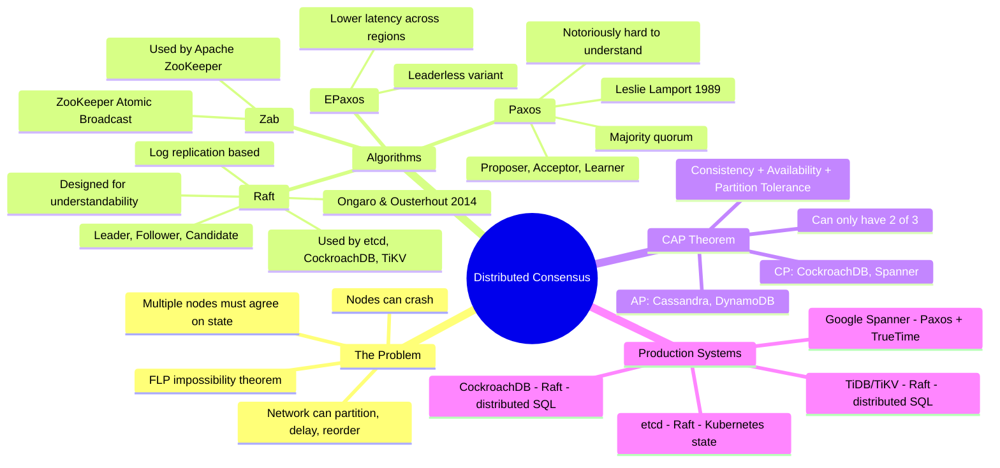
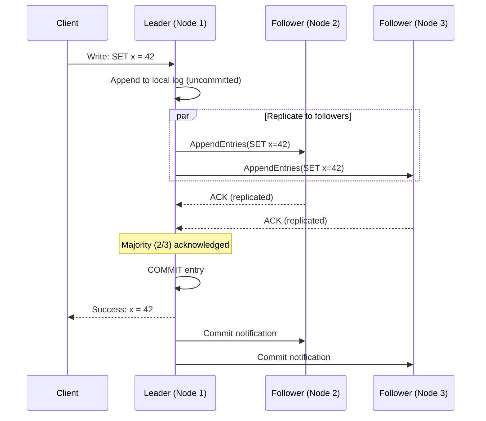

# Distributed Consensus — Concept Overview & Deep Internals

> Paxos, Raft, and the impossibility of having it all: how distributed databases agree on state.

---

## Why This Exists

A single-node database doesn't need consensus — one machine is the source of truth. But distributed databases (CockroachDB, Spanner, TiDB, etcd) must replicate data across nodes. When a write happens, how do 3 or 5 nodes agree that it's committed? That's the consensus problem.

**FLP Impossibility (1985)**: In an asynchronous network with even one faulty node, it's IMPOSSIBLE to guarantee consensus will be reached in bounded time. Every production system works around this with timeouts and leader election.

## Mindmap

## Raft — Leader Election + Log Replication

**Key rule**: A write is committed when a MAJORITY of nodes (quorum) have acknowledged. For 3 nodes: quorum = 2. For 5 nodes: quorum = 3. This tolerates 1 and 2 node failures respectively.

## CAP Theorem in Practice

| System | Choice | Trade-off |
|---|---|---|
| **CockroachDB** | CP | Unavailable during partition (rejects writes without quorum) |
| **Google Spanner** | CP + high availability | Uses GPS clocks (TrueTime) to minimize unavailability windows |
| **Cassandra** | AP (tunable) | Eventually consistent reads (tunable with QUORUM reads) |
| **DynamoDB** | AP (default) | Eventually consistent. Strong consistency available per-query |
| **PostgreSQL (single node)** | CA | No partition tolerance (single node, no distribution) |

## War Story: CockroachDB — Raft at Scale

CockroachDB uses Raft for replicating every "range" (64MB chunk) across 3+ nodes. A large cluster may run 100K+ concurrent Raft groups. The challenge: leader election latency during node failures. If a leader fails, followers wait for an election timeout (typically 1-3 seconds) before electing a new leader. During this window, writes to that range are unavailable.

**Optimization**: CockroachDB pre-elects "learner" replicas that can quickly take over, reducing unavailability to ~200ms.

## War Story: Google Spanner — TrueTime

Google Spanner achieves globally consistent reads across continents by using GPS and atomic clocks (TrueTime) to bound clock uncertainty to <7ms. When a transaction commits, it waits for the uncertainty interval to pass — guaranteeing that subsequent reads on any node will see the committed data. No other production system achieves this level of global consistency.

## Pitfalls

| Pitfall | Fix |
|---|---|
| Assuming consensus is free (low latency) | Each write requires a network round-trip to a quorum. Latency = leader-to-farthest-quorum-node RTT |
| Not understanding quorum math | 3 nodes: tolerate 1 failure. 5 nodes: tolerate 2. Even numbers (4 nodes) don't help |
| Using AP system for financial transactions | Use CP (CockroachDB, Spanner) for strong consistency. AP risks serving stale reads |
| Not handling split-brain in leader election | Raft/Paxos prevent split-brain by design. Don't roll your own consensus |

## Interview — Q: "Explain the CAP theorem and how you'd choose between CP and AP."

**Strong Answer**: "CAP says during a network partition, you choose between Consistency (reject requests without quorum) or Availability (serve potentially stale data). For financial systems: CP — a stale balance read can cause double-spending. For social media feeds: AP — showing a slightly stale feed is better than returning an error. In practice, most systems let you tune per-query: DynamoDB supports both eventually-consistent and strongly-consistent reads."

## References

| Resource | Link |
|---|---|
| *Designing Data-Intensive Applications* | Ch. 8-9: Distributed Systems |
| [Raft Paper](https://raft.github.io/raft.pdf) | Ongaro & Ousterhout (2014) |
| [Raft Visualization](https://raft.github.io/) | Interactive simulation |
| [Google Spanner Paper](https://research.google/pubs/pub39966/) | Corbett et al. (2012) |
| Cross-ref: MVCC | [../01_MVCC_Internals](../01_MVCC_Internals/) |
| Cross-ref: Isolation Levels | [../02_Isolation_Levels](../02_Isolation_Levels/) |
