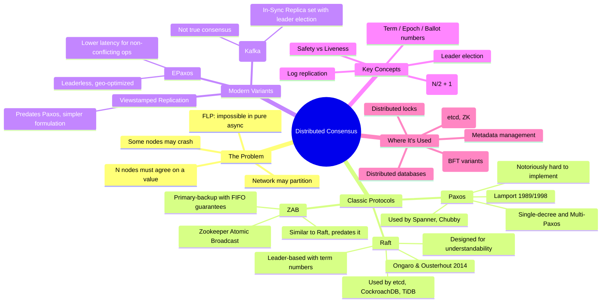
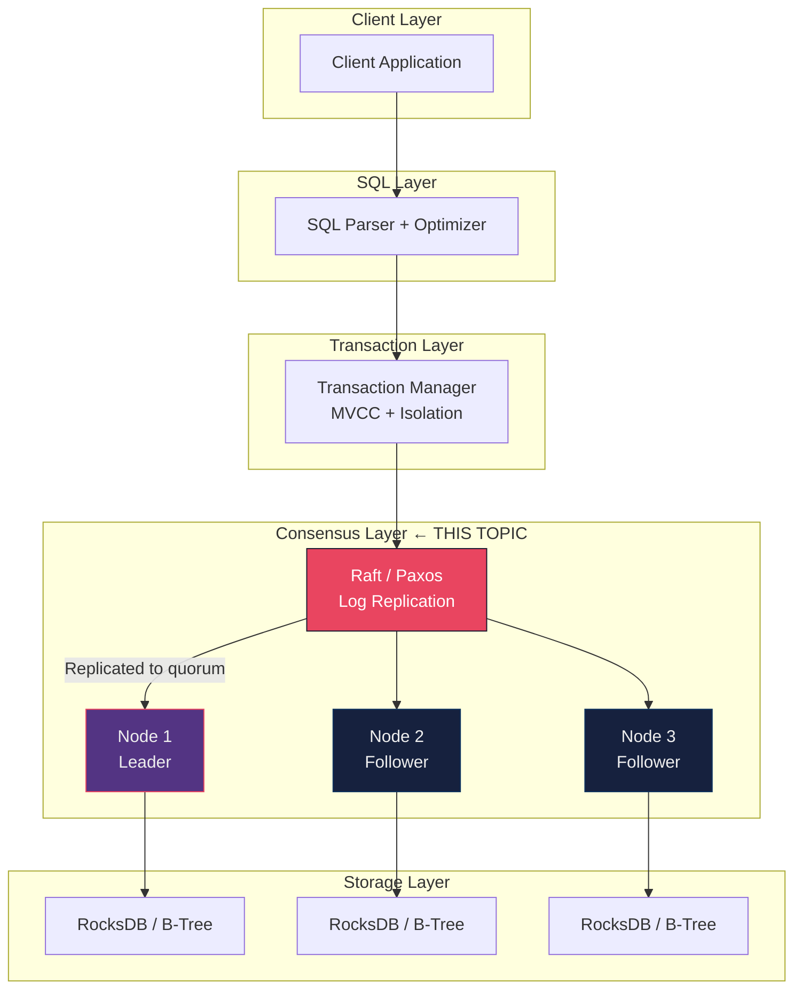

# Distributed Consensus — Concept Overview

> Distributed consensus is the problem of getting N machines to agree on a value, even when some machines crash, messages are delayed, or the network partitions. It is the single hardest problem in distributed systems — and every distributed database is built on top of a consensus protocol.

---

## Why a Principal Architect Must Know This

1. **Every distributed database uses consensus**: CockroachDB (Raft), Spanner (Paxos), TiDB (Raft), etcd (Raft), ZooKeeper (ZAB). You cannot reason about consistency guarantees without understanding the protocol underneath.
2. **CAP theorem trade-offs are consensus trade-offs**: When you choose CP over AP, you're choosing to run consensus on every write. The latency, throughput, and failure characteristics follow directly.
3. **System design interviews**: "Design a distributed lock service" or "Design a replicated state machine" — both require articulating a consensus protocol.
4. **Production incident debugging**: When a CockroachDB range becomes unavailable, or etcd loses quorum, or a Kafka partition can't elect a leader — the root cause is always a consensus failure.

---

## The Fundamental Problem

```text
The Consensus Problem:
  Given N processes (nodes), some of which may crash:
  - Agreement: All non-faulty processes decide the same value
  - Validity:  The decided value was proposed by some process
  - Termination: All non-faulty processes eventually decide
  
  FLP Impossibility (1985): In an asynchronous system with even 
  ONE faulty process, no deterministic algorithm can guarantee 
  all three properties. Every practical protocol works around this 
  with timeouts, randomization, or partial synchrony assumptions.
```

---

## Mind Map



---

## Protocol Comparison Matrix

| Property | Paxos | Multi-Paxos | Raft | ZAB | EPaxos |
|---|---|---|---|---|---|
| **Leader required** | No (per-slot) | Yes (steady state) | Yes | Yes | No |
| **Understandability** | Very hard | Hard | Easy | Medium | Hard |
| **Latency (normal)** | 2 RTT | 1 RTT (leader) | 1 RTT (leader) | 1 RTT (leader) | 1 RTT (fast path, no conflicts) |
| **Geo-distribution** | Poor | Poor | Poor | Poor | Good (leaderless) |
| **Fault tolerance** | f of 2f+1 | f of 2f+1 | f of 2f+1 | f of 2f+1 | f of 2f+1 |
| **Used by** | Spanner, Chubby | Spanner | etcd, CockroachDB, TiDB, Consul | ZooKeeper | Research, CockroachDB (experimental) |
| **Implementation complexity** | Extreme | Very high | Moderate | Moderate | Very high |

---

## The Quorum Insight

```text
For a cluster of N nodes:
  Write quorum:  W = ⌊N/2⌋ + 1  (majority)
  Read quorum:   R = ⌊N/2⌋ + 1  (majority)
  
  W + R > N  ← This guarantees at least one node in every 
               read quorum has the latest write.

  3-node cluster: tolerates 1 failure  (quorum = 2)
  5-node cluster: tolerates 2 failures (quorum = 3)
  7-node cluster: tolerates 3 failures (quorum = 4)

  Why not more nodes?
  - More nodes = higher latency (must wait for quorum ACKs)
  - More nodes = more network traffic
  - 3 or 5 is the sweet spot for most systems
```

---

## Safety vs Liveness

| Property | What It Means | Consensus Context |
|---|---|---|
| **Safety** | Nothing bad ever happens | Two leaders never exist in the same term; committed entries are never lost |
| **Liveness** | Something good eventually happens | The system eventually makes progress (elects a leader, commits entries) |

**FLP Impossibility** says you can't have both in a fully asynchronous system. Raft and Paxos sacrifice liveness during partitions (the minority partition stalls) to preserve safety (no split-brain, no data loss).

---

## Where Consensus Fits in a Database



---

## Cross-References

| Concept | Path | Relevance |
|---|---|---|
| MVCC Internals | [../01_MVCC_Internals](../01_MVCC_Internals/) | Consensus replicates the transaction log; MVCC provides isolation on top |
| Isolation Levels | [../02_Isolation_Levels](../02_Isolation_Levels/) | Serializable isolation in distributed DBs requires consensus on commit order |
| Spanner/CockroachDB/TiDB | [../../03_NewSQL_and_Distributed_RDBMS/01_Spanner_Cockroach_TiDB](../../03_NewSQL_and_Distributed_RDBMS/01_Spanner_Cockroach_TiDB/) | Practical applications of Paxos and Raft in production databases |
| WAL and Durability | [../../05_Database_Reliability_Engineering/01_WAL_and_Durability](../../05_Database_Reliability_Engineering/01_WAL_and_Durability/) | The replicated WAL IS the consensus log |
| Replication Topologies | [../../05_Database_Reliability_Engineering/02_Replication_Topologies](../../05_Database_Reliability_Engineering/02_Replication_Topologies/) | Single-leader replication is simplified consensus |
