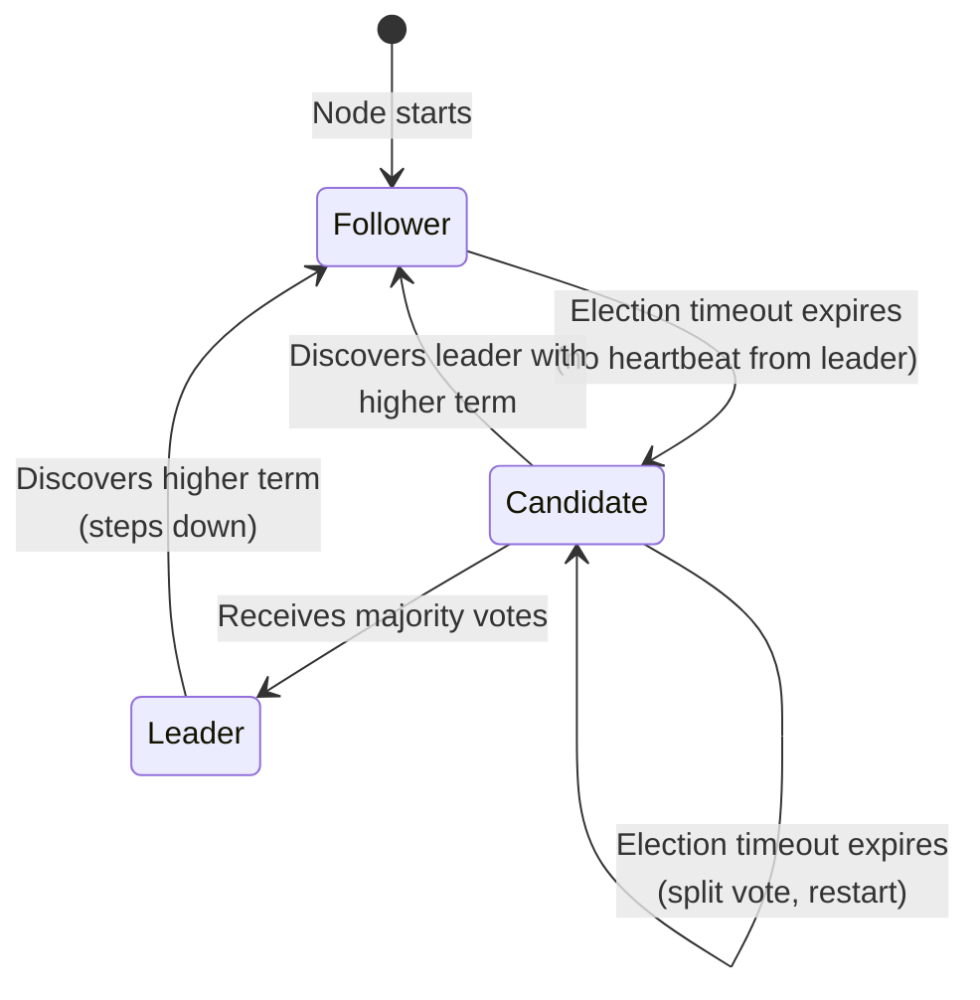
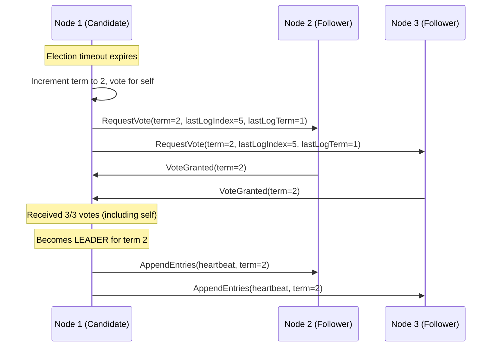
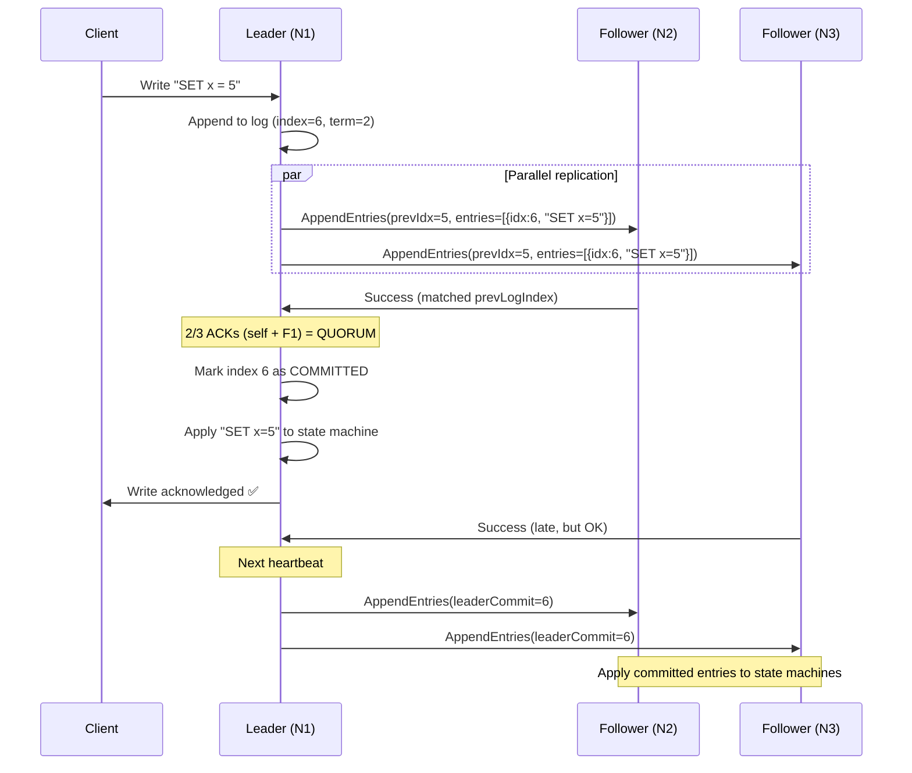
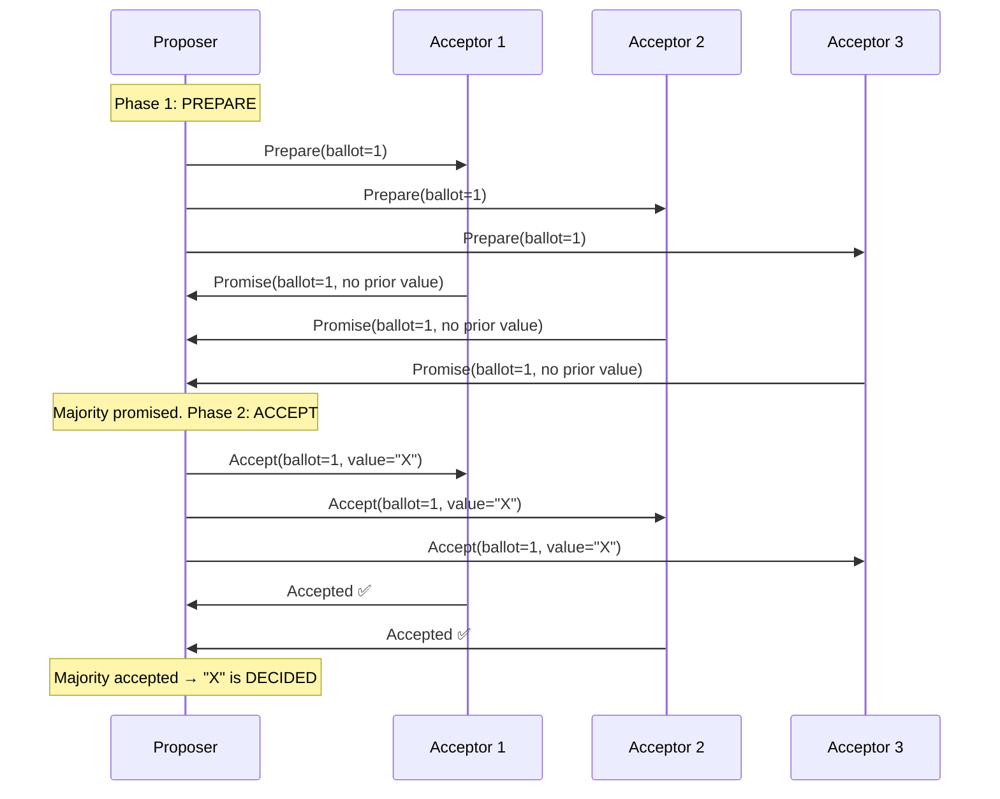
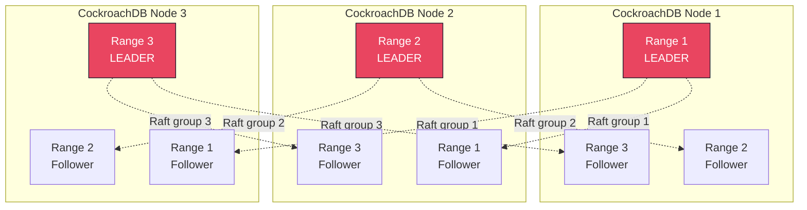
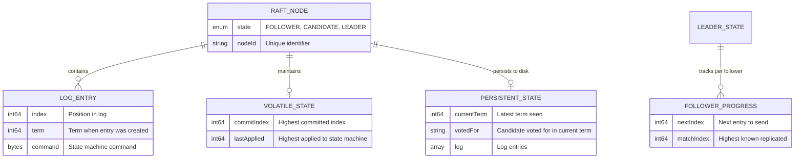

# Distributed Consensus — How It Works — Deep Internals

> This file covers the mechanics of Raft in detail (the protocol you'll encounter most in production), Paxos at a structural level, and the critical differences that matter for system design.

---

## 1. Raft: The Protocol You Must Know Cold

Raft decomposes consensus into three sub-problems:
1. **Leader Election** — choosing one node to coordinate
2. **Log Replication** — the leader copies entries to followers
3. **Safety** — ensuring logs never diverge

### 1.1 State Machine

Every Raft node is in exactly one of three states:



### 1.2 Leader Election — Step by Step

```text
STEP 1: Election Timeout
  - Each follower has a randomized election timeout (150-300ms typical)
  - If a follower receives no heartbeat before timeout → becomes Candidate

STEP 2: RequestVote RPC
  - Candidate increments its term number
  - Votes for itself
  - Sends RequestVote to all other nodes:
    {
      term: currentTerm,
      candidateId: self,
      lastLogIndex: index of last log entry,
      lastLogTerm: term of last log entry
    }

STEP 3: Vote Decision (each node)
  - If request.term < currentTerm → REJECT (stale candidate)
  - If already voted for someone else in this term → REJECT
  - If candidate's log is NOT at least as up-to-date as mine → REJECT
    (compare lastLogTerm first, then lastLogIndex for tiebreaker)
  - Otherwise → GRANT vote, reset election timeout

STEP 4: Election Result
  - If candidate gets majority (⌊N/2⌋ + 1) votes → becomes Leader
  - If candidate discovers a higher term → becomes Follower
  - If election timeout expires (split vote) → increment term, try again

KEY INSIGHT: The "log completeness" check in Step 3 ensures the 
leader always has ALL committed entries. This is Raft's core safety 
guarantee — no data loss during leader changes.
```



### 1.3 Log Replication — Step by Step

```text
STEP 1: Client sends write request to Leader

STEP 2: Leader appends entry to local log
  Entry = { index: nextIndex, term: currentTerm, command: "SET x=5" }

STEP 3: Leader sends AppendEntries RPC to all followers
  {
    term: currentTerm,
    leaderId: self,
    prevLogIndex: index of entry immediately before new entries,
    prevLogTerm: term of prevLogIndex entry,
    entries: [new entries to replicate],
    leaderCommit: leader's commitIndex
  }

STEP 4: Follower consistency check
  - If prevLogTerm at prevLogIndex doesn't match → REJECT
    (Leader will decrement prevLogIndex and retry — log repair)
  - If matches → APPEND entries, respond SUCCESS

STEP 5: Leader counts ACKs
  - When majority of nodes (including self) have the entry → COMMITTED
  - Leader advances commitIndex
  - Leader applies entry to state machine
  - Leader responds to client: "Write acknowledged"

STEP 6: Followers learn of commit
  - Next AppendEntries heartbeat carries updated leaderCommit
  - Followers apply committed entries to their state machines
```



### 1.4 Log Repair — Handling Divergence

When a new leader is elected, some followers may have stale or divergent logs:

```text
Scenario: Node 3 was partitioned and missed entries 4-6.
          New leader (Node 1) has entries 1-6.

Leader's log:   [1] [2] [3] [4] [5] [6]
Follower's log: [1] [2] [3]

Repair Process:
1. Leader sends AppendEntries(prevLogIndex=6, prevLogTerm=2, entries=[])
2. Follower: "I don't have index 6" → REJECT
3. Leader decrements: AppendEntries(prevLogIndex=5, ...)
4. Follower: "I don't have index 5" → REJECT
5. Leader decrements: AppendEntries(prevLogIndex=3, prevLogTerm=1, entries=[4,5,6])
6. Follower: "Index 3, term 1 matches!" → ACCEPT, append [4,5,6]

This is the "backtracking" mechanism. The leader finds the latest 
point of agreement, then replays everything after it.
```

---

## 2. Raft Safety Properties

### 2.1 The Five Guarantees

| Property | Guarantee |
|---|---|
| **Election Safety** | At most one leader per term |
| **Leader Append-Only** | Leader never overwrites or deletes its own log entries |
| **Log Matching** | If two logs have an entry with same index and term, all preceding entries are identical |
| **Leader Completeness** | If an entry is committed in a given term, it will be present in the logs of leaders for all higher terms |
| **State Machine Safety** | If a node applies entry at index i, no other node applies a different entry at index i |

### 2.2 Why "Leader Completeness" is the Most Important

```text
The voting rule enforces this:
  A candidate must have a log that is "at least as up-to-date" 
  as the voter's log.
  
  "At least as up-to-date" means:
    1. Candidate's last log term > voter's last log term, OR
    2. Same last term, but candidate's log is at least as long
  
  Since a committed entry exists on a majority, and a candidate 
  needs a majority of votes, the candidate MUST have contacted 
  at least one node that has the committed entry. That node will 
  reject candidates with stale logs.
  
  Result: Every leader has ALL previously committed entries.
          No committed data is ever lost.
```

---

## 3. Paxos — Structural Overview

Paxos is harder to understand but historically more influential. The key difference from Raft: **Paxos doesn't require a stable leader.**

### 3.1 Single-Decree Paxos (Agreement on ONE Value)

```text
Three Roles:
  - Proposer: Proposes a value
  - Acceptor: Votes on proposals (quorum of acceptors decide)
  - Learner:  Learns the decided value

Two Phases:

PHASE 1: PREPARE
  Proposer → Acceptors: "I want to propose with ballot number N"
  Acceptor response:
    - If N > any ballot I've seen: "OK, promise not to accept < N"
      Also return: any value I've already accepted (if any)
    - If N <= already promised ballot: REJECT

PHASE 2: ACCEPT
  If proposer gets majority of PREPARE responses:
    - If any acceptor returned an already-accepted value:
      Proposer MUST propose THAT value (not its own!)
    - Otherwise: Proposer proposes its own value
    
  Proposer → Acceptors: "Accept value V with ballot N"
  Acceptor:
    - If haven't promised a higher ballot: ACCEPT
    - Otherwise: REJECT
    
  If majority accepts → VALUE IS DECIDED
```



### 3.2 Multi-Paxos: Making It Practical

Single-decree Paxos decides one value. A database needs to decide a sequence of values (log entries). Multi-Paxos:

1. Run a "leader election" Paxos round to establish a distinguished proposer
2. The leader skips Phase 1 for subsequent proposals (already has the highest ballot)
3. Each log slot is a separate Paxos instance, but Phase 1 is amortized across all slots

**Result**: Steady-state Multi-Paxos looks similar to Raft — one leader, one-phase commits.

---

## 4. Raft vs Paxos: The Real Differences

| Aspect | Raft | Paxos |
|---|---|---|
| **Leader** | REQUIRED. All writes go through leader. | Optional in theory. Multi-Paxos uses one for efficiency. |
| **Log structure** | Strict ordering. Leader's log is authoritative. | Slots can be filled out of order. Gaps possible. |
| **Leader election** | Simple: RequestVote with log completeness check | Complex: Phase 1 of Paxos with ballot numbers |
| **Log repair** | Leader pushes missing entries to followers | Acceptors may have gaps, requires fill-in protocol |
| **Understandability** | Designed to be simple. 18-page paper. | 30+ years of papers. Still confuses experts. |
| **Reconfiguration** | Joint consensus (built into protocol) | Complex, often ad-hoc |

---

## 5. Practical Consensus: etcd and CockroachDB

### 5.1 etcd (Raft Implementation)

```text
etcd cluster = 3 or 5 nodes running Raft

Write path:
1. Client → any etcd node → forwarded to leader
2. Leader appends to Raft log
3. Leader replicates to followers (AppendEntries)
4. Quorum acknowledges → entry committed
5. Leader applies to BoltDB (key-value store)
6. Leader responds to client

Read path (linearizable):
1. Client → leader
2. Leader confirms it's still leader (ReadIndex or LeaseRead)
3. Leader reads from BoltDB and responds

ReadIndex: Leader sends heartbeat to confirm quorum, 
           then serves the read. Guarantees linearizability.
LeaseRead: Leader serves reads without confirmation 
           (faster, but relies on clock synchronization).
```

### 5.2 CockroachDB (Multi-Raft)

CockroachDB uses **one Raft group per range** (64MB chunk of data):



**Key insight**: Leadership is distributed across nodes. Range 1's leader might be on Node 1, Range 2's leader on Node 2. This balances write load across the cluster.

---

## 6. Consensus Performance Characteristics

### 6.1 Latency Analysis

```text
Normal write (3-node cluster, single datacenter):
  Client → Leader:           ~0.5ms (network)
  Leader → Log append:       ~0.1ms (fsync to WAL)
  Leader → Followers (2x):   ~0.5ms (network) + ~0.1ms (fsync)
  Leader waits for 1 ACK:    ~0.6ms
  Total:                     ~1.2ms

Cross-datacenter write (3-node, US-East/US-West/EU):
  Client → Leader:           ~0.5ms (same DC)
  Leader → Closest follower: ~30ms (US-East → US-West)
  Leader → Farthest follower:~80ms (US-East → EU)
  Leader waits for 1 ACK:    ~30ms (closest follower)
  Total:                     ~31ms

This is why Spanner uses Paxos and TrueTime — distributing 
leadership geographically reduces cross-DC round trips for writes.
```

### 6.2 Throughput vs Cluster Size

| Cluster Size | Quorum | Fault Tolerance | Write Throughput (relative) | Write Latency |
|---|---|---|---|---|
| 3 nodes | 2 | 1 node | 100% (baseline) | Lowest |
| 5 nodes | 3 | 2 nodes | ~85% | +15-20% |
| 7 nodes | 4 | 3 nodes | ~70% | +30-40% |
| 9 nodes | 5 | 4 nodes | ~55% | +50-60% |

> **Rule of thumb**: Use 3 nodes for most workloads. Use 5 nodes only when you need to tolerate 2 simultaneous failures (e.g., rolling upgrades + unexpected failure). Never use 7+ in practice.

---

## 7. Entity Relationship: Raft Internal State


