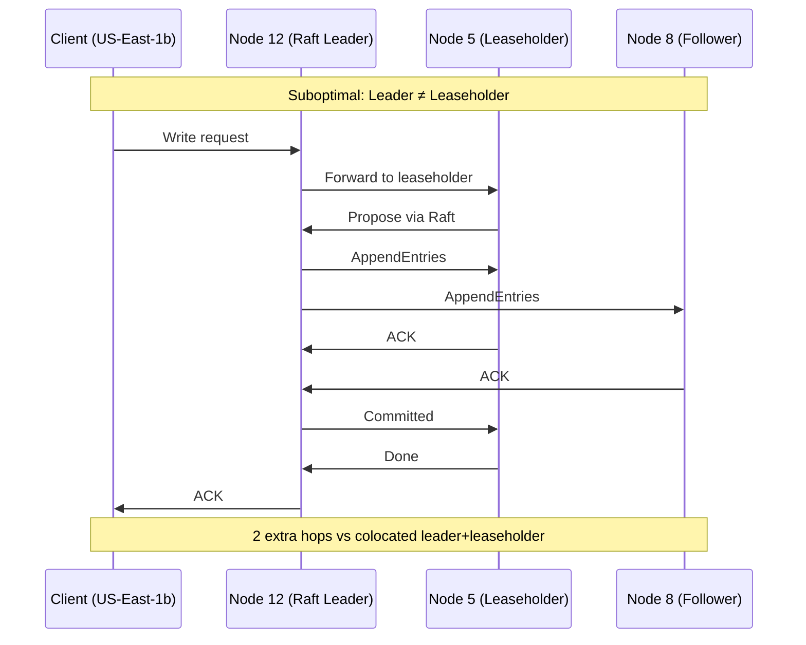
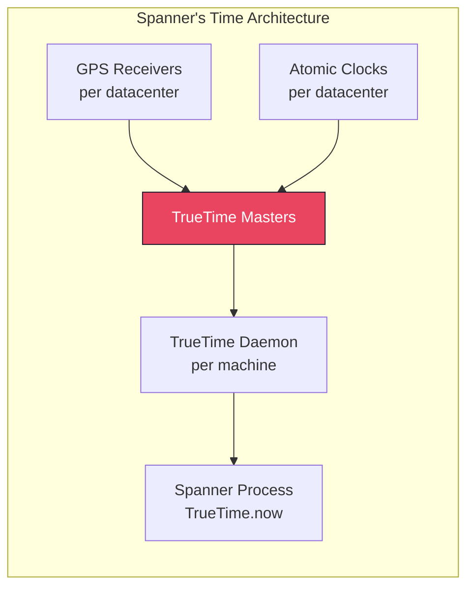
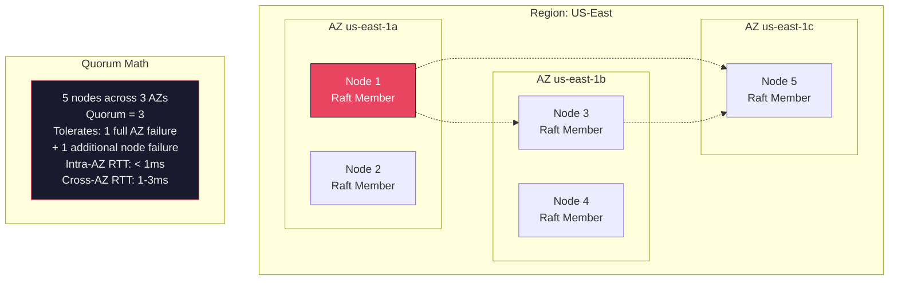

# Distributed Consensus — FAANG War Stories & Real-World Scenarios

> Every company that runs a distributed database has a consensus horror story. These are the ones that shaped how modern systems are designed.

---

## Case Study 1: Cloudflare — etcd Split-Brain Outage (2020)

**Scale**: 200+ data centers, serving ~25M HTTP requests/second

**What Happened**:
Cloudflare's control plane relied on a 5-node etcd cluster for service configuration. A network maintenance event created an asymmetric partition:

```text
Before: All 5 nodes connected
  N1 ←→ N2 ←→ N3 ←→ N4 ←→ N5

During maintenance: Asymmetric partition
  N1 ←→ N2 ←→ N3     N4 ←→ N5
  (3 nodes: quorum)   (2 nodes: no quorum)
  
  N3 could still reach N4 (but N1/N2 couldn't reach N4/N5)
  This created confusion in leader election:
  - N3 received heartbeats from N1 (leader in majority partition)
  - N4 started election, N3 voted for N4 (could reach it too)
  - N4 thought it had 3 votes (N3, N4, N5) → became leader
  - TWO LEADERS existed briefly (N1 and N4)
```

**Root Cause**: The asymmetric partition created a scenario where N3 was a "bridge" node — reachable by both partitions. Raft's safety properties prevented divergent commits, but the dual-leader situation caused **write availability loss** — both leaders attempted writes, but neither could commit consistently because N3's responses were non-deterministic.

**The Fix**:
1. Moved to a **3-node etcd cluster** instead of 5 (smaller quorum, simpler partition behavior)
2. Added network health checks that pre-emptively drain workload before maintenance
3. Implemented etcd learner nodes (non-voting replicas) for read scaling instead of full members

**Lesson**: More nodes ≠ more reliability. A 5-node cluster has more complex partition scenarios than a 3-node cluster.

---

## Case Study 2: CockroachDB — Range Leaseholder Thrashing

**Scale**: 100+ node CockroachDB cluster at a fintech company

**What Happened**:
The cluster experienced periodic write latency spikes (p99 jumping from 10ms to 500ms+) every 9 seconds. Investigation revealed:

```text
Timeline (repeating every ~9s):
t=0s:  Range 42 leaseholder on Node 5 (US-East-1a)
t=0s:  Heavy write traffic to Range 42 from US-East-1b client
t=3s:  Raft leader for Range 42 moves to Node 12 (US-East-1b)
       (closer to the write traffic)
t=3s:  But leaseholder is still Node 5 → writes forwarded N12→N5
t=6s:  Lease expires, transfers to Node 12
t=6s:  New write pattern shifts traffic back to US-East-1a
t=9s:  Raft leader moves back to Node 5
       Leaseholder still on Node 12 → forwarding again
```

**Root Cause**: CockroachDB separates **Raft leadership** (who coordinates consensus) from **leaseholder** (who serves reads and coordinates writes). When these are on different nodes, every write requires an extra network hop. The traffic pattern caused leadership and leaseholder to chase each other.



**The Fix**:
1. Set `kv.raft.leader_follows_leaseholder = true` (colocates Raft leader with leaseholder)
2. Used **lease preferences** to pin leaseholders to zones closest to write traffic
3. Split hot ranges to distribute load across more Raft groups

---

## Case Study 3: Google Spanner — TrueTime and Commit Wait

**Scale**: Largest distributed SQL database in production (~10M+ servers)

**What Happened** (not an outage — a design decision):
Spanner needed **external consistency** (stronger than Serializable) across globally distributed data. Standard Raft/Paxos gives consensus within a shard, but doesn't order transactions across shards.

**Solution**: GPS + atomic clocks → **TrueTime API**:

```text
TrueTime.now() returns an interval [earliest, latest]:
  - Real time is GUARANTEED to be within this interval
  - Uncertainty is typically 1-7ms (GPS sync)

Commit Wait Protocol:
  1. Transaction acquires all locks
  2. Picks a commit timestamp s = TrueTime.now().latest
  3. WAITS until TrueTime.now().earliest > s  
     (typically 7-10ms wait)
  4. Commits and releases locks

Why the wait?
  - After waiting, we're CERTAIN that the commit timestamp 
    is in the past (real time has definitely passed s)
  - Any future transaction will pick a timestamp > s
  - This gives external consistency without coordinating  
    timestamps across Paxos groups
```



**Lesson**: Spanner solved cross-shard ordering by attacking the clock uncertainty problem with hardware. No other database has replicated this — CockroachDB uses hybrid logical clocks (HLC) which give weaker ordering guarantees but work without specialized hardware.

---

## Case Study 4: Kafka — ISR vs True Consensus

**Scale**: LinkedIn, Uber, Netflix — trillions of messages/day

**What Happened**: Kafka's replication is NOT true consensus (Raft/Paxos). It uses **In-Sync Replicas (ISR)**:

```text
True Consensus (Raft): 
  - Write is committed when quorum (majority) acknowledges
  - Leader failure: new leader election among qualified candidates
  - Safety: committed writes NEVER lost (as long as majority survives)

Kafka ISR:
  - ISR = set of replicas that are "caught up" to the leader
  - Write is committed when ALL replicas in ISR acknowledge
  - If a replica falls behind → removed from ISR
  - min.insync.replicas controls minimum ISR size
  
  The problem: ISR can shrink to just the leader
  If min.insync.replicas = 1 and the leader dies:
    → Data loss! The only copy was on the dead leader.
```

**Production Incident at a Major Bank**:
1. Network issues caused Replica 2 and 3 to fall behind → removed from ISR
2. ISR = {Leader only}. `min.insync.replicas = 1` (default).
3. Writes continued (acks=all means acks from ISR, which is just the leader)
4. Leader crashed → newest committed messages existed ONLY on the dead broker
5. **12 hours of financial transaction events lost**

**The Fix**:
```properties
# REQUIRED for any system that can't lose data:
min.insync.replicas = 2
acks = all
# This means: at least 2 replicas must confirm every write
# If ISR shrinks below 2, producers get NotEnoughReplicasException
# Better to reject writes than lose them silently
```

---

## Case Study 5: TiDB — Raft Region Hotspot

**Scale**: Large Chinese e-commerce platform during Singles' Day (11.11)

**What Happened**:
During the sales event, a single product table's auto-increment ID range became a Raft region hotspot:

```text
Table: orders (id BIGINT AUTO_INCREMENT PRIMARY KEY, ...)

All inserts go to the LAST region (highest key range)
Region [1000001, +∞) on Node 7 → this region's Raft leader 
handles ALL writes for the entire table

Node 7 CPU: 95%
Nodes 1-6: 15% CPU each
Write throughput: 5,000 TPS (should be 30,000+)
```

**Root Cause**: Sequential auto-increment IDs concentrate writes at the end of the keyspace. Since TiDB (like CockroachDB) splits data into ranges with one Raft group each, ALL inserts hit the same Raft leader.

**The Fix**:
1. Changed primary key to `SHARD_ROW_ID_BITS = 4` (TiDB-specific: distributes IDs across 16 shards)
2. Alternative: Use UUID or hash-based keys to distribute writes
3. Pre-split the table into multiple regions before the event

---

## Deployment Architecture: Consensus Across Zones



**Best Practice for AZ Distribution**:
- 3 nodes → 1 per AZ (tolerates 1 AZ failure)
- 5 nodes → 2+2+1 across 3 AZs (tolerates 1 AZ + 1 node failure)
- Never put all nodes in one AZ — that defeats the purpose of consensus
