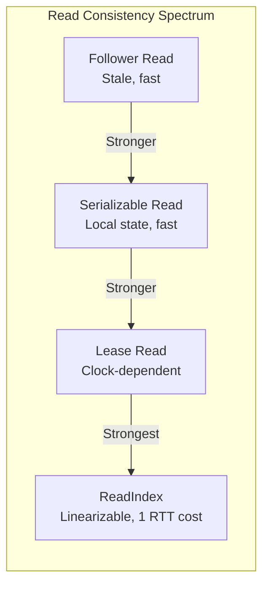

# Distributed Consensus — Common Pitfalls & Anti-Patterns

> These are the mistakes that cause distributed database outages. Every one has been observed at scale in production.

---

## Anti-Pattern 1: Odd vs Even Node Counts

**The Mistake**: Running a 4-node consensus cluster.

**Why It's Dangerous**:
```text
3-node cluster: quorum = 2, tolerates 1 failure
4-node cluster: quorum = 3, tolerates 1 failure  ← SAME fault tolerance
5-node cluster: quorum = 3, tolerates 2 failures

4 nodes gives you NO additional fault tolerance over 3 nodes, 
but adds latency (must wait for 3 ACKs instead of 2) and
complexity (more possible partition configurations).
```

**Fix**: Always use odd numbers: 3, 5, or (rarely) 7. If you have 4 machines, run consensus on 3 and use the 4th as a learner/non-voting replica.

---

## Anti-Pattern 2: Consensus for High-Throughput Data Plane

**The Mistake**: Using etcd, ZooKeeper, or a Raft-replicated store as the primary data store for high-throughput application data (e.g., storing user session data in etcd).

**Why It's Dangerous**:
- etcd is designed for metadata/configuration (small values, low write volume)
- etcd's write throughput caps at ~10,000-30,000 writes/sec
- The Raft log must be replicated and fsync'd to disk on every write
- Every write goes through the leader — no write scaling

**Sizes where consensus stores are appropriate**:

| Data Type | Expected Size | Writes/sec | Consensus Store OK? |
|---|---|---|---|
| Service discovery | < 10MB | < 100/s | ✅ Ideal use case |
| Feature flags | < 1MB | < 10/s | ✅ Perfect |
| Distributed locks | < 1MB | < 1,000/s | ✅ Fine |
| Session storage | 10-100GB | 10,000+/s | ❌ Use Redis/DynamoDB |
| Application data | Unbounded | 100,000+/s | ❌ Use a proper database |
| Event streaming | Unbounded | 1M+/s | ❌ Use Kafka |

**Fix**: Use consensus stores only for the **control plane** (configuration, coordination, leader election). Use purpose-built systems for the **data plane**.

---

## Anti-Pattern 3: Not Monitoring Raft Health

**The Mistake**: Setting up a CockroachDB or etcd cluster and only monitoring node-level metrics (CPU, memory, disk).

**What You MUST Monitor**:

```text
Critical Consensus Metrics:
1. raft.leader.changes    — Leader elections per minute
   Normal: 0 during steady state
   Alert: > 2 in 5 minutes (flapping leaders)

2. raft.heartbeat.latency — Heartbeat round-trip time
   Normal: < 10ms (same AZ), < 100ms (cross-AZ)
   Alert: > 500ms (risk of election timeout)

3. raft.log.behind        — Entries a follower is behind leader
   Normal: 0 (or < 10 during bursts)
   Alert: > 1000 (follower falling behind, risk of ISR-like removal)

4. raft.proposal.pending  — Unfinished Raft proposals
   Normal: < 10
   Alert: > 100 (write stall, possible quorum issue)

5. raft.snapshot.count     — Full snapshot transfers
   Normal: 0 during steady state
   Alert: Any occurrence (indicates a node was so far behind,
          incremental replication wasn't possible)
```

**Fix**: Set up dashboards for these metrics. Consensus problems show up in metrics 30-60 seconds before they impact application latency.

---

## Anti-Pattern 4: Cross-Datacenter Consensus Without Understanding Latency

**The Mistake**: Deploying a 3-node Raft cluster with one node per datacenter across US, Europe, and Asia.

**Why It's Dangerous**:
```text
US-East ←→ EU-West:  ~80ms RTT
US-East ←→ Asia:     ~150ms RTT
EU-West ←→ Asia:     ~200ms RTT

Quorum = 2 of 3. Every write waits for the CLOSEST follower ACK.
If leader is in US-East:
  - Write latency = max(0ms, 80ms, 150ms) → wait for closest = 80ms
  - But if EU node is down: latency jumps to 150ms (must wait for Asia)

Compare to 3 nodes within one region (cross-AZ):
  - Write latency = ~1-3ms
  - 40x-80x better than cross-datacenter
```

**Fix**: 
1. Keep consensus clusters within a single region for latency-sensitive workloads
2. Use async replication (PostgreSQL streaming, MySQL semi-sync) for cross-region DR
3. If you MUST have cross-region consensus, use 5 nodes (3+1+1) with the majority in the primary region

---

## Anti-Pattern 5: Ignoring the Raft Log Size

**The Mistake**: Running a consensus cluster for months without log compaction or snapshotting.

**Why It's Dangerous**:
- The Raft log is append-only and grows without bound
- etcd takes periodic snapshots and compacts the log, but the compaction frequency matters
- If a follower falls behind and the log entries it needs have been compacted away, it needs a full **snapshot transfer** (expensive, blocks the follower)
- Disk fills up → node crashes → quorum lost

**Detection**:
```bash
# etcd: check database size
etcdctl endpoint status --write-out=table
# DB SIZE column — if growing beyond 2-4GB, you have a problem

# etcd: check compaction status
etcdctl compaction <revision>
etcdctl defrag
```

**Fix**: Configure automatic compaction in etcd (`--auto-compaction-retention=1` for hourly). In CockroachDB, Raft log truncation is automatic but monitor `raft.log.truncated.count`.

---

## Anti-Pattern 6: Treating Consensus as "Magic" Replication

**The Mistake**: Assuming that because you use Raft, reads are automatically consistent from any node.

**The Reality**:

| Read Type | Consistency | How It Works |
|---|---|---|
| **Read from leader** | Linearizable (with ReadIndex) | Leader confirms it's still leader, then serves read |
| **Read from follower** | Stale (potentially) | Follower may not have applied latest committed entries |
| **Lease-based read** | Linearizable (clock-dependent) | Leader relies on lease timeout, assumes no new leader |
| **Serializable read (etcd)** | Sequential (not linearizable) | Read from local store, no quorum check |



**Fix**: Explicitly choose your read consistency. Default to linearizable for critical reads, allow stale reads for monitoring/dashboards where millisecond staleness is acceptable.

---

## Decision Matrix: When Consensus Is the Wrong Tool

| Requirement | Wrong Approach | Right Approach |
|---|---|---|
| Store 100GB of user data | etcd / ZooKeeper | CockroachDB, PostgreSQL, DynamoDB |
| 500K writes/sec | Any Raft-based store | Kafka (for streaming), Cassandra (for KV) |
| Cross-continent low-latency | 3-node global Raft | Local consensus + async replication |
| Read-heavy workload | Consensus on every read | Consensus for writes, follower reads for reads |
| Configuration management | Custom Raft implementation | etcd, Consul, ZooKeeper (battle-tested) |
| Distributed lock | Custom Paxos | etcd lease, ZooKeeper ephemeral node, Redlock |
