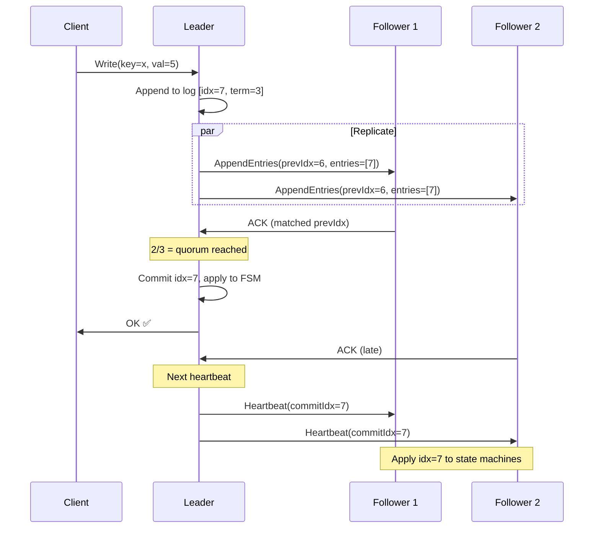

# Distributed Consensus — Interview Angle

> Distributed consensus is a top-3 system design interview topic at FAANG. The interviewer tests whether you understand the trade-offs — not whether you can recite the Raft paper from memory.

---

## How This Appears in Interviews

| Format | What They Ask | What They're Really Testing |
|---|---|---|
| **System Design** | "Design a distributed key-value store" | Can you articulate why consensus is needed and how Raft/Paxos provides it? |
| **Deep Dive** | "Walk me through what happens when the Raft leader dies" | Do you understand election mechanics, log completeness, safety vs liveness? |
| **Trade-off** | "Why not use Raft for everything?" | Do you know the throughput/latency costs and when consensus is inappropriate? |
| **Debugging** | "Our etcd cluster is unreachable, what do you check?" | Can you reason about quorum, partition scenarios, and recovery? |

---

## Sample Questions & Answer Frameworks

### Q1: "Explain the CAP theorem and how consensus relates to it."

**Weak Answer (Senior)**: "CAP says you can only have two of Consistency, Availability, and Partition tolerance. Raft gives you CP."

**Strong Answer (Principal)**:

"CAP is often oversimplified. Let me be precise:

**Partition tolerance isn't optional** — networks WILL partition. So the real choice is between consistency and availability during a partition.

**CP systems** (Raft/Paxos-based like CockroachDB, etcd, Spanner): During a partition, the minority partition becomes **unavailable** (can't reach quorum), but the majority partition remains **consistent** (linearizable). No split-brain, no data divergence.

**AP systems** (Cassandra, DynamoDB with eventual consistency): During a partition, BOTH partitions remain **available** (accept reads and writes), but they may **diverge**. Conflict resolution (LWW, CRDTs, application-level) is needed after the partition heals.

Consensus protocols are the mechanism that makes CP systems work — specifically, the quorum requirement ensures that any operation that 'succeeds' has been acknowledged by a majority, which guarantees that the majority partition includes all committed data.

The practical nuance: Even CP systems like CockroachDB offer **follower reads** that trade consistency for availability — you can read stale data from a partitioned follower. It's not binary CP vs AP; it's a spectrum controlled at the query level."

### Q2: "Walk me through what happens when the Raft leader dies mid-write."

**Strong Answer**:

"Let me trace the exact sequence:

1. **Client sends write to leader** → Leader appends to log at index N, starts replication
2. **Leader crashes** before quorum ACK arrives
3. **Followers notice**: No heartbeat for `election_timeout` (150-300ms randomized)
4. **First follower to timeout becomes Candidate**: Increments term, sends RequestVote
5. **Voting**: Each voter checks that the candidate's log is 'at least as up-to-date' as theirs — this is the **Leader Completeness** property. If the candidate is missing committed entries, voters with those entries will reject it.
6. **New leader elected**: Has ALL committed entries (guaranteed by the voting rule)

Now, what about the in-flight write?

**Case A**: The write reached a majority before the crash → it's committed. The new leader has it. The client may not know (it didn't get an ACK), so it retries. The system needs **idempotency** to handle duplicate retries.

**Case B**: The write reached only the old leader (or a minority) → it's NOT committed. The new leader doesn't have it. The entry will be overwritten during log repair. The client's retry will re-propose through the new leader.

**Key insight**: Committed entries are never lost. Uncommitted entries may be lost, which is correct — the client was never told the write succeeded."

### Q3: "Why does etcd recommend 3 or 5 nodes and not 7 or 9?"

**Strong Answer**:

"Three reasons:

1. **Diminishing fault tolerance returns**: 3 nodes tolerates 1 failure. 5 tolerates 2. 7 tolerates 3. Going from 1→2 failure tolerance is valuable. Going from 2→3 is rarely needed — if 3 nodes fail simultaneously, you have a systemic problem that more replicas won't fix.

2. **Write latency increases linearly**: Every write must wait for ⌊N/2⌋+1 ACKs. With 7 nodes, that's 4 ACKs. The slowest of those 4 determines your write latency. More nodes = more likely one is slow.

3. **Partition complexity grows combinatorially**: A 3-node cluster has 3 possible partition configurations. A 7-node cluster has 63 possible partition configurations. More configurations = harder to reason about, harder to test. Cloudflare learned this the hard way with their 5-node etcd asymmetric partition incident.

For most production systems: 3 nodes across 3 AZs is optimal. Use 5 only when you need to survive rolling upgrades (1 node down for maintenance) + 1 unexpected failure simultaneously."

### Q4: "How does Spanner achieve external consistency without single points of failure?"

**Strong Answer**:

"Spanner solves a problem that standard Raft/Paxos doesn't — ordering transactions across Paxos groups (shards). Within a shard, Paxos provides linearizability. Across shards, you need a globally consistent ordering.

Spanner's approach: **TrueTime + Commit Wait**.

TrueTime uses GPS receivers and atomic clocks in every datacenter to provide a clock API that returns an interval `[earliest, latest]` with a guaranteed bound on uncertainty (typically 1-7ms).

When a transaction commits:
1. Pick commit timestamp `s = TrueTime.now().latest`
2. **Wait** until `TrueTime.now().earliest > s` (7-10ms typically)
3. After the wait, we're CERTAIN that real time has passed `s`
4. Any future transaction will pick a timestamp > `s`

This gives external consistency — if transaction T1 commits before T2 starts (in real time), T1's timestamp < T2's timestamp, guaranteed.

The practical question you should anticipate: 'Can you do this without GPS clocks?' CockroachDB tries with Hybrid Logical Clocks — they provide causality ordering but NOT real-time ordering. CockroachDB has a clock skew tolerance parameter, and if clocks diverge beyond it, you can get anomalies that Spanner never would."

---

## Follow-Up Probing Questions

| Initial Answer | Follow-Up | What They Want |
|---|---|---|
| "Raft has a leader" | "What happens during leader election? Are writes available?" | No — there's a brief unavailability window (election timeout + election duration, typically 300ms-2s) |
| "Quorum is majority" | "What about flexible quorums?" | Awareness of research: you can use non-majority quorums if W+R > N, trading write availability for read availability or vice versa |
| "Use etcd for config" | "What's etcd's write throughput limit?" | ~10-30K writes/sec. Beyond that, you need a different system. |
| "Raft guarantees safety" | "What about Byzantine failures?" | Raft only handles crash failures. Byzantine (malicious) failures need BFT protocols (PBFT, Tendermint) — 3f+1 nodes for f failures. |

---

## Whiteboard Exercise: Draw the Raft Write Path

Draw this in under 4 minutes:

**Talking points while drawing**:
1. "Leader appends locally first, then replicates in parallel"
2. "Only needs majority ACK — doesn't wait for all followers"
3. "Client gets response AFTER quorum commit, not after all replicas"
4. "Followers learn about commits through subsequent heartbeats — there's a small window where the follower has the entry but hasn't applied it"
