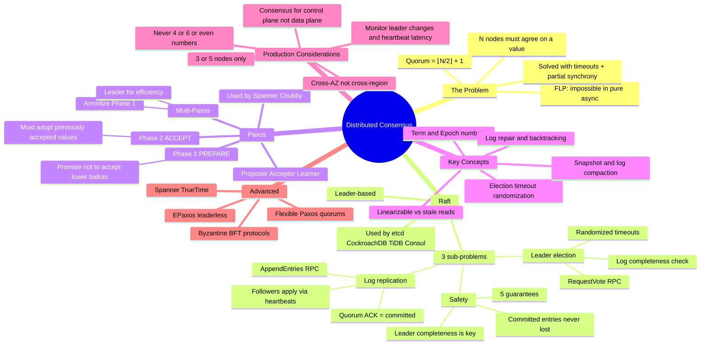

# Distributed Consensus — Mind Map

> One-page scannable reference. Use for quick recall before interviews or when debugging consensus issues in production.

---

## Visual Mind Map



---

## Decision Cheat Sheet

```text
┌─────────────────────────────────────────────────────────┐
│           CONSENSUS DECISION TREE                       │
├─────────────────────────────────────────────────────────┤
│                                                         │
│  Q: Do you need strong consistency (linearizable)?      │
│  └─ NO → Use eventual consistency (Cassandra, DynamoDB) │
│  └─ YES → Q: Is the data set small (< 10GB)?           │
│            └─ YES → etcd or ZooKeeper (config/coord)    │
│            └─ NO  → Q: Need SQL?                        │
│                     └─ YES → CockroachDB, Spanner, TiDB │
│                     └─ NO  → Custom Raft or Kafka (ISR) │
│                                                         │
│  CLUSTER SIZING:                                        │
│    3 nodes = standard (1 failure tolerance)              │
│    5 nodes = rolling upgrades + 1 failure                │
│    7+ nodes = almost never needed                       │
│                                                         │
│  DEPLOYMENT:                                            │
│    Same region, 3 AZs = optimal latency + safety        │
│    Cross-region = 80-200ms write latency penalty         │
│                                                         │
└─────────────────────────────────────────────────────────┘
```

---

## Quick-Reference: Protocol Comparison

| | Paxos | Multi-Paxos | Raft | ZAB | EPaxos |
|---|---|---|---|---|---|
| **Leader** | No | Yes | Yes | Yes | No |
| **Understandability** | ❌ Hard | ❌ Hard | ✅ Easy | ⚠️ Medium | ❌ Hard |
| **Latency** | 2 RTT | 1 RTT | 1 RTT | 1 RTT | 1 RTT (no conflict) |
| **Geo-optimized** | No | No | No | No | ✅ Yes |
| **Production use** | Spanner | Spanner | etcd, CRDB, TiDB | ZooKeeper | Research |

---

## Raft State Machine (Instant Recall)

```text
+──────────+  timeout  +───────────+  majority  +────────+
│ FOLLOWER │ ────────→ │ CANDIDATE │ ─────────→ │ LEADER │
+──────────+           +───────────+            +────────+
     ↑                      │                       │
     │    discovers          │   discovers           │
     │    higher term        │   higher term         │
     └──────────────────────┘───────────────────────┘
```

---

## Links

| File | What It Covers |
|---|---|
| [01_Concept_Overview.md](./01_Concept_Overview.md) | FLP, protocol matrix, quorum math, safety vs liveness |
| [02_How_It_Works.md](./02_How_It_Works.md) | Raft election/replication/repair, Paxos phases, CockroachDB Multi-Raft |
| [03_Hands_On_Examples.md](./03_Hands_On_Examples.md) | etcd cluster setup, quorum proof, CockroachDB ranges, Python client |
| [04_Real_World_Scenarios.md](./04_Real_World_Scenarios.md) | Cloudflare, Spanner TrueTime, Kafka ISR, TiDB hotspot |
| [05_Pitfalls_And_Anti_Patterns.md](./05_Pitfalls_And_Anti_Patterns.md) | Even nodes, control vs data plane, monitoring, cross-DC latency |
| [06_Interview_Angle.md](./06_Interview_Angle.md) | CAP+consensus, leader failure tracing, cluster sizing, TrueTime deep dive |
| [07_Further_Reading.md](./07_Further_Reading.md) | Papers (Raft, Paxos, FLP, EPaxos), books, tools |
