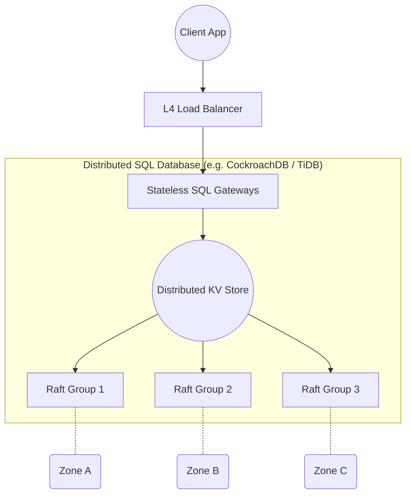
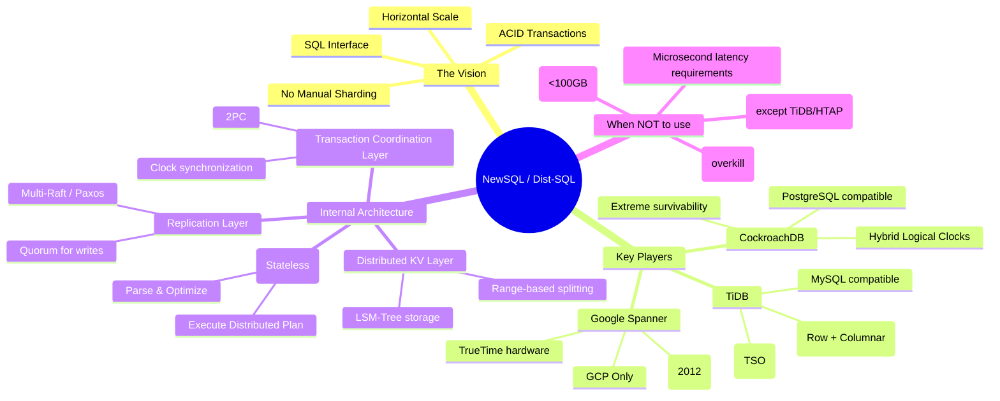

# NewSQL & Distributed RDBMS: Spanner, CockroachDB, TiDB — Concept Overview

> **Principal's Perspective:** For decades, the database world lived under a strict dichotomy: scale horizontally and lose ACID (NoSQL), or keep ACID and scale vertically (RDBMS). NewSQL (now often called Distributed SQL) shattered this false dichotomy. Understanding these architectures is mandatory for any modern data architect, as they represent the endgame for transactional storage.

---

## 1. The Core Problem: The Scaling Wall

Before 2012, architectures dealing with massive, globally distributed transactional data had horrible choices:
1. **Manual Sharding:** Break PostgreSQL/MySQL into dozens of independent instances. Applications contain complex routing logic. Cross-shard transactions are practically impossible or require fragile application-level two-phase commits (2PC). Re-sharding requires downtime.
2. **NoSQL Sacrifice:** Use Cassandra or DynamoDB. Gain infinite scale and high availability, but engineers spend 40% of their time writing compensating transactions, fixing consistency anomalies, and dealing with denormalized data models.

**The Dream:** A system that looks like PostgreSQL/MySQL to the developer (SQL, foreign keys, JOINs, serializable transactions) but acts like DynamoDB to the operator (add nodes to scale out, automatic data rebalancing, survives datacenter loss without downtime).

---

## 2. The Spanner Revolution (2012)

Google published the Spanner paper in 2012, proving the dream was possible. Spanner introduced the foundational architecture that defines this entire category:

1. **Replicated State Machines:** Data is divided into chunks (shards/ranges). Every chunk is an independent Paxos/Raft consensus group, replicated across 3-5 machines, typically in different availability zones or regions.
2. **Distributed Transactions:** When a transaction spans multiple consensus groups, a robust, highly optimized Two-Phase Commit (2PC) protocol coordinates them.
3. **Synchronized Clocks (TrueTime):** To order transactions globally without a central bottleneck, Google used GPS receivers and atomic clocks. 

**The Legacy:** CockroachDB and TiDB are the open-source intellectual descendants of Spanner, built so non-Google entities could have the same capabilities.

### Where It Fits: Component/Context Diagram

---

## 3. The Trifecta: Spanner vs. CockroachDB vs. TiDB

While they share the same DNA, their architectural choices diverge based on their origins.

| Dimension | Google Spanner | CockroachDB | TiDB |
| :--- | :--- | :--- | :--- |
| **Origin** | Google (2012 Paper) | Ex-Google engineers (2015) | PingCAP (2015) |
| **Wire Protocol** | Native / PostgreSQL (recent) | PostgreSQL | MySQL |
| **Consensus Protocol** | Paxos | Multi-Raft | Multi-Raft |
| **Storage Engine Structure**| Colossus (Proprietary DFS) | RocksDB → Pebble (LSM Tree) | TiKV (RocksDB based) |
| **Transaction Coordination**| TrueTime (Hardware-assisted) | Hybrid Logical Clocks (HLC) | Timestamp Oracle (TSO) |
| **Primary Use Case** | Massive global OLTP | Global OLTP, strong resilience | HTAP (OLTP + OLAP) |
| **Analytics Story** | Export to BigQuery | Not designed for heavy OLAP | **TiFlash** (Built-in Columnar engine) |
| **Deployment Model** | GCP fully managed only | DBaaS, On-Prem, Multi-cloud | DBaaS, On-Prem, Multi-cloud |

---

## 4. How They Solve The "Impossible" Trilemma

Distributed SQL databases sit exactly at the intersection of three highly difficult problems. Here is how they solve them concurrently:

### A. Horizontal Scalability (The KV Foundation)
Under the hood, **none of these databases are relational storage engines**. They translate SQL tables into massive, ordered, distributed Key-Value stores. 
* A table row becomes a key-value pair. 
* An index entry becomes another key-value pair.
This KV space is split into continuous ranges (e.g., 64MB chunks). When a range fills up, it splits in half. The system automatically moves these ranges across the cluster to balance CPU and disk IO.

### B. High Availability (Consensus)
Every range is replicated (usually 3 or 5 times). The replicas form a consensus group (Raft or Paxos). If a node dies, the ranges on that node lose a replica, but the consensus group retains a quorum. The leader continues serving traffic. The cluster automatically notices the missing replicas and re-creates them on healthy nodes.

### C. ACID Transactions (2PC + Clocks)
To do a transaction spanning Range A (on Node 1) and Range B (on Node 5), the system uses a distributed Two-Phase Commit. 
To ensure **External Consistency** (Linearizability) so that reads reflect immediately preceding writes across the globe without consulting a central coordinator, they rely on advanced clock synchronization (TrueTime/HLC/TSO).

---

## 5. Architectural Concept Map

---

## 6. The "Gotcha": The Latency Floor

The biggest misconception about Distributed SQL is performance. 
* **They are built for massive *throughput* (QPS), not tiny *latencies*.**
* Because every write requires a network round-trip for consensus (Raft/Paxos), the theoretical minimum write latency is bounded by the speed of light between your consensus nodes.
* If your nodes are in 3 different AWS regions (e.g., Virginia, Ohio, Oregon), a single write *must* hit at least 2 regions to achieve quorum. That means your `INSERT` will take ~40-60 milliseconds. Minimum. Period. 
* By comparison, a local PostgreSQL write to NVMe SSD takes <1 millisecond.

If your application demands sub-millisecond writes, Distributed SQL is the wrong choice. If your application demands surviving the loss of the US-East region with zero downtime and zero data loss while correctly processing financial transactions, Distributed SQL is the *only* choice.
