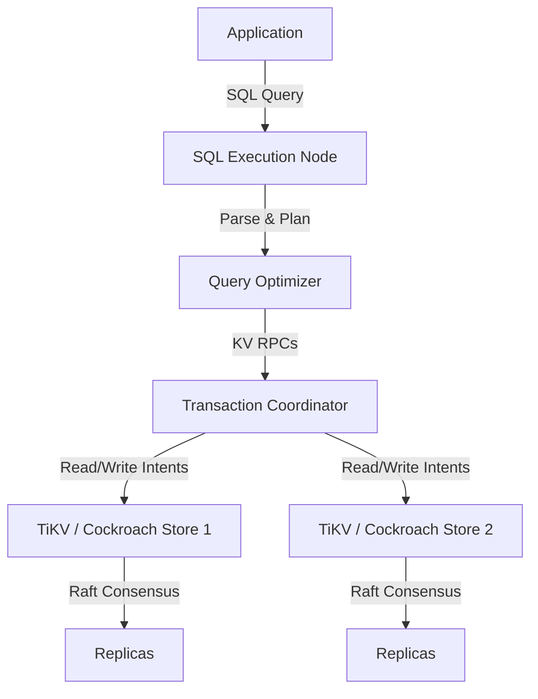
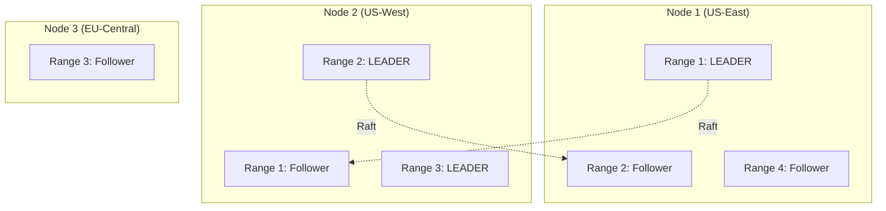

# Spanner, CockroachDB, TiDB — How It Works (Deep Internals)

> **Principal's Perspective:** To operate these systems at scale, you must stop thinking of them as RDBMS engines with a replication plugin. They are distributed Key-Value stores masked by a massive, stateless distributed SQL execution engine. The real magic happens in how they map SQL to KV, how they order time, and how they coordinate transactions across machines.

---

## 1. The Core Trick: SQL to Distributed KV

Traditional RDBMS engines (PostgreSQL, Oracle) lay out data in fixed-size pages (e.g., 8KB). NewSQL systems completely abandon this. They use an underlying distributed Key-Value store (typically based on an LSM Tree like RocksDB or Pebble). 

How does a table become KV pairs?

Consider this table:
```sql
CREATE TABLE Users (
    id UUID PRIMARY KEY,
    name VARCHAR(50),
    city VARCHAR(50)
);
CREATE INDEX idx_city ON Users(city);
```

**Row mapping to KV:**
The primary key dictates the KV formatting.
* **Key:** `/<TableId>/<IndexId(Primary)>/<UUID>`
* **Value:** `[name, city]` (serialized as a binary tuple)

**Secondary Index mapping to KV:**
* **Key:** `/<TableId>/<IndexId(Secondary)>/<City>/<UUID>`
* **Value:** `null` (or included columns if covering index)

### The Power of the Ordered KV Store
Because the underlying KV store is strictly sorted by Key, a `SELECT * FROM Users WHERE id > X` simply translates to a fast sequential scan on the underlying LSM tree starting at key `/<TableId>/<Primary>/X`.

### High-Level Design (HLD)


---

## 2. Data Distribution: Ranges/Regions

As data grows, the monolithic KV space is sliced into contiguous chunks called **Ranges** (CockroachDB/Spanner) or **Regions** (TiDB). These are usually 64MB or 96MB.

```text
Global Sorted Key Space:
[0.0.0.0] -------------------------------------------------> [z.z.z.z]

Sliced into Ranges:
|--- Range 1 ---|--- Range 2 ---|--- Range 3 ---|--- Range 4 ---|
(Keys A-F)      (Keys G-M)      (Keys N-S)      (Keys T-Z)
```

1. **Splitting:** When a range exceeds 64MB, it splits at the median key into two 32MB ranges.
2. **Replication:** Every single Range is a distinct Raft/Paxos consensus group. Range 1 is replicated 3 times across the cluster. Range 2 is replicated 3 times. 
3. **Multi-Raft:** A 100-node cluster might have 500,000 Ranges. That means 500,000 independent Raft groups running concurrently. This architecture is called "Multi-Raft".



---

## 3. The Time Problem (Ordering Transactions)

If a user in New York updates a row in `Range 1`, and a user in Tokyo reads from `Range 2`, how does the database know which transaction happened first? In a single-node DB, you just grab a mutex and check the local CPU clock. In a distributed system, clocks drift. If the NY server's clock is 50ms faster than the Tokyo server's clock, causality breaks. 

How the top 3 solve the "Time Problem":

### Google Spanner: TrueTime (Hardware approach)
Google put GPS receivers and atomic clocks in every datacenter. TrueTime provides an API: `TT.now()`. It returns a time interval `[earliest, latest]`. 
* The uncertainty window is strictly bounded (e.g., a maximum of 7ms).
* **Commit Wait Rule:** When a Spanner transaction commits, it pauses its commit until the uncertainty window passes. 
* By waiting exactly the maximum possible clock drift, Spanner guarantees that if Transaction B starts after Transaction A finishes, B will strictly have a higher timestamp across the globe without communication.

### CockroachDB: Hybrid Logical Clocks (Software approach)
Since CockroachDB must run on standard AWS/Azure VMs, it cannot rely on GPS atomic clocks. It relies on standard NTP plus logical counters.
* An HLC timestamp is `(Physical Time, Logical Counter)`.
* Nodes gossip their timestamps to each other. If Node A talks to Node B, the receiving node updates its clock to `max(local_time, remote_time)`.
* CockroachDB requires setting a maximum clock offset (e.g., 500ms). If NTP drifts beyond this, the node kills itself. 
* When a read detects a write within that 500ms uncertainty window, it is forced to do a "transaction restart" to figure out the exact causal ordering.

### TiDB: Timestamp Oracle (Centralized approach)
TiDB sidesteps physical clock sync altogether.
* It runs a highly available, centralized service called the **Placement Driver (PD)**.
* The PD acts as a Timestamp Oracle (TSO).
* Every transaction in TiDB must request a start timestamp and a commit timestamp from the PD over the network.
* **Pro:** Perfect global ordering, easy to implement.
* **Con:** The PD is a potential bottleneck, and every transaction pays a network round-trip to the PD, restricting extreme geographical distribution (e.g., a global cluster spanning Earth).

---

## 4. Distributed Transactions: Two-Phase Commit (2PC) under the hood

When a transaction hits multiple Ranges, we need atomicity across Raft groups. 

Imagine `UPDATE Users SET status='active' WHERE id IN (User_A, User_Z)`.
* User_A is in Range 1 (Leader on Node 1).
* User_Z is in Range 99 (Leader on Node 5).

Here is CockroachDB's highly optimized decentralized 2PC:

1. **Transaction Record Creation:** The gateway node creates a "Transaction Record" in the KV store, marked as `PENDING`. This record is itself replicated via Raft.
2. **Write Intents:** The gateway node sends out requests to Range 1 and Range 99. They write "Intents" (provisional writes). These intents point back to the Transaction Record.
3. **Commit Phase:** If both Ranges acknowledge the write intents (via quorum consensus), the gateway flips the Transaction Record to `COMMITTED`.
4. **Resolution (Async):** The transaction is complete and the client is ACKed. The Intents are asynchronously resolved into permanent committed values. 

If anyone tries to read User_Z and sees a `PENDING` intent, they go check the centralized Transaction Record to see if they should wait, abort, or read the new value.

### Sequence Diagram: 2PC Execution
```mermaid
sequenceDiagram
    participant C as Client
    participant GW as Gateway Node (Coordinator)
    participant N1 as Node 1 (Range 1 Leader)
    participant N5 as Node 5 (Range 99 Leader)
    participant TR as Node with Txn Record

    C->>GW: 1) BEGIN; UPDATE... COMMIT;
    GW->>TR: 2) Write Transaction Record (STATUS: PENDING)
    activate TR
    
    par Write Intents
        GW->>N1: 3) Write Intent (User_A = active)
        GW->>N5: 3) Write Intent (User_Z = active)
    end
    
    N1-->>GW: 4) ACK Intent (Logged via Raft)
    N5-->>GW: 4) ACK Intent (Logged via Raft)
    
    GW->>TR: 5) Update Transaction Record (STATUS: COMMITTED)
    TR-->>GW: 6) ACK
    deactivate TR
    
    GW-->>C: 7) Success returned to client
    
    par Async Cleanup
        GW->>N1: 8) Resolve Intent to Actual value
        GW->>N5: 8) Resolve Intent to Actual value
    end
```

---

## 5. TiDB's Unique Selling Point: HTAP (Hybrid Transactional/Analytical)

TiDB recognized that exporting data from an OLTP database to an OLAP data warehouse (like Snowflake) introduces massive lag and ETL complexity.

TiDB solves this with a dual-storage engine architecture:
1. **TiKV:** The row-based LSM KV store based on RocksDB. Optimized for fast, highly concurrent point lookups (OLTP).
2. **TiFlash:** A columnar storage engine based on ClickHouse. 

**How it works:**
* You tell TiDB to add a TiFlash replica for a specific table.
* TiFlash joins the Raft consensus group for that table as a **Learner Node**.
* When Raft commits a write to TiKV, it asynchronously replicates the Raft log to TiFlash.
* TiFlash applies the log but translates the data into a Columnar format in real-time.
* **Smart Optimizer:** When a query arrives, the TiDB SQL engine determines if it's a point lookup (`SELECT * FROM users WHERE id=1`) or an analytical scan (`SELECT SUM(revenue) FROM orders`). It dynamically routes the query to TiKV or TiFlash, completely transparent to the user.
