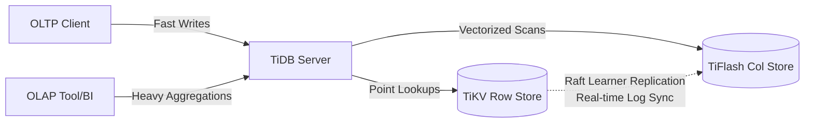

# Spanner, CockroachDB, TiDB — Hands-On Examples

> **Principal's Perspective:** Architecture diagrams only go so far. Running a local cluster and intentionally breaking nodes while executing distributed transactions is the fastest way to build intuition for NewSQL systems.

---

## 1. Running a Local CockroachDB Cluster

CockroachDB is uniquely trivial to run locally because it ships as a single statically linked binary. It simulates a distributed cluster on your laptop.

### Setup (MacOS / Linux)

```bash
# Download and install the binary
curl https://binaries.cockroachdb.com/cockroach-v23.2.3.darwin-10.9-amd64.tgz | tar -xz
cp -i cockroach-v23.2.3.darwin-10.9-amd64/cockroach /usr/local/bin/

# Start Node 1
cockroach start \
--insecure \
--store=node1 \
--listen-addr=localhost:26257 \
--http-addr=localhost:8080 \
--join=localhost:26257,localhost:26258,localhost:26259 \
--background

# Start Node 2
cockroach start \
--insecure \
--store=node2 \
--listen-addr=localhost:26258 \
--http-addr=localhost:8081 \
--join=localhost:26257,localhost:26258,localhost:26259 \
--background

# Start Node 3
cockroach start \
--insecure \
--store=node3 \
--listen-addr=localhost:26259 \
--http-addr=localhost:8082 \
--join=localhost:26257,localhost:26258,localhost:26259 \
--background

# Initialize the cluster (Bootstrap the Raft groups)
cockroach init --insecure --host=localhost:26257
```

### Connect and Observe Distributed Behavior

```bash
# Connect to Node 1 via the built-in SQL shell
cockroach sql --insecure --host=localhost:26257
```

```sql
-- 1. Create a table
CREATE DATABASE bank;
USE bank;
CREATE TABLE accounts (
    id UUID PRIMARY KEY DEFAULT gen_random_uuid(),
    balance DECIMAL(10,2) NOT NULL
);

-- 2. Insert test data
INSERT INTO accounts (balance)
SELECT 1000.00 FROM generate_series(1, 10000);

-- 3. OBSERVE THE RAFT DISTRIBUTION
-- This command shows how CockroachDB has sliced the table into Raft ranges
SHOW RANGES FROM TABLE accounts;
```

**Output Analysis:**
You will see output detailing the `start_key`, `end_key`, `replicas`, and `lease_holder`. 
* `replicas`: IDs of the nodes containing this range (should be all 3 in a local test).
* `lease_holder`: The specific node acting as the Raft Leader for this chunk of records.

---

## 2. Proving High Availability (Chaos Testing)

Let's run a continuous workload while we sever a node from the cluster.

### Terminal A: The Workload

While connected to the SQL shell on **Node 1** (`localhost:26257`):
```sql
-- Create an endless loop of inserts using a shell script, or run:
INSERT INTO accounts (balance) VALUES (500.00);
SELECT COUNT(*) FROM accounts;
```

### Terminal B: The Chaos

Kill Node 3:
```bash
# Find Node 3's PID
lsof -i :26259
# Kill it abruptly
kill -9 <PID>
```

### Terminal A Observation:

Return to your SQL shell. Hit `UP` and run the `INSERT` again.
**Result:** It succeeds instantly. 
**Why?** Nodes 1 and 2 still form a majority (2 out of 3). Raft guarantees progress as long as a quorum survives. The transaction commits transparently to the client.

Now, kill Node 2.
```bash
lsof -i :26258
kill -9 <PID>
```

Return to the SQL shell. Run the `INSERT` again.
**Result:** The terminal hangs or throws a `context deadline exceeded` error.
**Why?** Only Node 1 is alive. 1 out of 3 is not a quorum. The Raft group cannot acknowledge the appended log entry. The database protects consistency by sacrificing availability.

---

## 3. TiDB: TiUP Playground (HTAP in action)

TiDB's architecture requires multiple distinct binaries (TiDB server, PD server, TiKV storage). Testing this manually is tedious. PingCAP provides `tiup` to spin up a local playground cluster instantly.

### Setup

```bash
# Install TiUP
curl --proto '=https' --tlsv1.2 -sSf https://tiup-mirrors.pingcap.com/install.sh | sh

# Start a playground cluster with 1 TiDB (SQL), 1 TiKV (Row), 1 TiFlash (Columnar), 1 PD (Timestamp Oracle)
tiup playground --db 1 --pd 1 --kv 1 --tiflash 1
```

### HTAP Demonstration

Connect using a standard MySQL client:
```bash
mysql -h 127.0.0.1 -P 4000 -u root
```

```sql
CREATE DATABASE htap_test;
USE htap_test;

CREATE TABLE sales (
    id INT PRIMARY KEY AUTO_INCREMENT,
    product_id INT,
    amount DECIMAL(10,2),
    created_at TIMESTAMP DEFAULT CURRENT_TIMESTAMP
);

-- Insert dummy data
INSERT INTO sales (product_id, amount) VALUES (1, 100), (2, 200), (1, 150), (3, 300);

-- Enable the TiFlash (Columnar) replica for this table
ALTER TABLE sales SET TIFLASH REPLICA 1;

-- Check replication status (Wait for it to say 'AVAILABLE')
SELECT * FROM information_schema.tiflash_replica WHERE TABLE_NAME = 'sales';
```

Now, let's look at how the query optimizer routes traffic between the OLTP and OLAP engines automatically.

```sql
-- Query 1: Point Lookup (OLTP)
EXPLAIN SELECT * FROM sales WHERE id = 1;
```
**Output Observation:** The execution plan will show `TableReader` pulling from `TiKV`. Point lookups go to the row store.

```sql
-- Query 2: Aggregation (OLAP)
EXPLAIN SELECT product_id, SUM(amount) FROM sales GROUP BY product_id;
```
**Output Observation:** The execution plan will show `TableReader` pulling from `TiFlash`. The optimizer recognizes a heavy aggregation and routes it to the columnar engine, calculating the SUM in parallel without slowing down point-lookup transactions happening simultaneously in TiKV.

### TiDB HTAP Integration Architecture


---

## 4. CockroachDB Python Client: Handling Serialization Conflicts

Because Distributed SQL databases default to `SERIALIZABLE` isolation (the highest level), they use optimistic concurrency control. Unlike PostgreSQL which might "block" waiting on a row lock, Distributed SQL will often **abort** a transaction if it detects a read/write or write/write conflict across a globally distributed commit window.

Your application code **must** implement a retry loop for `TransactionRetryError` (SQLSTATE 40001). CockroachDB provides libraries to encapsulate this.

```python
import psycopg2
from psycopg2.errors import SerializationFailure

# This is the MANDATORY pattern for Distributed SQL apps
def run_transaction(conn, op):
    """
    Executes an operation (op) within a transaction with automatic retries on 
    SerializationFailure.
    """
    max_retries = 3
    for attempt in range(max_retries):
        try:
            with conn.cursor() as cur:
                op(cur)
            conn.commit()
            return
        except SerializationFailure as e:
            conn.rollback()
            print(f"Serialization failure (attempt {attempt+1}/{max_retries}): {e}")
            if attempt == max_retries - 1:
                raise
        except Exception as e:
            conn.rollback()
            raise

def transfer_funds(cur):
    # This might fail with SerializationFailure if another node is modifying account 1 concurrently
    cur.execute("UPDATE accounts SET balance = balance - 100 WHERE id = 1")
    cur.execute("UPDATE accounts SET balance = balance + 100 WHERE id = 2")

conn = psycopg2.connect("postgresql://root@localhost:26257/defaultdb?sslmode=disable")
run_transaction(conn, transfer_funds)
conn.close()
```
Without this retry loop, your application will see sporadic `40001` crashes under high concurrent load across a multi-node cluster.
