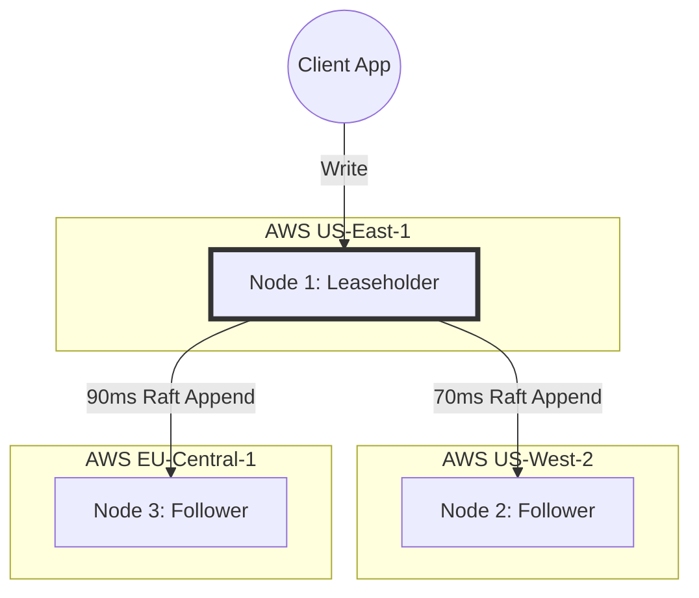

# Spanner, CockroachDB, TiDB — Real-World Scenarios & War Stories

> **Principal's Perspective:** Distributed SQL systems promise to hide the complexity of distributed systems behind a familiar SQL interface. However, abstraction leaks. When physics (latency) and cluster dynamics (rebalancing) hit the application, engineers who treat these systems like a standard MySQL instance cause catastrophic outages.

---

## Scenario 1: The "Sequential ID" Hotspot Failure (TiDB / CockroachDB)

**Background:** A high-growth e-commerce startup migrated their massive `Orders` table from a sharded MySQL cluster to TiDB to simplify queries and horizontal scaling.

**The Architecture:** 
They copied their exact MySQL schema over, utilizing an `AUTO_INCREMENT` primary key for the `Orders` table.
```sql
CREATE TABLE orders (
    id BIGINT AUTO_INCREMENT PRIMARY KEY,
    customer_id INT,
    status VARCHAR(20)
);
```

**The Incident:** 
During a flash sale, order volume spiked to 20,000 inserts per second. Suddenly, the TiDB cluster crashed. Monitoring showed that 29 out of 30 storage nodes (TiKV) were sitting idle at 5% CPU, while a single node spiked to 100% CPU and subsequently OOM-killed itself.

**The Root Cause:**
Distributed SQL databases split data mechanically based on sorted key ranges. 
1. The Primary Key is the clustering key.
2. `AUTO_INCREMENT` generates strictly sequential IDs (1001, 1002, 1003...).
3. TiDB maps these to the KV store. Because they are sequential, they all fall into the the *exact same underlying Raft range* at the "end" of the key space.
4. **Result:** Every single `INSERT` in the entire cluster was strictly routed to the one TiKV node acting as the Raft Leader for that final specific range.

**The Fix:**
In Distributed SQL, primary keys must be distributed randomly (or UUIDs) to spray writes evenly across all Raft ranges (and thus, all nodes).
* **TiDB Fix:** Altered the table to use `SHARD_ROW_ID_BITS = 4`, physically distributing the sequential IDs behind the scenes across 16 internal shards.
* **CockroachDB Fix:** Abandoned `SERIAL` and moved to `UUID` or `gen_random_uuid()`. 

---

## Scenario 2: The Multi-Region "Latency Floor" Awakening (CockroachDB)

**Background:** A global SaaS company wanted to survive a complete AWS region failure `(us-east-1)`. They deployed a 3-region CockroachDB cluster: `us-east-1`, `us-west-2`, and `eu-central-1`.

**The Incident:**
The application, previously communicating with a local PostgreSQL instance in `<1ms`, was suddenly experiencing `150ms` latency for every single `INSERT` or `UPDATE`. Background jobs that normally completed in 5 minutes were taking 4 hours. Developers blamed CockroachDB, heavily questioning the "SQL scale" promise.

**The Root Cause:**
Physics. 
In a 3-node cluster, a write commits only when a quorum (2 out of 3 nodes) acknowledges the Raft append.

### Multi-Region CockroachDB Deployment Topology


1. A client connects to the node in `us-east-1` and issues an `UPDATE`.
2. The `us-east-1` node acts as the leaseholder and attempts to write to the Raft log.
3. It writes locally (`<1ms`) but must wait for either `us-west-2` or `eu-central-1` to acknowledge.
4. The fastest network path is to `us-west-2` (approx 70ms round trip).
5. Therefore, the absolute mathematical floor for a write latency is `~70ms`, ignoring DB processing time.

The developers were wrapping thousands of individual inserts in loops rather than using bulk batch inserts `INSERT INTO ... VALUES (), (), ()`. Each loop iteration suffered the 70ms penalty.

**The Fix:**
1. **Application rewrite:** Batching statements together. One 70ms round-trip for 1,000 rows is fine. 1,000 round-trips is a disaster.
2. **Topology Pinning:** They realized users in `eu-central-1` rarely touched data created by `us-east-1`. They used CockroachDB's **Geo-Partitioning** to pin European data ranges to a quorum of European servers (e.g., `eu-central-1a`, `eu-central-1b`, `eu-west-1`), reducing write latency for EU users to `~2ms` while retaining global SQL query ability.

---

## Scenario 3: Spanner "Commit Wait" and Extreme Concurrency

**Background:** A massive ad-tech firm migrated their real-time bidding ledger from a sharded Cassandra environment to Google Spanner to regain cross-shard transaction safety (ACID) without losing scale.

**The Incident:**
During normal operations, Spanner's 99th percentile (p99) commit latency was exceptionally fast and stable (~10-15ms). However, during massive, concurrent spikes touching heavily contested rows (e.g., updating an advertiser's global budget constraint), transactions began experiencing high abort rates and retries leading to downstream starvation.

**The Root Cause:**
Google Spanner uses **TrueTime**. To ensure external consistency, Spanner requires a "Commit Wait".
1. A transaction acquires locks and calculates its commit timestamp `t`.
2. It looks at the TrueTime uncertainty window (`epsilon`, roughly 7ms).
3. The transaction literally sleeps until the current time is strictly greater than `t + epsilon` before reporting success to the client.

While this normally happens in parallel with the cross-region Paxos replication (meaning you often don't "feel" the wait), extreme contention on a *single row* forces serial execution. Transactions lining up for the same row lock must strictly run sequentially. If 100 transactions hit the same row at the exact same millisecond, transaction 100 will wait `100 * (Paxos Latency + Commit Wait)`, often blowing past timeout thresholds and aborting.

**The Fix:**
You cannot alter Spanner's TrueTime mechanics. The firm had to redesign their schema to avoid heavily contested single rows.
* Instead of updating a single `budget_spent` column for an advertiser, they appended delta records to a `budget_spends` table (a write-only pattern, avoiding locks).
* They used an asynchronous worker to roll up the sums periodically or summed them up on read, trading read speed for write concurrency.

---

## Scenario 4: The Out-of-Sync NTP Disaster (CockroachDB On-Prem)

**Background:** A European bank ran CockroachDB on their own managed on-premises data centers to comply with strict hardware security regulations, forbidding AWS or GCP usage.

**The Incident:**
At 2:00 AM on a Sunday, a third of the CockroachDB cluster suddenly committed suicide (processes intentionally crashed). The database effectively went down, requiring manual intervention.

**The Root Cause:**
Unlike Spanner's specialized atomic clocks, CockroachDB handles transaction causality via Hybrid Logical Clocks (HLC), which rely heavily on the accuracy of the host machine's Network Time Protocol (NTP) daemon.
To prevent consistency anomalies (where a read from the future reads data from the past), CockroachDB has a strict setting: `maximum clock offset` (usually 500ms).

The bank's IT department had an intermittent network switch failure that isolated the NTP server from one of the data centers. Over a few weeks, the un-synced servers drifted by more than 500ms.
CockroachDB detected that the clock drift exceeded the hard safety threshold. Rather than serving corrupted or inconsistent transactional data across the distributed cluster, the node processes chose safety over availability and terminated themselves.

**The Fix:**
1. Installed Chrony (modern NTP implementation) and configured it to aggressively step the clock.
2. Implemented strict Prometheus alerting on `clock-offset` metrics to alert administrators when drift exceeded 250ms, long before the 500ms crash threshold. 
3. The principal architect recognized that "software consensus" mandates highly rigorous operational hygiene on hardware infrastructure.
