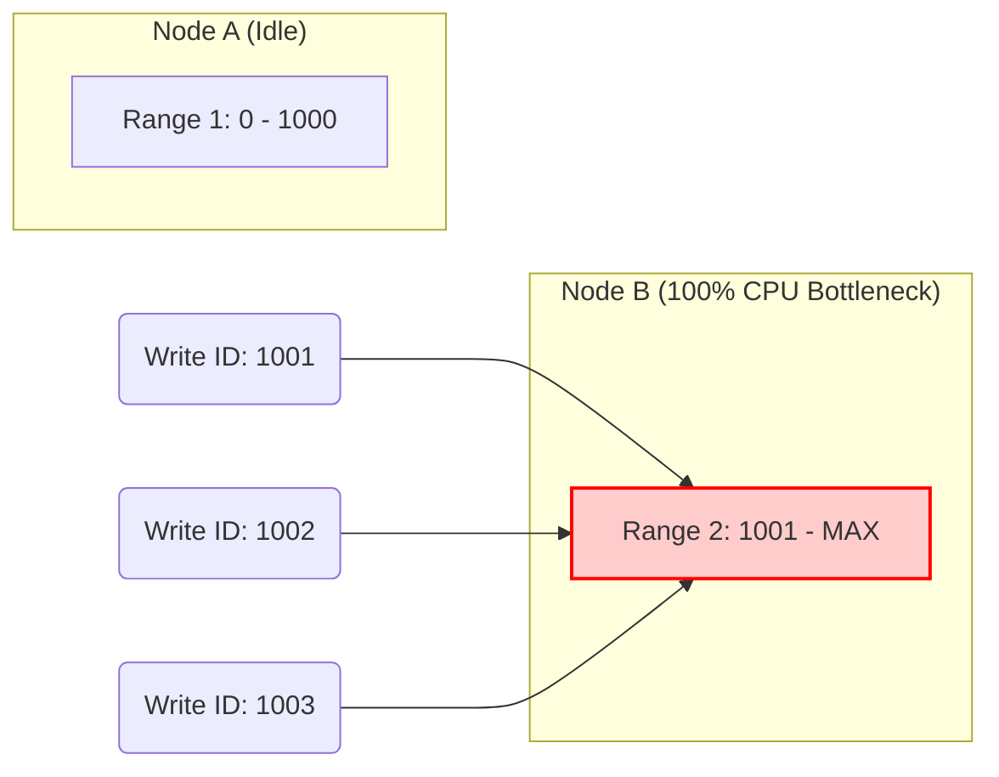

# Spanner, CockroachDB, TiDB — Pitfalls & Anti-Patterns

> **Principal's Perspective:** Because they look and feel like PostgreSQL or MySQL locally, developers assume they can lift-and-shift their monolithic application code. This is a trap. The abstraction leaks heavily at scale, specifically around latency, transaction conflicts, and schema design.

---

## Anti-Pattern 1: Sequential Primary Keys

**The Mistake:** Using `AUTO_INCREMENT`, `SERIAL`, or UUIDs generated as version 1 or 6 (time-based sequential UUIDs) as primary keys on high-insert tables.

**Why It's Dangerous:**
Distributed SQL breaks a table into contiguous, sorted chunks (Ranges) across nodes.
```text
Range 1: IDs 1 - 1,000,000 (Node A)
Range 2: IDs 1,000,001 - 2,000,000 (Node B)
```

### The Hotspot Failure Mode


If you insert rows with sequential IDs, every new `INSERT` will hit the "highest" Range currently in existence. All cluster write traffic converges on a single node (the Raft leader for that final range). The cluster becomes fundamentally unscalable for writes—running at the maximum performance of exactly 1 disk and 1 CPU thread.

**The Fix:**
* Use **UUID Version 4** (pure random).
* If you absolutely must use sequences (for business logic), use CockroachDB's `gen_random_uuid()` or TiDB's `SHARD_ROW_ID_BITS` feature to scatter the sequential assignments invisibly across underlying Ranges.

---

## Anti-Pattern 2: Missing Retry Logic for "Serialization Failure"

**The Mistake:** Not writing application-level retry blocks for `SQLSTATE 40001` (Serialization Failure) or `SQLSTATE 40003` (Statement Completion Unknown).

**Why It's Dangerous:**
To give you global correctness without central locks, these databases aggressively use **Optimistic Concurrency Control (OCC)**.
When two transactions conflict over a row on different nodes, rather than blocking the whole cluster indefinitely, one transaction is forced to **abort** (transaction restart).
The database will simply return an error to your code. If your application code (e.g., Spring Boot, Django, Node.js) doesn't catch `40001` and replay the `<try...commit>` block, the transaction is silently dropped, leading to customer-facing 500 errors and lost logic.

**The Fix:**
The `UPDATE` code *must* look like:
```python
while retry_count < max:
   try:
      execute(transaction)
      commit()
      return # Success
   except SerializationFailure:
      rollback()
      retry_count += 1
```
Use the native connector libraries from Cockroach Labs / PingCAP which often wrap this logic implicitly.

---

## Anti-Pattern 3: Massive O/R Mapper "N+1" Queries

**The Mistake:** Using an ORM (Hibernate, Prisma) heavily configured with Lazy Loading, running thousands of tiny sequential `SELECT` queries to resolve relationships.

**Why It's Dangerous:**
In local PostgreSQL, a network round trip from the App Server to the DB takes `0.5ms`. 
`1,000 reads = 0.5s` (Annoying, but survivable).

In CockroachDB, the data might be in another availability zone. A trip takes `3ms`. 
`1,000 reads = 3s` (Application times out, thread pool exhausts).

**The Fix:**
Distributed SQL hates chatty applications. 
* Rewrite queries to extensively use `JOIN`s, pushing the relational resolution down into the database engine.
* Use bulk fetches `WHERE id IN (...)`.
* Never design algorithms that issue queries within `for` loops.

---

## Anti-Pattern 4: Poor Interleaved or Family Groupings

**The Mistake:** Designing overly normalized schemas with parent/child tables (e.g., `Users` and `User_Preferences`) and frequently joining them, without telling the underlying Key-Value engine they belong together.

**Why It's Dangerous:**
If `Users.id=1` lands on Node A (Range 1), and `User_Preferences.user_id=1` lands on Node C (Range 400), a simple query grabbing a user and their preferences triggers an expensive distributed network query.

**The Fix:**
* **Interleaved Tables (Spanner/CockroachDB):** Physically embed the child rows near the parent rows in the sorted KV layer by defining the schema with an `INTERLEAVE IN PARENT` clause or careful primary key ordering.
```sql
CREATE TABLE users (id INT PRIMARY KEY);
CREATE TABLE user_prefs (
    user_id INT, 
    pref_id INT, 
    PRIMARY KEY(user_id, pref_id)
);
-- By sharing the prefix `user_id`, both tables sort adjacently in the LSM tree.
```

---

## Anti-Pattern 5: The Geography Ignore

**The Mistake:** Expanding a cluster to a new continent (e.g., adding 3 nodes in Europe to a 3-node USA cluster) but continuing to query USA-based user data from application servers in Europe.

**Why It's Dangerous:**
The application server inherently introduces `~80ms` of speed-of-light penalty for a cross-Atlantic query. Furthermore, writing data requires a Raft quorum consensus. A European user's write will require network hops back to the USA nodes, adding `~150ms`.

**The Fix:**
* Use **Data Domiciling/Geo-partitioning**. You instruct the database to pin rows where `country='EU'` exclusively to European datacenters at the Raft level.
* Use **Follower Reads**. For non-critical dashboards hitting global data, append `AS OF SYSTEM TIME '-10s'` to the query. The database will serve the query from a local stale replica (bypassing the Raft leader entirely), reducing latency from 150ms to 2ms.
