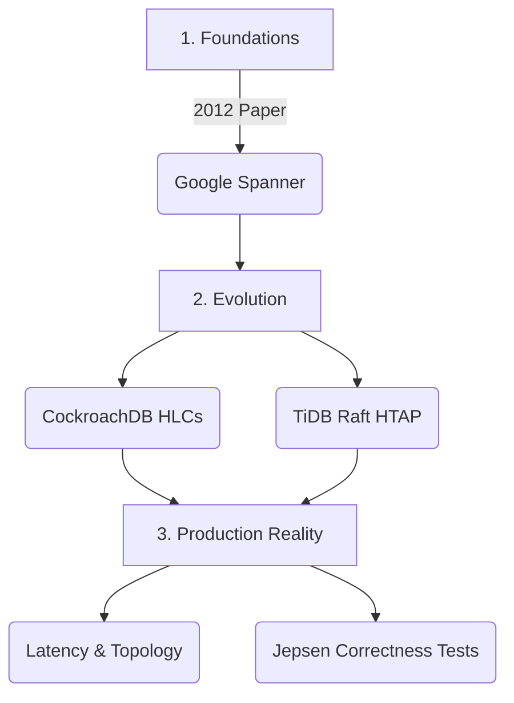

# Spanner, CockroachDB, TiDB — Further Reading

> **Principal's Perspective:** This is an incredibly dense, heavily researched area of computer science. If you only read one thing, read the original Spanner paper. It spawned a trillion-dollar industry.

### Reading Path Map

---

## Tier 1: The Foundational Architectures

| Resource | Why It Matters |
| :--- | :--- |
| **[Spanner: Google's Globally-Distributed Database (Corbett et al., 2012)](https://static.googleusercontent.com/media/research.google.com/en//archive/spanner-osdi2012.pdf)** | The paper that started the NewSQL movement. Introduce Paxos-replicated KV, TrueTime, and external consistency. This is required reading for Staff+ engineers. |
| **[Spanner: Becoming a SQL System (Bacon et al., 2017)](https://static.googleusercontent.com/media/research.google.com/en//pubs/archive/46103.pdf)** | Follows up the 2012 paper detailing how they added a robust SQL query execution and optimization engine on top of the KV layer. |
| **[TiDB: A Raft-based HTAP Database (Huang et al., 2020)](https://www.vldb.org/pvldb/vol13/p3072-huang.pdf)** | Explains the complete PingCAP architecture. Specifically covers the integration of TiKV (Row) and TiFlash (Col) using Raft Learner nodes, proving the viability of massive HTAP systems. |
| **[CockroachDB: The Resilient Geo-Distributed SQL Database (Taft et al., 2020)](https://dl.acm.org/doi/pdffull/10.1145/3318464.3386134)** | Cockroach Labs detailing their implementation of Hybrid Logical Clocks, their heavily optimized 2PC protocol, and their mapping of SQL constraints onto RocksDB. |

---

## Tier 2: Deep Dives into Core Mechanisms

| Resource | Focus |
| :--- | :--- |
| **[Logical Physical Clocks and Consistent Snapshots in Globally Distributed Databases (Kulkarni et al., 2014)](https://cse.buffalo.edu/tech-reports/2014-04.pdf)** | The academic foundation for Hybrid Logical Clocks (HLC) used by CockroachDB instead of Spanner's TrueTime. |
| **[Living Without Atomic Clocks (Cockroach Labs Blog)](https://www.cockroachlabs.com/blog/living-without-atomic-clocks/)** | A highly accessible practitioner explanation of how HLCs work, maximum clock offsets, and how uncertainty windows cause transaction restarts. |
| **[Calvin: Fast Distributed Transactions for Partitioned Database Systems](https://dl.acm.org/doi/10.1145/2213836.2213838)** | An alternate approach to Spanner. Uses a deterministic locking protocol rather than 2PC. Foundation for FaunaDB. Good for contrast. |

---

## Tier 3: Production Engineering & Latency Truths

| Resource | Focus |
| :--- | :--- |
| **[Understanding Consistency in Distributed Databases (Jepsen Reports)](https://jepsen.io/analyses)** | Read the specific testing analyses for CockroachDB and TiDB. Aphantyr details exactly how the databases fail when network partitions induce clock drift and packet loss. |
| **[CockroachDB Topology Patterns](https://www.cockroachlabs.com/docs/stable/topology-patterns.html)** | The authoritative guide on how to survive AWS multi-region failures, covering geo-partitioning, duplicate indexes, and follower reads to solve the "Latency Floor" problem. |
| **[TiDB Performance Tuning Guide](https://docs.pingcap.com/tidb/stable/tune-performance)** | Covers the painful reality of "hot regions", why sequential inserts destroy distributed databases, and how to use PD to spot Raft distribution bottlenecks. |

---

## Connections within the Curriculum

| Topic | Reference | Why it intersects |
| :--- | :--- | :--- |
| **Distributed Consensus** | [../../02_Transactions_and_Consistency/03_Distributed_Consensus/](../../02_Transactions_and_Consistency/03_Distributed_Consensus/) | Spanner/TiDB/CockroachDB are just thick wrappers running over hundreds of thousands of concurrent *Raft* or *Paxos* groups. |
| **PACELC Theorem** | [../02_PACELC_Theorem/](../02_PACELC_Theorem/) | These NewSQL databases generally trade latency (the 'L') during normal operations to guarantee strict consistency (the 'C'). |
| **Isolation Levels** | [../../02_Transactions_and_Consistency/02_Isolation_Levels/](../../02_Transactions_and_Consistency/02_Isolation_Levels/) | Distributed SQL systems strictly enforce Serializable (CockroachDB) or Snapshot Isolation (TiDB) by leveraging OCC across massive topologies. |
