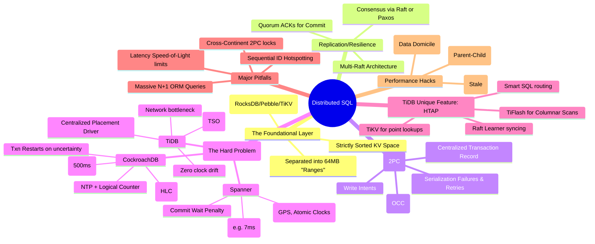

# Spanner, CockroachDB, TiDB — Mind Map

> **Principal's Perspective:** A quick visual reference mapping the core structural differences, problem solving tools, and architectural tradeoffs inherent to Distributed SQL.

---

## Visual Architecture Map

---

## Quick Comparison Matrix

| Aspect                 | Spanner           | CockroachDB      | TiDB               |
|:-----------------------|:-----------------:|:----------------:|:------------------:|
| **Language Compat**    | PostgreSQL / Spanner | PostgreSQL | MySQL             |
| **Primary Clock**      | Hardware (TrueTime) | Software (HLC) | Central Network (TSO) |
| **Transaction Method** | 2PC + Paxos       | 2PC + Multi-Raft | 2PC + Multi-Raft  |
| **Deep Analytics**     | BigQuery (Export)   | No               | Native (TiFlash) |
| **Open Source**        | No                  | BSL (Source Available) | Apache 2.0  |

---

## The "How Does a Write Happen?" Flow

1. **Client connects to node (Gateway).**
2. Gateway checks SQL -> Maps to KV keys.
3. Gateway opens Transaction Record (Pending).
4. Gateway determines which internal Ranges map to the Keys.
5. Gateway asks Cluster: "Who is the Raft Leaseholder for Range Z?"
6. Gateway sends KV Write Intents to the Leaseholder.
7. Leaseholder writes payload to Raft log, replicates exactly a subset to quorum.
8. Quorum ACKs.
9. Gateway updates Transaction Record (Committed).
10. System responds to Client (Success).
11. Async: Intents are lazily cleaned up to normal committed values in the LSM.
