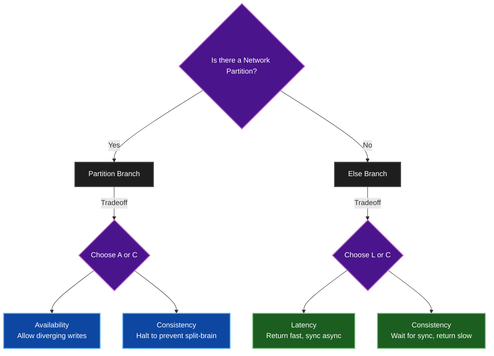

# The PACELC Theorem — Concept Overview

> **Principal's Perspective:** CAP theorem is fundamentally flawed for modern system design because it only describes what happens during a rare network partition. PACELC describes what happens the other 99.99% of the time: the brutal tradeoff between Latency and Consistency. If you don't use PACELC, you are ignoring the actual cost of your distributed system.

---

## 1. Why CAP is Dead (or at least, inadequate)

The CAP Theorem states that given a network **P**artition, a distributed database must choose between **C**onsistency and **A**vailability.
* If a network cable is cut between NYC and London, do you halt writes in London to keep data consistent (CP)?
* Or do you allow writes in both places, knowing they might diverge (AP)?

**The problem with CAP:** Networks don't partition constantly. Modern cloud networks (AWS, GCP) are incredibly stable. If your theoretical framework only helps you make decisions during a rare failure event, it is useless for designing average-case performance.

## 2. Enter PACELC (2010, Daniel Abadi)

Daniel Abadi proposed an extension to CAP that addresses normal operations. 

**PACELC stands for:**
* If there is a **P**artition (**P**), how does the system trade off **A**vailability and **C**onsistency (**A** vs **C**)?
* **E**lse (**E**), during normal operations without partitions, how does the system trade off **L**atency and **C**onsistency (**L** vs **C**)?

> **P A/C , E L/C**

This transforms database selection from a binary choice during emergencies into a continuous spectrum of choices for daily operation.

---

## 3. The "Else" Clause: The Latency vs. Consistency Tradeoff

This is the most critical realization in distributed systems: **You cannot have strong consistency across geography without paying a speed-of-light latency penalty.**

If you have servers in New York and servers in Tokyo:
* To be **Consistent (C)**, a write in New York *must* wait for Tokyo to acknowledge it before telling the user "success". You pay a massive **Latency** penalty (150ms+).
* To have low **Latency (L)**, a write in New York returns "success" instantly to the user, and replicates to Tokyo asynchronously in the background. But you have sacrificed **Consistency**, because a user querying Tokyo milliseconds later will see stale data.

**The Golden Rule of PACELC:** You can be fast, or you can be perfectly synchronized. You cannot be both across a network.

---

## 4. The PACELC Categorization Matrix

Modern databases fit into this framework, usually driven by their default configurations.

| PACELC Category | Database Examples | What It Means |
| :--- | :--- | :--- |
| **PC / EC**  (Always Consistent) | **Spanner, CockroachDB, TiDB, VoltDB** | If partitioned -> gives up Availability to stay Consistent.  Else -> gives up Latency to stay Consistent (every write requires synchronous quorum). |
| **PA / EL**  (Always Available/Fast) | **DynamoDB, Cassandra, Riak, Cosmos DB** | If partitioned -> gives up Consistency to stay Available.  Else -> gives up Consistency (returns data fast, syncs async) to stay low Latency. |
| **PA / EC**  (The Rare Breed) | **MongoDB (Default)** | If partitioned -> stays Available (primary steps down, secondary takes over).  Else -> gives up Latency to stay Consistent (reads/writes hit the primary node only). |
| **PC / EL**  (The Specialized Breed) | **PNUTS (Yahoo)** | If partitioned -> loses Availability to ensure Consistency.  Else -> gives up Consistency to guarantee low Latency. |

---

## 5. Why PACELC Matters for Architecture Configuration

The defining trait of a Principal Architect isn't just picking the right database from the matrix above; it's recognizing that **these properties are tunable per query**.

You can take Cassandra (strictly `PA/EL` by default) and run a query with `CONSISTENCY LEVEL ALL`. You have suddenly forced it to operate as `PC/EC` for that exact query, forcing the user to endure maximum latency to guarantee perfect consistency.

You can take CockroachDB (strictly `PC/EC` by default) and run a query `AS OF SYSTEM TIME '-10s'`. You have forced it to operate as `EL` (low latency, stale data) for that query.

**Architecture is no longer about choosing a database based on its logo; it's about continuously twiddling the dials of the PACELC formula to match business requirements.**
