# The PACELC Theorem — How It Works (The Mechanics)

> **Principal's Perspective:** To understand the `E L/C` (Else Latency/Consistency) branch of PACELC, you must understand how physical data replication actually occurs. The underlying mechanics of Quorums, Synchronous vs Asynchronous replication, and Read/Write intersections define exactly where a system lands on the PACELC spectrum.

---

## 1. The Core Mechanic: Quorums (W + R > N)

The mechanism by which most modern distributed databases allow you to tune your PACELC placement is the **Quorum**.

* **N**: Total number of replicas for a piece of data.
* **W**: Write Quorum (how many nodes must acknowledge a write before returning success).
* **R**: Read Quorum (how many nodes must be consulted to serve a read).

**The Rule of Strict Consistency:**  
If `W + R > N`, your system is strictly consistent (`EC`). You will always read the most recently written data, because the set of nodes you wrote to will always mathematically overlap with the set of nodes you read from.

```mermaid
sequenceDiagram
    autonumber
    participant Client
    participant Coord as Coordinator Node
    participant N1 as Node 1 (Local)
    participant N2 as Node 2 (Remote)
    participant N3 as Node 3 (Remote)
    
    rect rgb(30, 30, 30)
    note right of Client: Low Latency (W=1)
    Client->>Coord: Write(W=1)
    Coord->>N1: Write Data
    N1-->>Coord: ACK
    Coord-->>Client: Success (Fast!)
    Coord-)N2: Async replicate
    Coord-)N3: Async replicate
    end

    rect rgb(40, 20, 20)
    note right of Client: Strict Consistency (W=2 / Quorum)
    Client->>Coord: Write(W=2)
    Coord->>N1: Write Data
    Coord->>N2: Write Data
    N1-->>Coord: ACK
    N2-->>Coord: ACK
    Coord-->>Client: Success (Slow, waiting for N2)
    end
```

### Example: Tuning Cassandra (N=3)

If you have 3 nodes, you can explicitly choose your `E L/C` profile per query.

**Scenario A: The "EL" (Low Latency) Profile**
* Write with `W=1`. (Database writes to 1 node, returns success instantly. Replicates to others async).
* Read with `R=1`. (Database asks 1 node, returns data instantly).
* `W(1) + R(1) = 2`. Since `2` is not greater than `N(3)`, you risk reading stale data. You chose Latency over Consistency.

**Scenario B: The "EC" (High Consistency) Profile**
* Write with `W=2` (QUORUM). (Database writes to 1 node, forces a second node across the network to acknowledge it. High latency).
* Read with `R=2` (QUORUM). (Database asks 2 nodes, compares timestamps to find the newest. High latency).
* `W(2) + R(2) = 4`. Since `4 > N(3)`, you are mathematically guaranteed to read the latest write. You chose Consistency over Latency.

---

## 2. Synchronous vs Asynchronous Replication

For systems that use primary/replica models (PostgreSQL, MySQL, MongoDB), PACELC behavior is explicitly defined by replication settings.

### Asynchronous Replication (The PA/EL Default)
1. Client writes to Primary.
2. Primary writes to its local disk.
3. Primary responds "Success" to Client.
4. *Millis later*, Primary streams the WAL (Write-Ahead Log) to Replicas.

**PACELC Analysis:**
* **Else (Normal):** Latency is very low (`EL`), but Consistency is weak. Replicas are slightly stale.
* **Partition/Failure:** If the Primary dies right after step 3, but before step 4, the data is permanently lost. Standard High-Availability failover promotes a Replica that missed the write. Availability won (`PA`).

### Synchronous Replication (The PC/EC Configuration)
1. Client writes to Primary.
2. Primary writes to its local disk.
3. Primary streams the WAL to Replica.
4. Replica writes, and sends ACK to Primary.
5. Primary responds "Success" to Client.

**PACELC Analysis:**
* **Else (Normal):** Latency is high (`EC`), bound by the network trip to the replica. Consistency is perfect.
* **Partition/Failure:** If the network link between Primary and Replica is partitioned, step 4 never happens. The Primary will block indefinitely. The system halts writes to preserve consistency (`PC`).

---

## 3. The Protocol Impact (Raft/Paxos vs Gossip)

The choice of consensus protocol hardwires a database's fundamental PACELC bias.

### 1. Consensus Protocols (Raft, Paxos) -> Bias: `PC/EC`
Used by Spanner, CockroachDB, TiDB, etcd, ZooKeeper.
* **Mechanics:** They enforce a strict, synchronous majority quorum for every write. No exceptions.
* **Result:** They *must* be `EC` (pay latency for consistency), and they *must* be `PC` (halt if a majority is partitioned).
* **The "Escape Hatch":** To regain Latency, they offer "Follower Reads" (reading stale data intentionally), but writes can never be low-latency.

### 2. Gossip / Dynamo Protocols -> Bias: `PA/EL`
Used by Cassandra, DynamoDB, Riak.
* **Mechanics:** These are "leaderless" systems. Any node can accept a write. They use a gossip protocol, hinted handoffs, and anti-entropy repair (Merkle Trees) to sync data *eventually*.
* **Result:** They are fundamentally tuned to return fast (`EL`) and stay alive during partitions (`PA`).
* **The "Escape Hatch":** As shown above, you can force them to behave `EC` by maxing out `W` and `R` quorums, but you are fighting the core design of the system, and it will be less efficient than a native `PC/EC` system.

---

## 4. The Micro-Level: Database Caches

PACELC isn't just for massive distributed networks; it applies to local memory vs disk architectures.

Consider Redis caching a database.
* **Write-through cache (`EC`):** Write to cache + write to DB synchronously. High latency, perfectly consistent.
* **Write-behind cache (`EL`):** Write to cache, return to user, async flush to DB. Low latency, highly vulnerable to data loss on power failure.

Every single decision in data architecture where duplication occurs is bound by PACELC.
