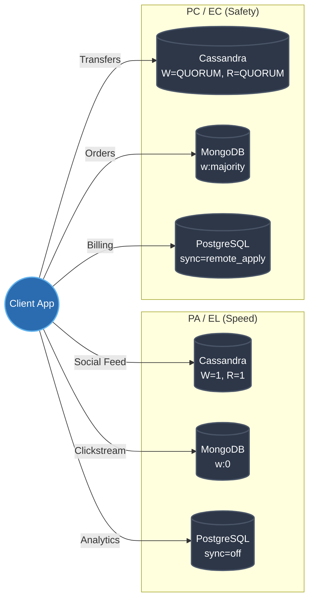

# The PACELC Theorem — Hands-On Examples

> **Principal's Perspective:** Theory is useless until you tie it to the configuration files of the databases you operate. Let's look exactly at how to twiddle the PACELC dials in three major database ecosystems.

---

## 1. Cassandra: Tuning PACELC per Query

Cassandra is the ultimate `PA/EL` database, but it explicitly exposes PACELC tuning via the `CONSISTENCY LEVEL` setting on every single read and write.

Suppose we have a 3-node Cassandra cluster (`N=3`).

### Scenario A: Extreme Latency Optimization (EL)
We want writes to return practically instantly, even if data is lost on node failure.

```cql
-- Force the write to succeed if ANY one node receives it
CONSISTENCY ONE;
INSERT INTO telemetry (device_id, temp, time) VALUES ('sensor-01', 72.5, toTimestamp(now()));

-- Force the read to return instantly from the fastest responding node
CONSISTENCY ONE;
SELECT temp FROM telemetry WHERE device_id = 'sensor-01' LIMIT 1;
```
**PACELC Profile:** `W=1, R=1, W+R=2 <= N(3)`. We sacrificed Consistency for maximum Latency reduction (`EL`). During a partition, we remain Available (`PA`).

### Scenario B: Strong Consistency Guarantee (EC)
We are writing critical financial data. We *must* guarantee linearizable reads.

```cql
-- Force the write to reach a majority of nodes before returning success
CONSISTENCY QUORUM;
INSERT INTO accounts (user_id, balance) VALUES ('user-01', 500.00);

-- Force the read to check a majority of nodes, compare timestamps, and return the newest
CONSISTENCY QUORUM;
SELECT balance FROM accounts WHERE user_id = 'user-01';
```
**PACELC Profile:** `W=2, R=2, W+R=4 > N(3)`. We sacrificed Latency by forcing network hops to guarantee Consistency (`EC`). During a partition that splits the cluster 2v1, the minority partition will refuse writes (`PC`).

---

## 2. PostgreSQL: The Synchronous Commit Toggle

PostgreSQL defaults to `PC/EL` for a single node (consistent single master, asynchronous replication to standbys). You control PACELC via the `synchronous_commit` parameter in `postgresql.conf`.

### Scenario A: The Default (EL)
```ini
# postgresql.conf
synchronous_commit = on
```
Wait, the default `on` means asynchronous? Yes. It means the Primary waits for its *own* local disk to sync the WAL before returning success to the client. It does *not* wait for replicas.
* **PACELC Result:** Low Latency (`EL`), but if the primary dies before the network layer ships the WAL, committed data is lost (weak Consistency).

### Scenario B: Maximum Consistency (EC)
```ini
# postgresql.conf
synchronous_commit = remote_apply
synchronous_standby_names = 'replica1,replica2'
```
Now, the Primary writes to local disk, streams the WAL to `replica1`, and waits for `replica1` to apply the WAL to its local database pages, *then* returns success to the client.
* **PACELC Result:** High Latency (`EC`), bounded by network RTT and replica disk IO. Perfect Consistency. If the network drops (`P`), the primary halts (`PC`).

---

## 3. MongoDB: Write Concerns and Read Preferences

MongoDB defaults to `PA/EL` with asynchronous replication. You manipulate the PACELC spectrum using Write Concerns (`w`) and Read Preferences.

### Scenario A: The Danger Zone (EL+)

```javascript
// A fire-and-forget write. 
// The client doesn't even wait for the primary MongoDB node to ACK the network receipt.
db.clicks.insert(
   { user: "john", button: "buy" },
   { writeConcern: { w: 0 } }
)
```
**PACELC Result:** Absolute minimum latency (`EL`), massive risk of data loss. 

### Scenario B: The "Just Right" Balance (EC)

```javascript
// The client waits for the primary AND a majority of secondaries to flush to journal
db.orders.insert(
   { order_id: 12345, total: 100.50 },
   { writeConcern: { w: "majority", j: true } }
)

// Read from the primary to ensure we don't hit a lagging secondary
db.orders.find({ order_id: 12345 }).readPref("primary")
```
**PACELC Result:** Consistency won the trade-off (`EC`). Latency is penalized by the network wait to the majority quorum.

---

## Integration Diagram: Tuning Across Systems



---

## Key Takeaway for Architects

You do not "buy" a `PA/EL` or `PC/EC` database off the shelf. You configure a cluster topology, and then developer code controls the precise PACELC behavior on a per-query basis. If developers are unaware of this, they will use the defaults, which are overwhelmingly tuned for `EL` (speed) over `EC` (safety).
