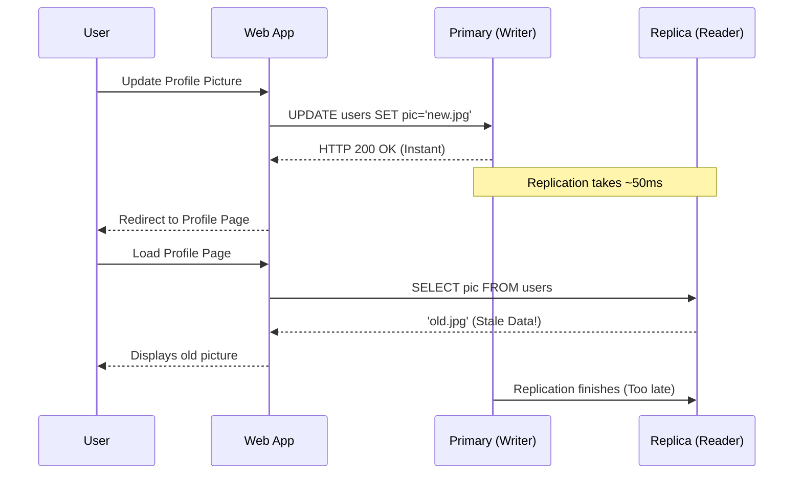

# The PACELC Theorem — Pitfalls & Anti-Patterns

> **Principal's Perspective:** The PACELC theorem exposes the lies told by database marketing teams. If a vendor promises "ACID transactions with zero latency over global distances," PACELC proves they are lying. The pitfalls emerge when engineers believe the marketing over the physics.

---

## Anti-Pattern 1: The "Read-After-Write" Delusion

**The Mistake:**
Configuring an infrastructure to be `EL` (Low Latency / Weak Consistency) via asynchronous replication or low quorums, but developing the application as if the database is `EC` (Strictly Consistent).

**How it Manifests:**
1. A user updates their profile picture (`UPDATE ...`). The database responds `200 OK` instantly (`EL`).
2. The UI immediately redirects to the profile page.
3. The profile page issues a `SELECT ...` to a replica.
4. Because replication takes 50ms and the redirect took 20ms, the replica serves the old profile picture.
5. The user complains: "I just updated it, but it didn't save!"

**The PACELC Reality Check:**
If you choose `E L`, you surrender the guarantee of reading your own writes on subsequent page loads unless you employ sticky routing (forcing the user to read from the primary/node they just wrote to).

---

## Anti-Pattern 2: Conflating "Availability" with "Uptime"

**The Mistake:**
Choosing a `PC/EC` database (like Spanner or CockroachDB) and assuming your application will have "100% Availability" because the marketing page said it survives node loss.

**How it Manifests:**
During a network partition (e.g., AWS East to West is cut), the minority side of the cluster strictly enforces `PC` (Partition -> Consistency). It **halts**. It refuses reads and writes to prevent split-brain.
If your API layer is load-balanced across the partition, 33% of your users will hit nodes that are hard-failing with `Timeout` or `Not Leader` errors.

**The PACELC Reality Check:**
`PC` databases mathematically sacrifice Availability during partitions. If 100% API uptime is the ultimate business mandate regardless of network health, you *must* choose a `PA` architecture (like DynamoDB) and deal with the inevitable conflict resolution logic in your code.

---

## Anti-Pattern 3: Misconfigured Quorums (W + R <= N)

**The Mistake:**
In systems like Cassandra, teams attempt to "tune" performance without understanding the math constraint: `W + R > N` for strict consistency.

**How it Manifests:**
A team has a 5-node cluster (`N=5`). Let's say writes are slow, so they lower the Write Quorum to `W=2`.
Reads are also slow, so they set Read Quorum to `R=2`.
`W(2) + R(2) = 4`. `4 is not greater than 5`.

When a read occurs, the coordinator asks 2 nodes for the data. But the last write only went to 2 *other* nodes. The coordinator sees old timestamps and returns stale data. The team assumes the database is "broken."

**The PACELC Reality Check:**
You cannot cheat the math. If you lower `W` to gain latency, you must raise `R` (increasing read latency) to maintain the inequality. You are simply shifting the latency penalty from the writer to the reader.

---

## Anti-Pattern 4: "Just slap Redis in front of it"

**The Mistake:**
An application uses a slow legacy RDBMS (`PC/EC`). To solve the latency problem, the team puts Redis in front of it as a write-behind cache.

**How it Manifests:**
The application writes to Redis, returns to the user (`EL`), and a worker thread flushes to the RDBMS.
A power failure takes down the Redis node. The worker thread dies. Thousands of "committed" transactions in Redis RAM are lost before reaching the RDBMS.

**The PACELC Reality Check:**
By putting an asynchronous cache in front of a `PC/EC` database, you have silently changed the architectural profile of your entire system to `PA/EL`. You traded Consistency for Latency, introducing permanent data loss vectors into a system the business *thinks* is strictly consistent.

---

## Anti-Pattern 5: Ignoring Geographic Distance in EC Systems

**The Mistake:**
Setting up a synchronous `EC` cluster across distant regions (e.g., Virginia, London, Tokyo) and acting surprised when simple `INSERT` statements take 200ms.

**The PACELC Reality Check:**
In an `EC` system, a transaction commits at the speed of the slowest link in the required quorum. You cannot bend the speed of light. An `EC` system should almost always be deployed across 3 Availability Zones within the **same** Region (e.g., `us-east-1a`, `us-east-1b`, `us-east-1c`) where ping times are `<1ms`, keeping the `EC` latency penalty negligible while surviving datacenter fires.
