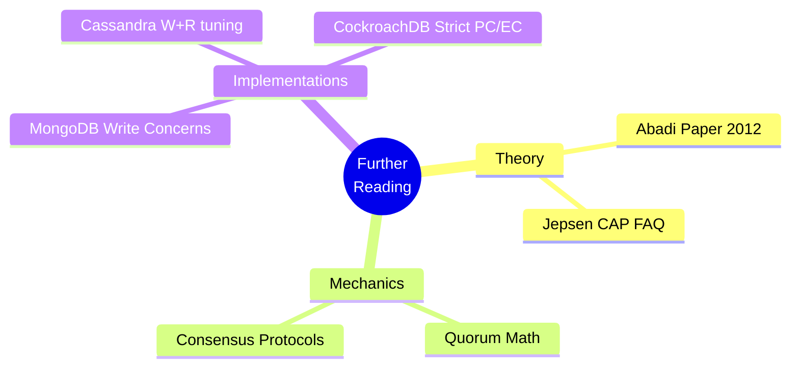

# The PACELC Theorem — Further Reading

> **Principal's Perspective:** CAP theorem is taught in Computer Science 101. PACELC is taught in the real world when your CTO asks why the distributed database you recommended just dropped 5,000 user registrations. Read the foundational paper to understand the theoretical limits.

---

## Tier 1: The Foundational Theory

| Resource | Why It Matters |
| :--- | :--- |
| **[Consistency Tradeoffs in Modern Distributed Database System Design (Abadi, 2012)](https://courses.cs.duke.edu/fall16/compsci516/papers/Consistency-Tradeoffs.pdf)** | This is the seminal paper by Daniel Abadi where the PACELC theorem was formally codified. It evaluates Dynamo, Bigtable, Cassandra, PNUTS, and SimpleDB against the theorem. If you read only one document on distributed systems taxonomy, read this. |
| **[CAP FAQ - Jepsen (Kyle Kingsbury)](https://jepsen.io/consistency/cap)** | Kingsbury breaks down exactly what CAP means practically, why it's mostly misunderstood, and explores the 'gray areas' where PACELC provides far better explanatory power. |

---

## Tier 2: Practical Application via Quorums

| Resource | Focus |
| :--- | :--- |
| **[Cassandra Architecture: Data Consistency](https://cassandra.apache.org/doc/latest/cassandra/architecture/dynamo.html#tunable-consistency)** | The official Apache Cassandra documentation explaining how `CONSISTENCY LEVEL` controls the W and R quorums. It perfectly demonstrates the tension between Latency (EL) and Consistency (EC). |
| **[Database Internals (Alex Petrov, 2019) - Chapter 11](https://www.oreilly.com/library/view/database-internals/9781492040330/)** | This chapter breaks down consensus protocols and their relationship to consistency guarantees. It mathematically explains W+R>N in a deeply accessible way. |

---

## Tier 3: Exploring Specific Implementations

| Resource | Focus |
| :--- | :--- |
| **[CockroachDB: What is the PACELC Theorem?](https://www.cockroachlabs.com/blog/pacelc-theorem/)** | Cockroach Labs outlines why they proudly build a strictly `PC/EC` database, explicitly prioritizing correctness over maximum theoretical speed during normal operations. |
| **[MongoDB Documentation: Write Concerns](https://www.mongodb.com/docs/manual/reference/write-concern/)** | Read the specific manual page on `w: "majority"` versus `w: 1`. It clearly shows how simply toggling a string in the application driver completely alters the fundamental PACELC constraints of the cluster. |

---

## Connections within the Curriculum

| Topic | Reference | Why it intersects |
| :--- | :--- | :--- |
| **Isolation Levels** | [../../02_Transactions_and_Consistency/02_Isolation_Levels/](../../02_Transactions_and_Consistency/02_Isolation_Levels/) | PACELC defines consistency across *space* (replicas). Isolation defines consistency across *time* (concurrent transactions). A fully ACID distributed system must master both. |
| **Spanner, CockroachDB, TiDB** | [../01_Spanner_Cockroach_TiDB/](../01_Spanner_Cockroach_TiDB/) | These are the prime examples of `PC/EC` databases. They use Paxos/Raft to explicitly trade latency for consistency. |
| **Distributed Consensus** | [../../02_Transactions_and_Consistency/03_Distributed_Consensus/](../../02_Transactions_and_Consistency/03_Distributed_Consensus/) | Consensus protocols (Raft) enforce strict sequential logging, which inherently forces a system into the `EC` (Consistent but Latency-penalized) corner of the PACELC matrix. |
