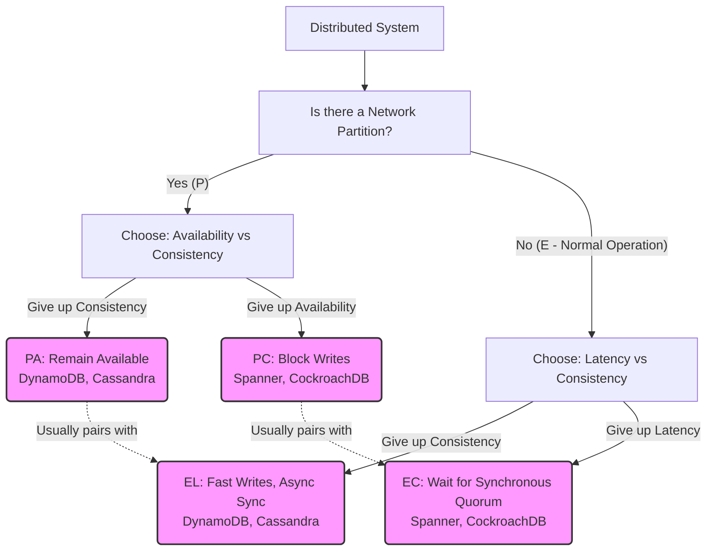

# The PACELC Theorem — Mind Map

> **Principal's Perspective:** A visual checklist detailing the foundational split between partition behavior and normal-operation behavior, mapping common database engines into their respective quadrants.

---

## PACELC Concept Flow



---

## Practical Quorum Math (`W + R > N`)

To achieve Strict Consistency (`EC`), the Write Quorum and Read Quorum must mathematically overlap so that a read ALWAYS touches at least one node containing the most recent write.

```text
N = 3 (Total Replicas)

CASE 1: LATENCY OPTIMIZED (EL)
Write (W=1) -> [ Node 1 ]      Node 2      Node 3
Read (R=1)  ->   Node 1      [ Node 2 ]    Node 3
Result: W(1) + R(1) = 2. Since 2 <= 3, the read missed the write. Stale data.

CASE 2: CONSISTENCY OPTIMIZED (EC)
Write (W=2) -> [ Node 1 ]    [ Node 2 ]    Node 3
Read (R=2)  ->   Node 1      [ Node 2 ]  [ Node 3 ]
Result: W(2) + R(2) = 4. Since 4 > 3, Node 2 provides the overlap and returns the fresh timestamp. Consistent data.
```

---

## The PACELC Category Matrix

| Category        | The Trade-Off Made | Common Use Cases | Classic Examples |
|-----------------|--------------------|-------------------|------------------|
| **PA / EL**     | Refuses to halt. Maximizes speed. Application handles conflict resolution later. | Shopping Carts, High-Velocity Telemetry, Social Feeds | Cassandra, Riak, DynamoDB |
| **PC / EC**     | Strict single truth. Halts if unsafe. Pays network ping latency on every single write. | Financial Ledgers, Inventory Control, Security Settings | Spanner, CockroachDB, TiDB |
| **PA / EC**     | The "Single Master" paradox. Survives partitions via elections, but normally proxies all queries to one consistent leader. | Caching, Content Management, Standard Web Apps | MongoDB (default setup) |
| **PC / EL**     | Halts during split-brain, but normally replicates fast and loose in the background. | Ad-Tech, Highly specialized distributed queues | Yahoo PNUTS |

---

## Principal's Cheat Sheet: "How to tune it?"

* **Cassandra:** Manipulate the `CONSISTENCY LEVEL` flag per-statement in your CQL drivers.
* **PostgreSQL:** Modify `synchronous_commit` and `synchronous_standby_names` in `postgresql.conf`.
* **MongoDB:** Adjust `writeConcern (w:)` and `readPreference` per-collection or per-query.
* **CockroachDB:** Enforces `PC/EC` on writes. Can be tuned to `EL` for queries using "Follower Reads" (`AS OF SYSTEM TIME '-10s'`).
