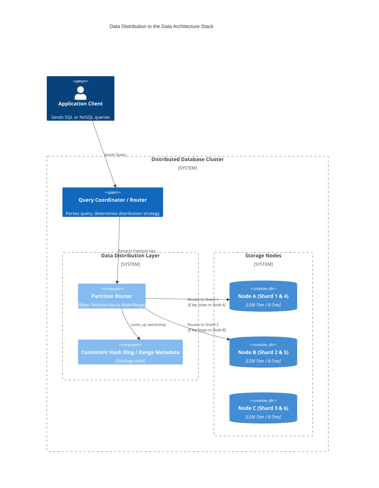

# Data Distribution Mechanics — Concept Overview

## Why This Exists

In systems dealing with internet-scale data, the limits of vertical scaling (scaling up a single machine) are reached relatively quickly due to hardware ceilings (CPU, RAM, PCIe bus limits, storage I/O). The industry pivot to horizontal scaling required data to be split across a cluster of commodity nodes. The challenge wasn't just storing the bytes, but effectively routing requests, managing hotspots, and surviving node additions or failures without shifting the entire dataset. Data distribution mechanics—ranging from simple modulo hashing to range-based splitting and consistent hashing—were invented precisely to solve the problem of dividing a monolithic dataset into discrete, manageable, and independently scalable fragments (shards/partitions).

## What Value It Provides

*   **Engineering ROI**: Predictable sub-10ms latency regardless of dataset size (from 1TB to 10PB). Decoupled failure domains (losing one node only affects $1/N$ of the data).
*   **Business ROI**: Infinite scalability of write throughput. Unblocks user growth curves that would otherwise be capped by the largest available AWS instance size. Cost-efficiency via utilizing fleets of cheaper instances rather than exorbitant mainframe-class machines.

## Where It Fits

Data distribution is the foundational routing layer sitting beneath the query execution engine, but above the physical storage engine (like RocksDB or InnoDB).

## When To Use / When NOT To Use

| Scenario | Distribution Strategy | Decision | Rationale |
| :--- | :--- | :---: | :--- |
| **B2B SaaS with defined tenants** | Tenant-based Range/Hash | ✅ YES | Tenant boundaries naturally isolate query workloads. |
| **Timeseries IoT data** | Time-based + Device Hash | ✅ YES | Avoids hotspots on "now" while allowing fast time range scans. |
| **Graph traversals of social networks** | Hash Partitioning | ❌ NO | High cross-partition latency; use specialized Graph DBs or careful edge replication. |
| **Financial ledger w/ ACID constraints** | Horizontal Sharding | ⚠️ CAUTION | Distributed transactions (2PC) over shards will destroy throughput. If required, use localized routing (Spanner/Cockroach). |
| **Dataset < 500GB** | Any distribution | ❌ NO | Just buy a bigger single-node Postgres instance (up to 128 vCPU / 4TB RAM is cheap). Don't pay the distributed tax prematurely. |

## Key Terminology

| Term | Precise Definition |
| :--- | :--- |
| **Shard / Partition** | A logical, mutually exclusive, and collectively exhaustive subset of the total dataset. |
| **Partition Key / Shard Key** | The attribute(s) of a record used by the hashing or routing algorithm to determine which node holds the data. |
| **Consistent Hashing** | A distributed hashing scheme that operates independently of the number of servers, ensuring that when an array is resized, only $K/n$ keys need to be remapped. |
| **Virtual Nodes (vnodes)** | Abstracting physical servers into multiple logical tokens on a hash ring to ensure even data distribution, especially across heterogeneous hardware. |
| **Scatter-Gather** | A query execution pattern where a coordinator asks *all* shards for data, aggregates the responses, and returns them to the client. Extremely inefficient at scale. |
| **Hotspot** | A severe performance degradation occurring when a poorly chosen partition key directs a massive disproportionate share of reads or writes to a single node. |
