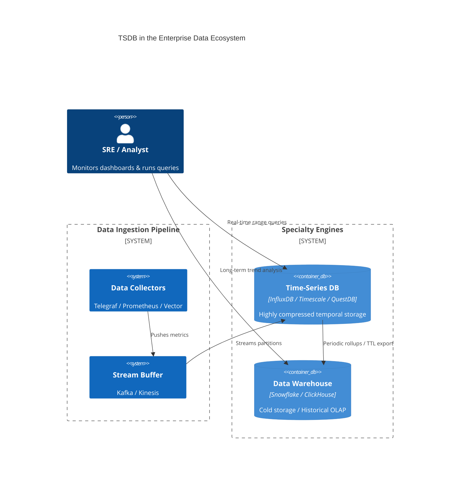

# Time-Series Databases (TSDB) — Concept Overview

## Why This Exists

The explosion of observational data—from IoT sensors, high-frequency financial trading, and microservices monitoring—created a data profile that general-purpose RDBMS (Relational Database Management Systems) struggle to handle efficiently. Time-Series data is characterized by:
1.  **Append-Only Workloads**: Data is almost never updated or deleted individually.
2.  **High-Velocity Ingestion**: Millions of events per second.
3.  **Time-Ordered Queries**: Data is almost always queried by time ranges and aggregated (mean, max, percentile).
4.  **Data Decay**: Recent data is extremely valuable; older data is summarized (downsampled) or deleted (retention).

Traditional B-Trees in RDBMS collapse under 100k+ inserts/sec due to index maintenance costs and lock contention. TSDBs utilize Log-Structured Merge (LSM) trees or Time-Structured Merge (TSM) trees and columnar storage to sustain massive ingestion while providing sub-second analytical queries.

## What Value It Provides

*   **Engineering ROI**: 90%+ storage reduction through specialized compression (Gorilla/Delta-Delta encoding). Sustains 10x higher ingestion rates on identical hardware vs. standard Postgres/MySQL.
*   **Business ROI**: Enables real-time anomaly detection for fraud or industrial safety. Provides millisecond-level visibility into infrastructure health, reducing Mean Time to Recovery (MTTR) by 40-60%. 

## Where It Fits

TSDBs occupy the "Observability" and "Industrial IoT" niches of the data stack. They rarely act as the "System of Record" for transactional data but are the primary sink for all event-stream data.

## When To Use / When NOT To Use

| Scenario | Recommendation | Rationale |
| :--- | :--- | :--- |
| **High-Frequency Metrics** | ✅ YES | Optimized for 1M+ inserts/sec and delta-encoding compression. |
| **Financial Tick Data** | ✅ YES | Native support for ASOF joins and temporal window functions. |
| **Order Management / CRM** | ❌ NO | TSDBs lack strong ACID constraints for updates/deletes. Use RDBMS. |
| **Full-Text Log Search** | ❌ NO | TSDBs are for quantitative metrics. Use Elasticsearch / Loki for logs. |
| **Small-Scale Monitoring** | ⚠️ CAUTION | If you have <10k points/sec, standard Postgres with an index on `created_at` is sufficient and avoids "specialty tax". |

## Key Terminology

| Term | Precise Definition |
| :--- | :--- |
| **Series / Stream** | A unique sequence of data points identified by a specific metric name and set of tags/labels. |
| **Tags / Labels** | Indexed metadata (e.g., `host_id`, `region`) used for filtering. These are usually stored once per series to save space. |
| **Fields / Samples** | The actual quantitative measurements (e.g., `cpu_temp`, `stock_price`). Usually non-indexed. |
| **Retention Policy** | A configuration defining how long data is kept before automatic deletion. |
| **Downsampling** | The process of aggregating high-resolution data (e.g., 1s intervals) into lower-resolution buckets (e.g., 1m intervals) for long-term storage. |
| **Cardinality** | The total number of unique series in the system. High cardinality is the primary "engine killer" for many TSDBs. |
