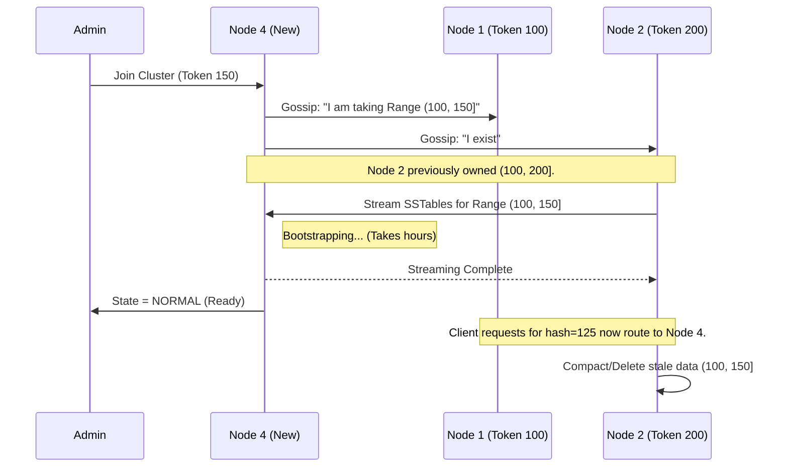
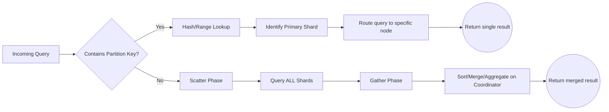

# Data Distribution Mechanics — How It Works

## Architecture: The Distribution Strategies

At a principal level, you must understand the exact algorithms underpinning how data is mapped to nodes. There are three dominant patterns:

1.  **Hash Distribution (Modulo)**: `Hash(PartitionKey) % N_Nodes`. Dead simple, perfectly even. *Fatal flaw*: Changing `N_Nodes` redistributes $O(K)$ keys, moving nearly the entire dataset. Rarely used in modern distributed systems.
2.  **Consistent Hashing (Dynamo, Cassandra)**: Points are distributed on a virtual ring (e.g., $0$ to $2^{64}-1$). `Hash(PartitionKey)` maps to a point on the ring; we walk clockwise to the next physical node token. Adding a node only moves data from its immediate neighbor.
3.  **Range Partitioning (Spanner, CockroachDB, HBase)**: Data is sorted lexicographically by the primary key and divided into contiguous ranges (e.g., `[A-C)`, `[C-F)`). *Advantage*: Efficient range scans (`SELECT * WHERE user_id BETWEEN 10 AND 50`). *Disadvantage*: Prone to hotspotting on sequential writes (e.g., timestamps).

## High-Level Design (HLD)

```mermaid
graph TD
    classDef client fill:#f9f,stroke:#333,stroke-width:2px;
    classDef router fill:#bbf,stroke:#333,stroke-width:2px;
    classDef storage fill:#bfb,stroke:#333,stroke-width:2px;
    classDef meta fill:#fbb,stroke:#333,stroke-width:2px;

    C[Client Application]:::client -->|Write\nPK=Alice, Val=100| L[Load Balancer]
    L --> R1[Coordinator / Router Node A]:::router
    L --> R2[Coordinator / Router Node B]:::router
    
    R1 -->|Lookup "Alice"| M[(Metadata / Gossip State)]:::meta
    M -.->|Alice is in Range A-D on Node 3| R1
    
    R1 -->|Forward Write| SN3[Storage Node 3: Range A-D]:::storage
    R1 -.->|Scatter-Gather If No PK| SN1[Storage Node 1]:::storage
    R1 -.->|Scatter-Gather If No PK| SN2[Storage Node 2]:::storage
    
    SN3 -->|Ack| R1
    R1 -->|OK| C
```

## Sequence Diagram: Adding a Node in Consistent Hashing

When scaling up a Cassandra or DynamoDB cluster, data moves deterministically without locking the entire table.



## Data Flow Diagram (DFD): Query Routing



## Table Structures (DDL)

To execute data distribution effectively in modern RDBMS (like CockroachDB or partitioned Postgres), the DDL must encode distribution rules.

**CockroachDB (Range Partitioning by Geo):**
```sql
CREATE TABLE users (
    id UUID,
    region STRING,
    name STRING,
    created_at TIMESTAMP,
    PRIMARY KEY (region, id) -- Region is the partition key prefix
);

-- Force ranges to specific physical regions
ALTER PARTITION 'eu' OF INDEX users@primary CONFIGURE ZONE USING constraints = '[+region=eu]';
ALTER PARTITION 'us' OF INDEX users@primary CONFIGURE ZONE USING constraints = '[+region=us]';
```

**Cassandra (Hash Partitioning):**
```sql
CREATE TABLE sensor_data (
    sensor_id UUID,
    event_month text,
    event_time timestamp,
    reading decimal,
    -- (sensor_id, event_month) is the Partition Key (Hashed)
    -- event_time is the Clustering Key (Sorted on disk)
    PRIMARY KEY ((sensor_id, event_month), event_time) 
) WITH CLUSTERING ORDER BY (event_time DESC);
```
