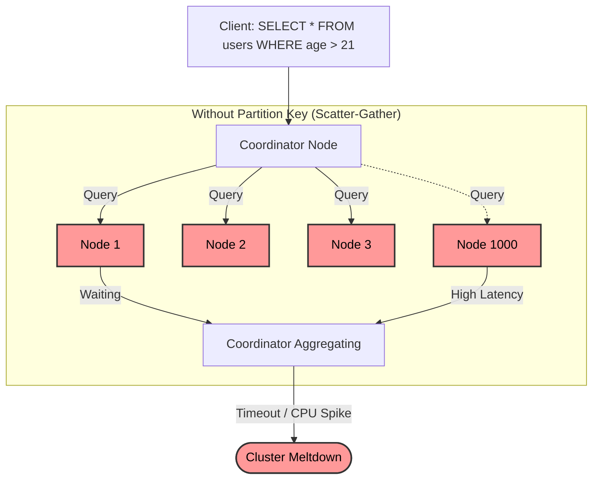

# Data Distribution Mechanics — Common Pitfalls & Anti-Patterns

## The "Scatter-Gather" Death Spiral

When a query is executed without providing the required Partition Key, the coordinating node does not know which physical shard holds the data. Therefore, it is forced to broadcast the request to *every* node in the cluster, wait for responses from all of them, and then aggregate the results. 

This works fine with 3 nodes. At 1,000 nodes, a single unindexed query translates into 1,000 backend database hits. Ten users running that query per second generates 10,000 QPS across the cluster, triggering a complete meltdown.



## Anti-Pattern 1: The Timestamp Monotonic Hotspot

**The Trap:** In an effort to keep data ordered temporally, an engineer uses `created_at` or a sequential `auto_increment` ID as the partition key.
**The Symptoms:** In range-partitioned systems, 100% of all writes simultaneously target the single physical node holding the "latest" range. The CPU of node `X` reaches 100%, while nodes `A` through `W` sit at 0%.
**The Fix:** Prepend a random hash or use a naturally distributed UUID format (like UUIDv4). If time-based ordering is absolutely necessary, use a composite primary key like `(tenant_id, created_at)`.

## Anti-Pattern 2: The "Fat Partition" (Unbounded Growth)

**The Trap:** Partitioning by a highly skewed categorical variable. For instance, partitioning a multi-tenant B2B SaaS application purely by `tenant_id`.
**The Symptoms:** The physical partition size on disk grows continuously. A mega-customer (e.g., Walmart) creates literally 1000x more data than average customers. The single node mapped to Walmart hits capacity limits. Rebalancing becomes impossible because moving a 2TB chunk of data across the network takes hours and tanks cluster performance.
**The Fix:** "Partition Key Salting". Introduce a random suffix to the key, or sub-partition by timestamp or month (`tenant_id_2024_01`).

```sql
-- WRONG: Mega-tenant destroys Node 3
CREATE TABLE user_events (
    tenant_id UUID,
    event_id UUID,
    PRIMARY KEY (tenant_id, event_id)
);

-- RIGHT: Salting the partition key manually (Bucketing)
CREATE TABLE user_events_salted (
    tenant_id UUID,
    event_id UUID,
    bucket INT AS (hash(event_id) % 10) VIRTUAL, -- 10 buckets per tenant
    PRIMARY KEY (tenant_id, bucket, event_id)
);
```

## Anti-Pattern 3: Cross-Shard Distributed Transactions

**The Trap:** Designing an online transaction processing (OLTP) application that frequently updates records spread across different physical partitions simultaneously (e.g., deducting a balance from User A and adding to User B in a global bank).
**The Symptoms:** Terrible latency. Distributed databases must perform a "Two-Phase Commit" (2PC) over the network. If Node A and Node B are in different un-synchronized regions, network latency destroys throughput and leads to lock timeouts.
**The Fix:**
1.  **Strict Avoidance:** Redesign the schema and key structure to ensure 99% of transactions hit the same partition (co-location).
2.  **Saga Pattern:** Abandon database-level transactions entirely. Process updates via an async messaging queue where each step modifies a single partition and publishes explicit success/failure events.

## Decision Matrix: When to NOT Shard Your Data

At a Principal architect level, the hardest decision isn't *how* to shard, but knowing when *not* to.

| Current Environment | Should You Shard / Use CockroachDB/Cassandra? | Reasoning |
| :--- | :--- | :--- |
| **< 100GB of uncompressed data** | ❌ Absolutely Not | A standard vertical scaling (Aurora Serverless, RDS) handles this effortlessly. You are introducing immense operational complexity for theoretical scale. |
| **Complex analytical joins across all dimensions** | ❌ No | Distributed hash/range partitions are hostile to massive unpredictable JOINs. Use Snowflake/BigQuery (Columnar OLAP) instead. |
| **P99 Write Latency must be < 1ms** | ❌ No | Physical network hops between coordinator and replicas usually bottom out around 2-3ms within an AWS Availability Zone. Use Redis. |
| **Data growth is 500GB+ per month** | ✅ YES | You have crossed the barrier where vertically scaling instances becomes cost prohibitive. Prepare for data distribution. |
