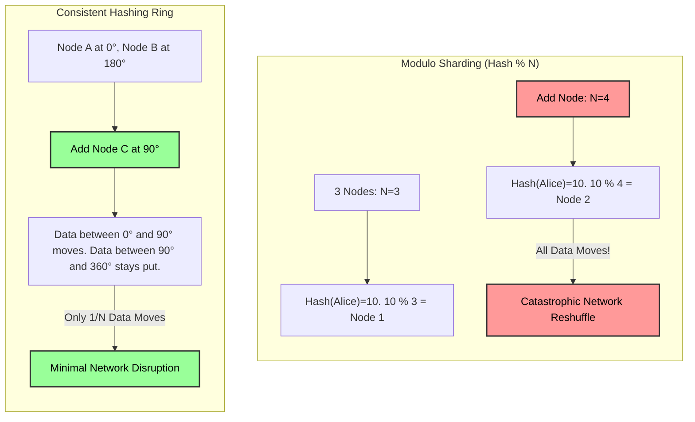

# Data Distribution Mechanics — Interview Angle

## How This Appears in System Design Interviews

Discussions around data distribution mechanics frequently dominate the middle-third of a FAANG system design interview. When designing highly concurrent platforms (Uber, Twitter, WhatsApp), the interviewer initially lets you build a single-node `users` or `messages` table. 

As the interview progresses, they will invariably push the scale: *"We are now ingesting 1 million messages per second. A single giant Postgres box is melting down. What do you do?"*

The expectation for a Senior/Principal candidate is to seamlessly introduce sharding, explicitly call out the partition key choice, analyze the resulting network topography, and proactively defend against hotspots and replication lag.

## Sample Questions

### Question 1: The Twitter/X Celebrity Problem
**Interviewer:** *"You decided to shard the global 'Likes' table by `user_id`. Elon Musk tweets something extremely controversial. 500,000 people attempt to Like the tweet within 10 seconds. What happens to our cluster and how do you fix it?"*

*   **Weak Answer (Mid-Level):** "The single shard for his User ID will get too much traffic. We should add caching in Redis so the database isn't hit directly."
*   **Strong Answer (Principal):** "Sharding by `user_id` was the immediate mistake. We have a massive write hotspot. A single underlying physical node hit its IOPS/CPU limit, causing 503s or cascading lock contention. Redis caching helps reads, but doesn't solve write throughput. I would redesign the distribution mechanics using a composite key: `hash(tweet_id) + user_id`. This uniformly scatters the 500k INSERTS across the *entire* cluster, leveraging aggregate throughput. For reading the total like count, I would use an async Kafka consumer to aggregate the numbers and store the summarized count separately in Redis or a counter table."

### Question 2: Resizing the Cluster
**Interviewer:** *"Our Cassandra cluster has 10 nodes. Black Friday is approaching and we need to double our capacity. What happens under the hood when we add 10 new nodes?"*

*   **Weak Answer (Mid-Level):** "Cassandra will automatically balance the data to the new nodes, improving performance."
*   **Strong Answer (Principal):** "Cassandra uses Consistent Hashing via a token ring. By adding 10 physical nodes, we introduce hundreds of new virtual nodes (vnodes) randomly distributed across the $2^{64}$ token space. Each new vnode claims ownership of a specific data range from its immediate predecessor on the ring. The existing nodes will stream SS-Tables (data files) over the network to the new nodes based on the updated ring topology. Crucially, this creates intense network I/O and disk reads. If we do this *during* Black Friday traffic, we might take down the cluster via network saturation. We strictly do this weeks in advance."

## What They're Really Testing

1.  **Do you understand the physical reality of the network?** (Data doesn't magically appear on new nodes; it takes hours of copying over 10Gbe connections).
2.  **Can you visualize queries at scale?** (Spotting scatter-gather queries immediately from a proposed schema).
3.  **Are you pragmatic?** (Knowing when *not* to shard and just paying AWS for a bigger instance).

## Whiteboard Exercise: Consistent Hashing vs Hash Distribution

Be prepared to draw why modulo arithmetic (`Hash % N`) fails catastrophically when a node dies, and why the "Ring" (Consistent Hashing) is mathematically superior.

