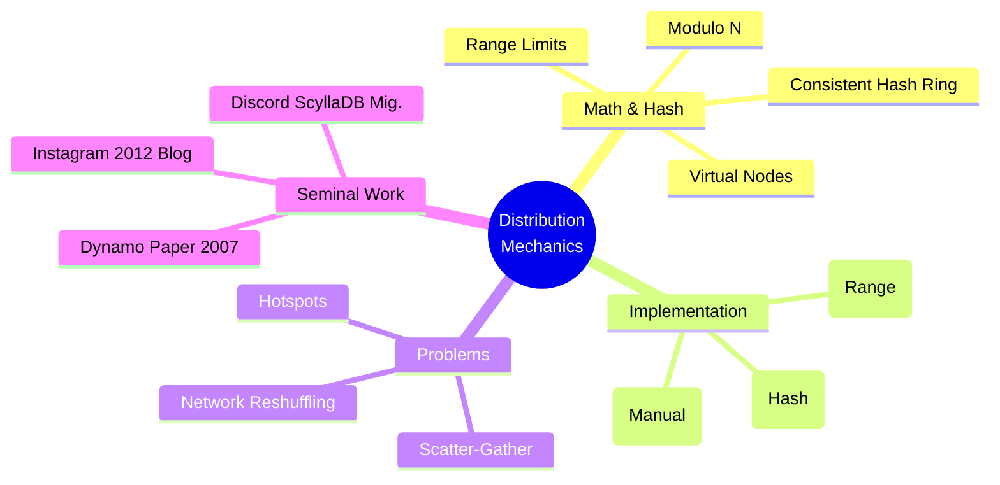

# Data Distribution Mechanics — Further Reading

## Core Papers & Concepts

| Resource | Description |
| :--- | :--- |
| **[Dynamo: Amazon's Highly Available Key-value Store (2007)](https://www.allthingsdistributed.com/files/amazon-dynamo-sosp2007.pdf)** | The seminal paper that introduced Consistent Hashing, vector clocks, and quorum-based replication to the masses. Essential reading for system design. |
| **[F1: A Distributed SQL Database That Scales (Google, 2013)](https://research.google.com/pubs/archive/41344.pdf)** | Google's deep dive into transitioning from MySQL sharding to an asynchronous, range-partitioned database sitting on top of Spanner. |
| **[Consistent Hashing and Random Trees (Karger et al. 1997)](https://www.akamai.com/es/es/multimedia/documents/technical-publication/consistent-hashing-and-random-trees-distributed-caching-protocols-for-relieving-hot-spots-on-the-world-wide-web-technical-publication.pdf)** | The original underlying MIT paper that defined the math behind Consistent Hashing, initially designed for web caches but pivotal for NoSQL. |

## Engineering Blogs & War Stories

| Resource | Description |
| :--- | :--- |
| **[Discord: How Discord Stores Trillions of Messages](https://discord.com/blog/how-discord-stores-trillions-of-messages)** | A brutal, honest look at what happens when Cassandra GC pauses destroy cluster latencies, and why they moved to ScyllaDB for optimal data distribution. |
| **[Uber Engineering: Designing Schemaless](https://www.uber.com/en-IN/blog/schemaless-part-two/)** | Uber’s architecture for an append-only, sharded key-value store atop MySQL. Excellent overview of manual cell-based sharding vs distributed DBs. |
| **[Instagram: Sharding & IDs at Instagram](https://instagram-engineering.com/sharding-ids-at-instagram-1cf5a71e5a5c)** | The legendary 2012 breakdown of how Instagram used PostgreSQL to auto-shard image data via custom PL/pgSQL sequential IDs embedding shard IDs. |

## Books & Chapters

| Resource | Book Structure |
| :--- | :--- |
| **Designing Data-Intensive Applications (Kleppmann)** | **Chapter 6: Partitioning.** The definitive guide on the trade-offs of hash vs. range partitioning, secondary indexes in partitioned stores (local vs global), and request routing. |
| **Database Internals (Petrov)** | **Chapter 11: Distributed Systems.** Extremely heavy on the internal mechanics of gossip protocols, leader election, and distributed coordination needed for shards to talk to each other. |

## Mindmap Overview

---

## Connections within the Curriculum

*   **[← 02_PACELC_Theorem](../02_PACELC_Theorem/)**: Distribution strategy directly determines how hard a database is hit by latency (EL) during normal operations vs consistency drops (PA) during netsplits.
*   **[→ 04_Distributed_Query_Execution](../04_Distributed_Query_Execution/)**: Once you split the data (Distribution), how do you actually run a massive `GROUP BY` that spans 50 different shards?
