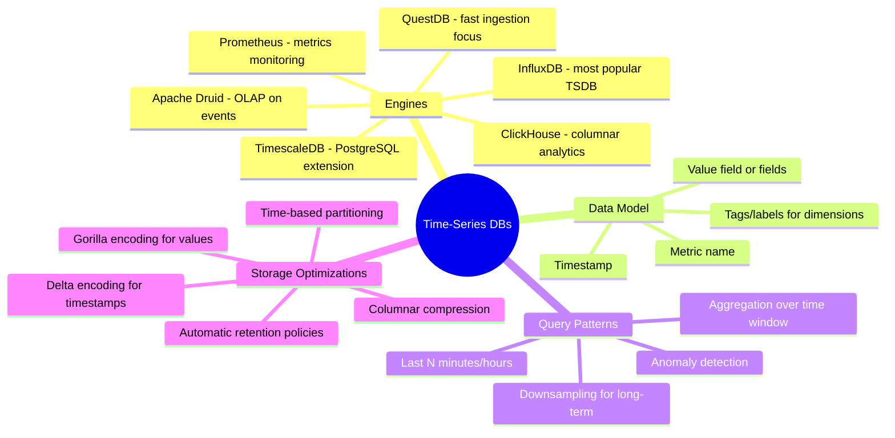

# Time-Series Databases — Concept Overview & Deep Internals

> Purpose-built engines for append-heavy, time-stamped data: IoT sensors, metrics, financial ticks.

---

## Why This Exists

General-purpose RDBMS treats time-series data as just another table. But time-series has unique properties: data is append-only (never updated), queries always filter by time range, and ingestion rates can exceed millions of points per second. Purpose-built engines exploit these properties for 10-100x better performance.

## Mindmap

## Comparison

| Feature | InfluxDB | TimescaleDB | ClickHouse | Prometheus |
|---|---|---|---|---|
| **Query Language** | InfluxQL/Flux | Full SQL | SQL | PromQL |
| **Storage** | Custom TSM | PostgreSQL (hypertables) | MergeTree (columnar) | Custom TSDB |
| **Ingestion Rate** | 1M pts/sec | 500K pts/sec | 1M+ rows/sec | 100K pts/sec |
| **Best For** | IoT, monitoring | SQL-native time-series | Log analytics | Kubernetes metrics |
| **Retention** | Built-in policies | Chunked, compressible | TTL on partitions | Compact + remote |

## War Story: Uber — TimescaleDB for Trip Metrics

Uber processes 100M+ trips/day. Trip metrics (duration, distance, surge pricing) were stored in PostgreSQL. At scale, time-range queries degraded to 30+ seconds. Migrating to TimescaleDB (PostgreSQL extension with hypertables) partitioned data by 1-hour chunks automatically. Same SQL, same PostgreSQL ecosystem, but queries dropped to 200ms.

## Interview — Q: "PostgreSQL vs a dedicated TSDB for time-series workloads?"

**Strong Answer**: "If < 10M rows/day and you need SQL joins with relational data → TimescaleDB (PostgreSQL extension). If > 100M rows/day with pure time-series queries → InfluxDB or QuestDB for ingestion speed. If you need SQL analytics over events → ClickHouse. The key: time-series engines optimize for append-only writes and time-range scans, which general RDBMS doesn't."

## References

| Resource | Link |
|---|---|
| [TimescaleDB Docs](https://docs.timescale.com/) | PostgreSQL extension |
| [InfluxDB](https://docs.influxdata.com/) | Purpose-built TSDB |
| [Gorilla Paper](https://www.vldb.org/pvldb/vol8/p1816-teller.pdf) | Facebook's time-series compression |
