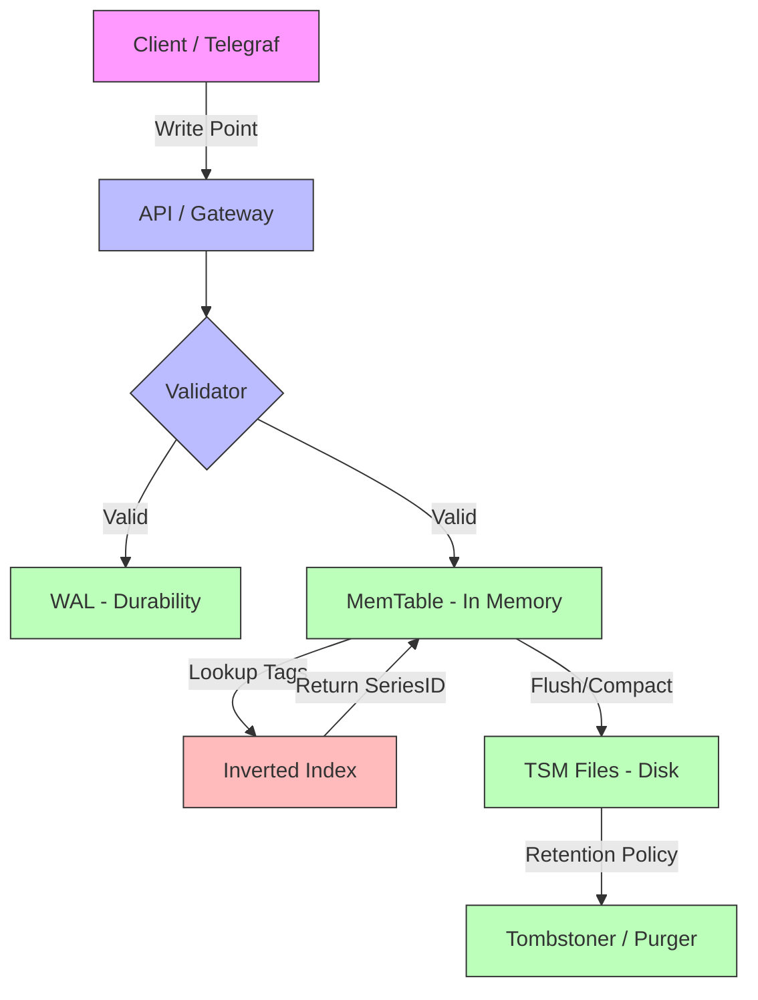
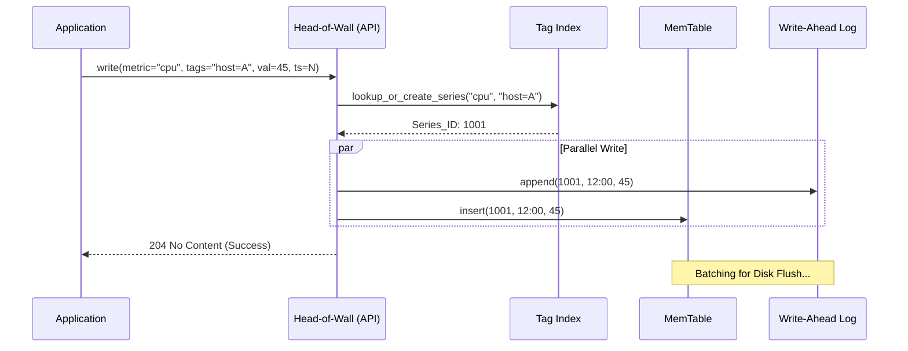
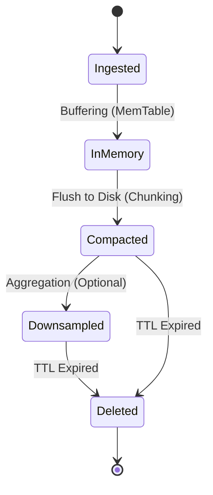
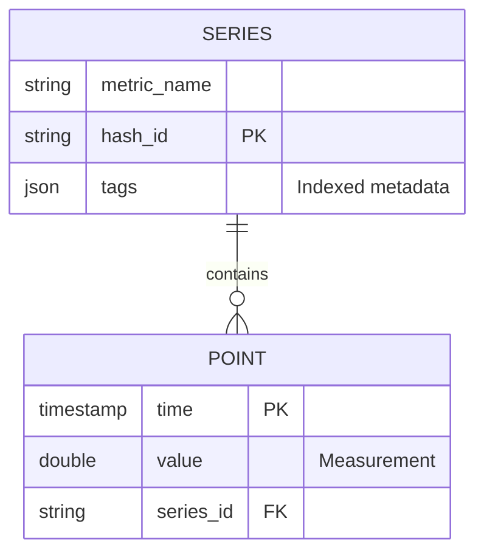

# Time-Series Databases — How It Works

## Architecture: The TSDB Engine Design

Modern TSDBs are built on the principle of **Inverted Indexing** for metadata (labels/tags) and **Columnar Data Stores** for measurements.

1.  **Index Layer (Inverted Index)**: Maps tag values (e.g., `region=us-east`) to a `Series ID`. This allows $O(1)$ lookups of which series need to be scanned.
2.  **Storage Layer (TSM / LSM)**:
    *   **WAL (Write Ahead Log)**: Immediate durability for incoming points.
    *   **Cache / MemTable**: In-memory buffer for the latest data points.
    *   **TSM (Time-Structured Merge Tree)**: Compressed, immutable files on disk. Data is sorted by `Series ID` then `Timestamp`.

## High-Level Design (HLD)



## Sequence Diagram: Data Ingestion & Indexing



## State Machine: The Lifecycle of a Data Point



## Data Flow Diagram (DFD): Query Execution

```mermaid
flowchart LR
    Q[SQL / PromQL Query] --> P[Parser]
    P --> T[Tag Filter Planner]
    T --> I[Index Interaction]
    I --> S[Gather Series IDs]
    S --> R[Range Scanner]
    R --> D[Disk SStables / TSM]
    D --> C[Decompress Chunks]
    C --> A[Aggregation Engine]
    A --> Result[Final Payload]
```



## Entity-Relationship (ER) Overview

In a TSDB, the relationship is between the "Series definition" and the "Point values".



## Table Structures (DDL)

**TimescaleDB (PostgreSQL Based):**
```sql
-- 1. Create standard table
CREATE TABLE sensor_data (
    time        TIMESTAMPTZ       NOT NULL,
    sensor_id   INTEGER           NOT NULL,
    temperature DOUBLE PRECISION  NULL,
    cpu_load    DOUBLE PRECISION  NULL
);

-- 2. Convert to Hypertable (Partitioned by time)
SELECT create_hypertable('sensor_data', 'time');

-- 3. Add compression policy
ALTER TABLE sensor_data SET (
    timescaledb.compress,
    timescaledb.compress_segmentby = 'sensor_id'
);

-- 4. Set Retention Policy
SELECT add_retention_policy('sensor_data', INTERVAL '30 days');
```

**InfluxDB (Line Protocol Entry):**
```text
# Measurement, Tags, Field, Timestamp
cpu_usage,host=server01,region=us-west value=0.64 1434055562000000000
```
