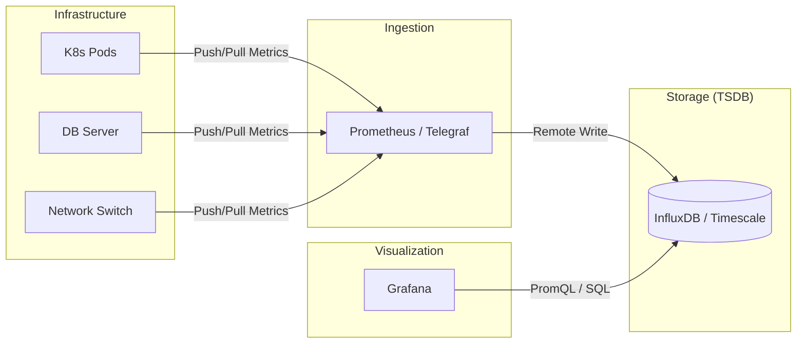

# Time-Series Databases — Hands-On Examples

## Integration Diagram: The Observability Stack

A typical production implementation using a Time-Series Database usually involves a "Sidecar" or "Agent" collector and a visualization layer.



## Before vs After: Handling Time-Range Scans

### The Bad Approach (Standard RDBMS Index)
In a standard table with millions of rows, a B-Tree index on `created_at` becomes deeply nested. Inserting new data requires rebalancing the tree, which slows down as the table grows.

```sql
-- Standard Postgres (No Partitioning)
CREATE TABLE metrics (
    id SERIAL PRIMARY KEY,
    ts TIMESTAMP NOT NULL,
    val DOUBLE PRECISION
);
CREATE INDEX idx_ts ON metrics(ts);

-- Query: Scan for 1 year of data
SELECT avg(val) FROM metrics WHERE ts > now() - interval '1 year';
-- ISSUE: Scans a massive B-tree, potentially swapping from disk if index doesn't fit in RAM.
```

### The Correct Approach (TSDB / Hypertable)
Using partition-aware storage (Hypertables), the database only scans the relevant "Chunks" for that specific time range, bypassing 90% of the data.

```sql
-- TimescaleDB (Hypertable)
SELECT create_hypertable('metrics', 'ts', chunk_time_interval => interval '1 day');

-- Query:
SELECT time_bucket('1 hour', ts) AS hour, avg(val) 
FROM metrics 
WHERE ts > now() - interval '24 hours'
GROUP BY hour;
-- RESULT: Scans exactly 1 chunk (24 hours). Instant response.
```

## Production Configuration (Prometheus Remote Write)

To scale Prometheus beyond a single node, practitioners use "Remote Write" to a long-term TSDB like VictoriaMetrics or InfluxDB.

```yaml
# prometheus.yml
global:
  scrape_interval: 15s

scrape_configs:
  - job_name: 'node_exporter'
    static_configs:
      - targets: ['localhost:9100']

remote_write:
  - url: "http://influxdb:8086/api/v1/prom/write?db=prometheus"
    remote_timeout: 30s
    queue_config:
      max_samples_per_send: 1000
      max_shards: 200
```

## Runnable Exercise: Understanding Gorilla Compression

A key reason TSDBs are efficient is **XOR Delta-Delta compression** (Gorilla). You can simulate the logic in Python to understand how 64-bit floats are compressed into few bits.

```python
import struct

def xor_compress(v1, v2):
    """Simplified XOR compression concept for floats"""
    # 1. Convert floats to 64-bit unsigned integers
    b1 = struct.unpack('Q', struct.pack('d', v1))[0]
    b2 = struct.unpack('Q', struct.pack('d', v2))[0]
    
    # 2. XOR current value with previous
    diff = b1 ^ b2
    
    if diff == 0:
        return "0"  # Identical value consumes 1 bit
    else:
        # Real Gorilla tracks 'leading zeros' and 'trailing zeros' 
        # to pack only the meaningful diff bits.
        return f"1:{bin(diff)}"

prev_val = 45.0
curr_val = 45.1
print(f"Compressed Representation: {xor_compress(prev_val, curr_val)}")
```

## Advanced Query: ASOF Joins (QuestDB/KDB+)

In financial data, "Last Observation Carried Forward" is critical. You want the price *at the time* of the trade, even if the price was recorded 2 seconds before the trade.

```sql
-- QuestDB Syntax
SELECT 
    t.timestamp, t.symbol, t.price as trade_price, q.bid
FROM trades t
ASOF JOIN quotes q ON (symbol)
WHERE symbol = 'BTC-USD';
```
