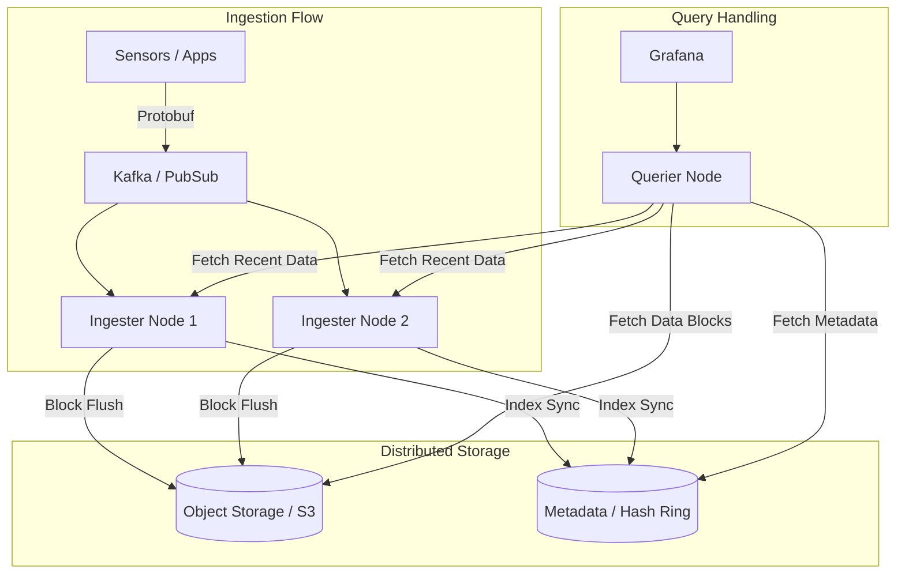

# Time-Series Databases — FAANG War Stories

## Deployment Topology: High-Availability TSDB Cluster

At enterprise scale, a single TSDB node is a massive single point of failure. Modern architectures pull the "Ingester", "Querier", and "Storage" apart.

## Case Study 1: Facebook's Gorilla (Memcache for Metrics)

**The Challenge**: Facebook had to store billions of time-series points. Standard HDFS storage was too slow for real-time dashboards.
**The Fix**: They built **Gorilla**, an in-memory TSDB.
*   **Innovation**: Introduced XOR-based float compression and Delta-Delta timestamp encoding.
*   **The Result**: Reduced the size of a data point from **16 bytes to an average of 1.37 bytes**. This allowed them to keep the last 24 hours of all metrics entirely in RAM, enabling millisecond-level query latency. (Now open-sourced as part of Beringser/Beringei).

## Case Study 2: Uber's M3 (The Metrics Platform)

Uber outgrew its Prometheus/Graphite setup as they hit millions of write operations per second across multiple data centers. 

*   **The Problem**: Neither Prometheus nor Graphite provided global multi-DC aggregation or efficient long-term storage at Uber's scale.
*   **The Solution**: They built **M3DB**.
*   **Key Numbers**: 500 million metrics per second. Aggregating data from 4,000+ microservices.
*   **Architectural Pivot**: They implemented a custom distributed TSDB written in Go that uses a decentralized hash ring for data placement and integrates directly with Prometheus query language (PromQL).

## Case Study 3: Netflix's Atlas

Netflix handles over 2 billion distinct time series for their cloud infrastructure.

*   **The Pivot**: Unlike others who store data on disk, Atlas is primarily **In-Memory-First**.
*   **Strategy**: Since SREs care most about the last 3-6 hours during an incident, Atlas keeps high-resolution data in memory across a cluster. Older data is rolled up and moved to S3 for historical audits.
*   **Performance**: Can handle 10k+ concurrent queries per second while maintaining sub-second P99 latencies.

## Post-Mortem: The "Cardinality Explosion" Outage

**The Incident**: A major e-commerce platform's monitoring system crashed during a high-traffic sale. Grafana went blank, and the TSDB stopped responding to writes.
**The Root Cause**: A developer pushed a code change that added `user_id` as a **Tag** (Label) in a Prometheus metric tracking "checkout_attempts".
**Why this failed**:
1.  **Cardinality** = Unique combinations of tag values.
2.  With 1 million users per hour, the TSDB suddenly had 1,000,000 unique series instead of the usual 1,000 (per region/host).
3.  The **Inverted Index** (mapping tags to series IDs) grew so large it exceeded RAM, causing the DB to thrash the disk and eventually OOM (Out of Memory).
**The Fix**:
1.  Immediately drop the "user_id" tag from the ingestion pipeline.
2.  Implement **Cardinality Guardrails** (Rate limiting unique series per tenant).
3.  Rule: Never put high-cardinality values (IDs, Emails, IPs) in TSDB tags. Put them in logs or traces.
