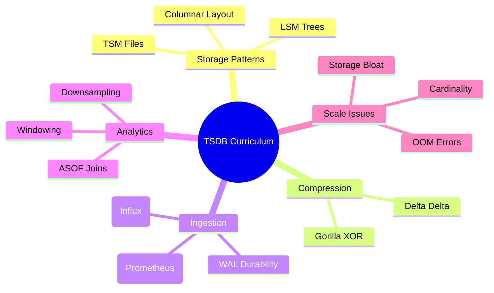

# Time-Series Databases — Further Reading

## Core Papers & Concepts

| Resource | Description |
| :--- | :--- |
| **[Gorilla: A Fast, Scalable, In-Memory TSDB](https://www.vldb.org/pvldb/vol8/p1816-teller.pdf)** | The Facebook paper that defined the state-of-the-art for time-series compression (XOR / Delta-Delta). |
| **[Druid: A Real-time Analytical Data Store](http://static.druid.io/docs/druid.pdf)** | Details how Druid uses pre-aggregations, inverted indexes, and columnar storage for sub-second event analytics. |
| **[TimescaleDB Engineering Blog](https://www.timescale.com/blog/)** | Excellent deep dives into B-Tree performance vs. Hypertables and the math of temporal indexing. |

## Engineering Blogs & War Stories

| Resource | Description |
| :--- | :--- |
| **[Uber Engineering: M3 Platform](https://www.uber.com/en-IN/blog/m3-ubers-open-source-distributed-metrics-platform/)** | How Uber built M3 to scale to 500 million metrics per second across global data centers. |
| **[Netflix: Atlas Architecture](https://netflixtechblog.com/introducing-atlas-netflixs-primary-telemetry-platform-bd31f4fc6902)** | Why Netflix chose an in-memory-first TSDB and how they handle billions of series. |
| **[High Cardinality in Prometheus](https://grafana.com/blog/2022/02/15/how-to-manage-high-cardinality-metrics-in-prometheus/)** | A practical guide to identifying and neutralizing cardinality explosions. |

## Top 10 Specialty Engines (GitHub)

1.  **[TimescaleDB](https://github.com/timescale/timescaledb)**: The SQL-native choice (Postgres Extension).
2.  **[InfluxDB](https://github.com/influxdata/influxdb)**: The OSS heavyweight (Go-based custom TSM engine).
3.  **[VictoriaMetrics](https://github.com/VictoriaMetrics/VictoriaMetrics)**: Highly efficient, drop-in replacement for Prometheus.
4.  **[QuestDB](https://github.com/questdb/questdb)**: Performance-first via SIMD instructions and Java/Zero-copy.
5.  **[ClickHouse](https://github.com/ClickHouse/ClickHouse)**: Technically OLAP, but widely used for high-velocity log/metric analytics.
6.  **[Prometheus](https://github.com/prometheus/prometheus)**: The gold standard for pull-based cloud-native monitoring.
7.  **[M3DB](https://github.com/m3db/m3)**: Uber's distributed TSDB.
8.  **[Apache Druid](https://github.com/apache/druid)**: For sub-second OLAP on streaming event data.
9.  **[Cortex](https://github.com/cortexproject/cortex)** / **[Thanos](https://github.com/thanos-io/thanos)**: Providing global scale to Prometheus.
10. **[GreptimeDB](https://github.com/GreptimeTeam/greptimedb)**: A modern Rust-based open-source TSDB.

## Mindmap Overview

---

## Connections within the Curriculum

*   **[← Storage Engines](../../01_Storage_Engines_and_Disk_Layout/)**: TSDBs are a specialized application of LSM and Columnar storage principles.
*   **[→ OLAP & Columnar Stores](../../../03_Data_Warehousing/04_Columnar_Storage_Performance/)**: Cross-over with ClickHouse and Druid for event-based analytics.
*   **[→ Distributed Consensus](../../02_Transactions_and_Consistency/03_Distributed_Consensus/)**: Needed for clustering and high-availability in M3 and InfluxDB Enterprise.
